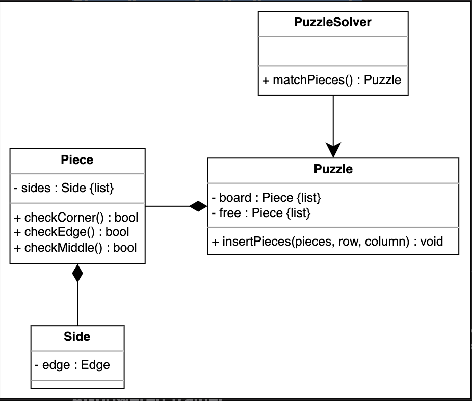

Getting Ready: Jigsaw Puzzle'

Problem definition

A jigsaw puzzle is a picture divided into irregularly shaped pieces that can be assembled together to form a complete picture. A puzzle has a fixed number of pieces that can only fit together in exactly one way. We can solve the jigsaw puzzle by aligning the pieces in a way that they fit with each other and also create a coherent picture.

The puzzle board

You may want to ask the interviewer more about the kind of jigsaw puzzle. You can ask the following questions:

What does a jigsaw puzzle look like. Is there a picture or a pattern on the puzzle?

What type of shape does our board have? Is it rectangular, circular, or any other shape?

The puzzle pieces

It is important to clarify the requirements for a single piece of the puzzle as it is a key feature of the problem. You can ask the following questions:

What kind of shape do the puzzle pieces have? How many sides does a piece have?

How do the pieces fit together?

Will all the pieces of a jigsaw puzzle be unique?

Design approach

We are going to design this jigsaw puzzle using the bottom-up design approach. For this, we will follow the steps below:

Identify and design the smallest components first like the puzzle edges of a piece.

Use these small components to design bigger components, for example, the puzzle piece.

Repeat the steps above until we design the whole system, i.e., the puzzle board.

Design pattern

During an interview, it is always a good practice to discuss the design patterns that a Jigsaw puzzle falls under. Stating the design patterns gives the interviewer a positive impression and shows that the interviewee is well-versed in the advanced concepts of object-oriented design.

Requirements for the Jigsaw Puzzle

R1: Our board will be in the shape of a rectangle.

R2: All pieces will have four sides that can either have an indentation, an extrusion, or a flat edge.

Class Diagram for the Jigsaw Puzzle

Class diagram for the jigsaw puzzle

Design pattern

In the jigsaw puzzle, there is only one instance of the puzzle board. Therefore, we use the Singleton design pattern to ensure that only one instance for the board is created using a special creation method, and this instance has a global point of access.

Additional requirements

The interviewer can introduce some additional requirements in the jigsaw puzzle, or they can ask some follow-up questions. Let's see some examples of additional requirements:

Rotate piece: Pieces can be rotated to fit on the puzzle. The class diagram provided below shows the added functionality of rotation in the Piece class:

Code of Jigsaw Puzzle

Enumerations

The following code defines the Edge enum that represents the shape of the puzzle piece:

Side

The Side class contains a reference to the Edge enum that will describe the edge shape of any side of a puzzle piece.

Piece

The Piece class contains a list of sides (representing each side of a piece) and ensures if a particular piece is a corner, middle, or edge using its respective functions.

Puzzle

The Puzzle class includes the entire board of the jigsaw puzzle as well as the unused pieces. Since the board is a rectangle, it will be represented using a 2-D array. In addition, there will be only one instance of the puzzle board in the jigsaw puzzle. Therefore, the Puzzle class will be a Singleton class to ensure that only one instance for the board is created in the entire system.

Puzzle solver

The PuzzleSolver class tries to solve the puzzle using the matchPieces() function.

