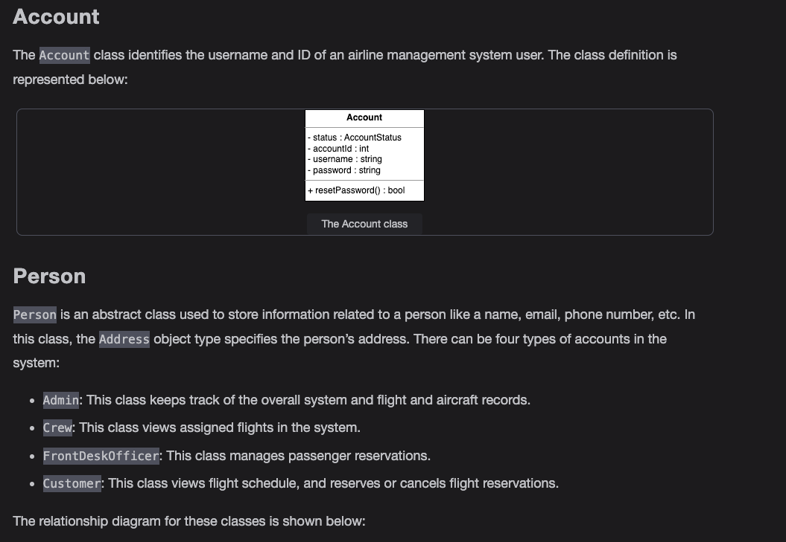
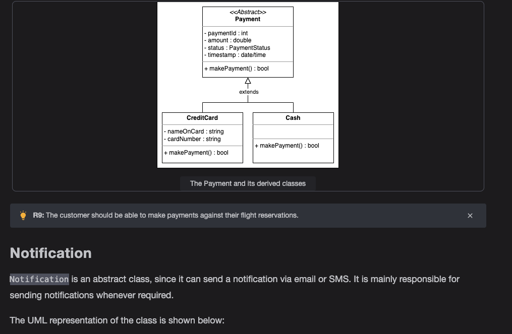
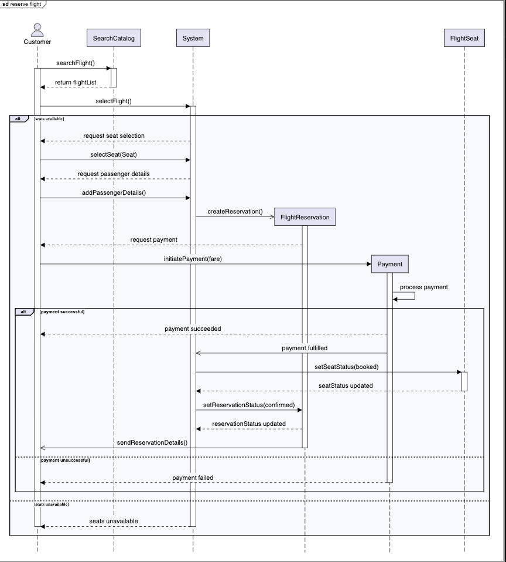
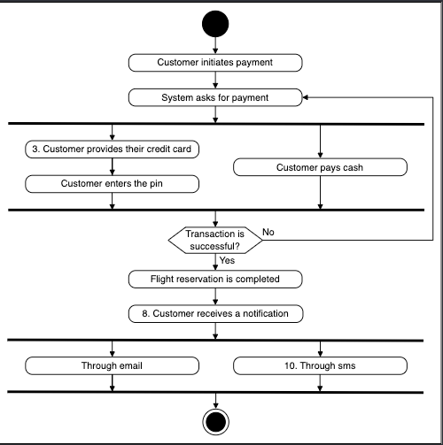

Getting Ready: The Airline Management System

Problem definition

An airline management system is a software used to manage all activities of the airline system efficiently. Nowadays, every airline has a management system to digitize the process of scheduling flights, managing staff, ticket reservations, and performing other necessary airline management tasks. Moreover, the system keeps track of the number of aircraft, pilots, and their availability at airports. The system provides customers the complete flight information so they can view the available flights and schedule them online. Similarly, the admin can manage all the airline activities with the help of this system. Therefore, the airline management system facilitates its customers as well as admins and controls all the operations of the airline company.

Flight reservation

Flight reservation is an essential part of the airline management system. The system has to ensure that no two people should be mapped to the same seat. The interviewer expects you to ask questions to identify how the system will complete flight reservations:

How will the system ensure that multiple users do not have the same seat on the aircraft?

Can one itinerary reserve multiple flights?

Can the customer reserve the whole aircraft?

Payment handling

One of the airline management system's most significant attributes is its payment structure for its customers. This can vary, so the interviewer would expect you to ask the questions listed below:

What payment methods can the customer use, for example, credit card or cash?

How does the customer make the payment? Does the customer pay online or in persone?

Will the customer be able to pay in advance for a flight booking, or is a just-in-time (JIT) payment method available?

Price variance

Now that we’ve discussed the payment methods of the airline management system, let’s ask the interviewer about the pricing model. You may ask the questions listed below:

Is the price set manually, or does the system calculate the price for each flight?

Does every seat has the same price, or is it calculated based on the seat type?

Does the weekdays and weekends affect the price of the flight?

Is the price of the flight affected by an increase in demand?

How does the duration of the flight affect the payment?

Flight cancellation

In the airline management system, the customer may want to cancel the flight after booking it. Therefore, you can ask the following questions:

Can the customer cancel a flight?

What is the time limit to cancel the flight?

Which type of users are allowed to request a flight cancellation?

Design approach

We’ll design this airline management system using the bottom-up approach. For this purpose, we will follow the steps below:

Identify and design the smallest components first, including seat, flight, etc.

Use these small components to design bigger components, including airport, aircraft that can be composed of multiple seats, etc.

Repeat the steps above until we design the whole airline management system.

Design pattern

During an interview, it is always a good practice to discuss the design patterns that an airline management system falls under. Stating the design patterns gives the interviewer a positive impression and shows that the interviewee is well-versed in the advanced concepts of object-oriented design.

Requirements for the Airline Management System

R1: A customer should be able to search for flights by the date, departure, and destination airport.

R2: A customer should be able to reserve tickets for available flights. Customers should also be able to book multiple flights at once.

R3: The customer should be allowed to book multiple seats for a single flight.

R4: The system should allow the customer to check flight details, such as available seats, flight schedules, and departure/arrival times.

R5: The admin should be able to add new flights. The admin should be able to update or cancel scheduled flights.

R6: An airline should be able to own multiple aircrafts. The admin should be able to add these aircrafts to the system.

R7: An airline should be able to operate its flights from different airports.

R8: The admin should be able to assign pilots and crew members to flights effectively.

R9: The customer should be able to make payments against their flight reservations.

R10: The customer should be able to cancel their previous reservations.

R11: The front desk officer should be able to reserve tickets, create itineraries, and make flight payments for the customer.

R12: The flight crew should be able to view the schedule for their assigned flights.

R13: The system should send the customer a notification whenever a reservation has been made or canceled or when there is an update for their flight.

Use Case Diagram for the Airline Management System

System

Our system is an "airline."

Actors

Now, we’ll define the main actors of the airline management system.

Primary actors

Customer: The customer is the airline's primary actor who can search for flights, create an itinerary, make a payment, and update or cancel the flight reservation.

Front desk officer: This actor can perform all the actions that the customer can. The front desk officer can create an itinerary, make payment, update or cancel the flight reservation on behalf of customers, assign them seats, and search for flights.

Admin: The admin is in charge of performing numerous operations, like adding aircraft to the system, adding or modifying flights, flight instances, and their schedules, canceling any flight, and assigning crew to the flight.

Secondary actors

System: This actor is responsible for sending notifications for flight status updates, itinerary changes, and reservation cancellations.

Crew: This actor can view the schedules of the assigned flights.

Use cases

Customer/front desk officer

Update/cancel reservation: To update or cancel a flight reservation of the customer

Login/logout: To log in or log out of the airline system

Reset password: To reset the password of the account

Create itinerary: To create an itinerary for the customer

Assign seat: To assign a seat to the passenger for the flight

Search flights: To search for flights in the airline management system

Make payment: To pay for the itinerary or flight reservation

View itinerary: To view the details of an itinerary

Cancel itinerary: To cancel the itinerary for the customer

Admin

Add aircraft: To add a new aircraft to the airline management system

Add/modify flight: To add a new flight or modify it

Assign crew: To assign crew to the flight instance

Block/unblock user: To block or unblock a user in an airline management system

Cancel flight: To cancel the instance of a flight

Search flights: To search for flights in the airline management system

System

New itinerary notification: To send a notification of a new itinerary to the customer

Flight status notification: To send the flight status update notification to the customer

Reservation cancel notification: To send a reservation cancellation notification to the customer

Crew

View flight schedule: To view the schedule of the assigned flights

Relationships

Associations

Include

To create an itinerary, one or more flight reservations should be created to add the passengers to the itinerary. Therefore, the “Create itinerary” use case has an include relationship with both “Create flight reservation” and “Add passenger” use cases.

While creating a flight reservation, the seat should be assigned to the customer. Therefore, the “Create flight reservation” use case has an include relationship with the “Assign seat” use case.

Whenever the flight is canceled, its related flight reservations should also be canceled. Hence the “Cancel flight” use case has an include relationship with the “Cancel reservation” use case.

When an itinerary is created, a notification is sent to the customer. Therefore, the “Create itinerary” use case has an include relationship with the “New itinerary notification” use case.

If an itinerary is canceled, the payment will be refunded, and a reservation cancellation notification will be sent to the customer. Hence, the “Cancel itinerary” use case has an include relationship with both “Refund payment” and “Reservation cancellation notification” use cases.

When the flight is canceled, the payment will be refunded, and a reservation cancellation notification will be sent to the customer. Hence, the “Cancel reservation” use case has an include relationship with both “Refund payment” and “Reservation cancellation notification” use cases.

Extend

When modifying the flight instance, the admin can assign the crew to the flight instance. Therefore, the “Modify flight instance” use case has an extend relationship with the “Assign crew” use case.

Use case diagram

Class Diagram for the Airline Management System

Class diagram of the airline management system

Design pattern

The Airline class follows the Singleton design pattern because there will only be a single instance of the Airline class as it is the main organizational class.

The airline management system can also implement the Observer design pattern because all the passengers flying in a particular flight instance must be updated about any changes in their flight schedule. The passengers here will act as subscribers and be notified whenever the flight status changes.

Sequence Diagram for the Airline Management System

Reserve a flight

The sequence diagram for reserving a flight should have the following actors and objects that will interact with each other:

- Actor: Customer
- Objects: SearchCatalog, FlightReservation, FlightSeat, and Payment
- System

Sequence challenge: Cancel a reservation

Activity Diagram for the Airline Management System

Create an itinerary

The states and actions that will be involved in this activity diagram are provided below.

States

Initial state: The customer chooses an option to create the itinerary.

Final state: A customer books their ticket.

Actions

The customer selects an option to create an itinerary online themselves or through the front desk officer. The customer then selects their flights. Finally, the customer books their ticket.

Activity challenge: The user receives confirmation notification after payment

Code for the Airline Management System

Constants

The following code provides the definition of the various enums and custom data types being used in the airline management system:

Account and passenger

The Account class refers to an account for any user including admin, crew, front desk officer, and a customer. The Passenger class represents the passengers in the airline system. 

Person

Person is an abstract class that represents the various people or actors that can interact with the system. There are four types of persons: Admin, Crew, FrontDeskOfficer, and Customer. 

Seat and flight seat

The Seat and FlightSeat are used to keep track of the customer’s seat. Here, Seat is the physical seat in the aircraft and FlightSeat is the seat assigned to a specific flight instance. 

Flight and flight instance

The Flight and FlightInstance classes provide the details of the flight and its instances to the customer

Itinerary and flight reservation

The Itinerary and FlightReservation classes are used to keep track of itineraries and flights reserved by the customers.

Payment

The Payment class is another abstract class with two child classes: Cash and CreditCard. This takes the PaymentStatus enum to keep track of the payment status.

Notification

The Notification class is another abstract class responsible for sending notifications with two child classes: SMSNotification and EmailNotification .

Search and catalog

The SearchCatalog class contains the flight instance information and implements the Search interface class to enable the search functionality based on the criteria

Airport, aircraft, and airline

This section contains classes like Airport, Aircraft, and Airline that make up the infrastructure of our airline management system. Here, Airline is a Singleton class

