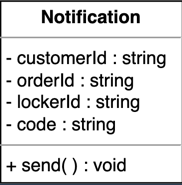
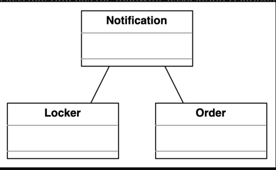

Amazon Locker is also known as Amazon Hub or Amazon Hub Locker. It is a fully automated package delivery service provided by Amazon. Customers can choose any locker location as their delivery address and pick up the package from that location at no additional cost. In particular, when a customer places an order and chooses to get their item delivered to locker service, the system suggests the nearest available locker based on preferences. The order is packaged and placed in the locker. The customer gets the notification containing the code to open the locker, and they can pick up the package using that code within a valid amount of time. This is how the Amazon Locker service functions.

clarifications

Every locker is of a specific size in the Amazon Locker system. The interviewer expects you to ask questions listed below:

Will every locker be of the same size?

Is there any size restriction on an item that can be kept in the locker?

Locker selection

The most significant part of the Amazon Locker service is the selection of the locker. The system has to make sure that more than one customer should not be able to access a locker at a single time. The interviewer expects you to ask the questions listed below to identify how the system will work in such situations:

How will the system make sure that multiple customers do not get the same locker?

Will the customer choose the locker of his own choice, or will the system assign him a locker based on availability?

Can a customer get two lockers for different orders at the same time?

Will the system keep in mind the locker and package sizes while assigning the locker to the customer?

Locker status

Since this problem revolves around the locker, you may ask the questions listed below about the locker status:

Is there any time constraint on the package that can be kept in the locker?

What will happen if the customer does not come to pick up his package within the valid time period?

Returning an item

Similar to the order delivery process, the item can also be returned through the Amazon Locker service. Therefore, you may ask the questions listed below:

Can the customer return an item through the Amazon Locker service?

If yes, will they get the same locker from which they picked up the item?

How will the locker be assigned to the customer while returning an item?

Design approach

We will design this Amazon Locker service using the bottom-up design approach. For this purpose, we will follow the steps below:

Identify and design the simple components first, like the locker and item.

Use these small components to design bigger components, such as the locker location and order that can be composed of multiple lockers and items, respectively.

Repeat the steps above until we design the whole system.

Design pattern

During an interview, it is always a good practice to discuss the design patterns that the amazon locker system falls under

Requirements :

R1: While ordering the item(s), the customer can choose the nearest location to pick up the order package from the locker.

R2: One or more items can be contained in one order. An order will be placed in a package before the delivery.

R3: There can be different sizes of lockers including extra small, small, medium, large, extra large, and double extra large.

R4: The locker is assigned to the customer based on the size of the order package.

R5: When the order package is delivered to the locker location specified by the customer, a 6-digit code(OTP - One Time Password) will be sent to the customer to open the locker.

R6: The package will be kept or placed inside the locker for three days only.

R7: If the customer does not pick up the package from their locker within three days, the refund process will be initiated and the customer won’t be allowed to pick up the package any longer.

R8: Only eligible packages can be placed in the locker such that the size of the package must be less than the size of the locker.

R9: There can be multiple lockers at every locker location.

R10: The Amazon Locker is accessed within a specific time. Every location has its opening and closing time. Therefore, the customer should pick up the package during this time period.

R11: The item can be returned to the Amazon Locker if it doesn’t match the expectation of the customer or is faulty, and there is a refund policy available for that product.

R12: To return an item, the customer needs to choose the nearest locker location. An available locker will be assigned to them based on the size and location.

R13: When the customer picks up the order package from the locker, the locker’s state is changed to closed, and the customer will no longer be able to open the locker with the given code.

Use case diagram

System - Amazon Locker

Actors - primary actors - customer, delivery guy, secondary actors - system

Customer: This is Amazon's customer who ordered a package delivered to the Amazon Locker. It can enter the code at the locker and get its product. This actor can also request a return and put the package back at the locker.

Delivery guy: This can also enter the code and add the product to the locker so the "Customer" can pick it up. This actor can pick up a returned package from the locker.

System: This can send the delivery and due date notifications, generate code, validate code, and choose a locker. It can also find the locker and open or close the locker door.

Customer

Enter code: To enter the code to open a locker

Add product: To add a product to the locker

Remove product: To pick up the product from the locker

Delivery notification: To notify about the product location status

Submit return request: To submit a return request to return a product

Overdue notification: To notify if the date and time for the product pickup are passed

Delivery guy

Enter code: To enter the code to open a locker

Add product: To add a product to the locker

Remove product: To pick up the product from the locker

Return notification: To notify about the product return status

System

Validate code: To validate the locker code entered

Find locker: To find the locker as per the code entered

Lock/unlock door: To lock or unlock the door lock

Return notification: To notify about the product return status

Generate code: To generate the locker code

Issue locker: To issue the appropriate locker depending upon product size

Overdue notification: To notify if the date and time for the product pickup are passed

Delivery notification: To notify about the product location status

Relationships

Associations

Include

When a “Customer” enters a code, the system then checks if the code is correct or not and finds the locker according to the code entered. Then, the system unlocks the door. This means that:

The "Enter code" use case has an include relationship with the "Validate code" use case.

The "Validate code" use case has an include relationship with the "Find locker" use case.

The " Find locker" use case has an include relationship with the "Lock/unlock door" use case.

To return a product, the customer must go to the Amazon website and submit a return request. After the approval of the request, Amazon Locker will generate a code that will be used to access the locker.

The "Submit return request" use case has an include relationship with the "Request notification" use case.

The "Request notification" use case has an include relationship with the "Generate code" use case.

use case diagram

class diagram

Item

The Item class represents each item of the order. Every item contains an Id and the order’s quantity. The class representation is shown below

Order

The order placed by a customer is represented by the Order class. Every order has a unique Id, contains a list of items, and the delivery location of the order

R2: One or more items can be contained in one order. An order will be placed in a package before the delivery.

Notification

The notification is sent to the customer when an order is shipped. A Notification class has a customerId, orderId, and lockerId that specify the customer to whom the notification has to be sent, against the order the notification has to be sent, and the locker where the order has arrived, respectively. Moreover, this class contains a 6-digit code to open the locker

R5: When the order package is delivered to the locker location specified by the customer, a 6-digit code will be sent to the customer to open the locker.

Package and locker package

The Package class represents the order which is packaged. The package is what can be kept in the locker. Each package has its own id and size. Moreover, the Package class has an Order type attribute to show against which order the package is sent. The class representation of Package is provided below:

The package that is kept inside the locker is represented by the LockerPackage class. Since an item kept in a locker has a validity of certain days, we have codeValidDays to keep track of this. This class contains lockerId to keep track of which locker contains a particular package. The code to open the locker for that package is stored in the code class and the packageDeliverTime class stores information about when the package is delivered to the particular locker.

The representation of the Package and LockerPackage classes

R2: One or more items can be contained in one order. An order will be placed in a package before the delivery.

R6: The package will be kept or placed inside the locker for three days only.

R7: If the customer does not pick up the package from their locker within three days, the refund process will be initiated, and the customer won’t be allowed to pick up the package any longer.

Locker

Since we are designing a locker service problem, we should have a Locker class. Every locker has its ID, size, and reference to the location ID. Moreover, the Locker class has a member, lockerState, to specify the present state of the locker. We can add a package to the locker and remove a package from the locker.

R4: The locker is assigned to the customer based on the size of the locker.

Locker location

A locker is kept at the location. Since a location may contain more than one locker, we have a list of lockers in the LockerLocation class. The longitude and latitude are used to store the location. According to the requirements, the specific locker is opened only for a particular period of time and the customer can only get a package from the locker if they visit the locker during the location timing. The openTime and closeTime variables store information about the timings applicable to the particular locker location.

R9: Amazon Locker Service

Locker service

The LockerService class is the main class of the Amazon Locker service system and contains a reference to the list of locker locations.

Enumerations

LockerStatus: The locker status describes the current status of the locker, whether it is closed, booked, or available.

LockerSize: The locker size expresses the size of the locker, whether it is extra small, small, medium, large, extra large, or double extra large.

R3: There can be different sizes of lockers like extra small, small, medium, large, extra large, and double extra large.

R13: When the customer picks up the order package from the locker, the locker’s state is changed to closed and the customer will no longer be able to open the locker with the given code.

Association

The Notification class has a two-way association with the Locker and Order classes.

Composition

The class diagram has the following composition relationships:

The LockerService class comprises the LockerLocation class, which itself is composed of the Locker class and the LockerPackage class.

The Package class is composed of the Order class which is composed of the Item class.

Inheritance

The following classes show an inheritance relationship:

The LockerPackage class extends the Package class.

Class diagram of the Amazon Locker service

Design pattern

In the Amazon Locker service, there are multiple lockers at the given locker location. There are also different locker locations which are specified by the customer. Therefore, the system assigns the most appropriate locker to the customer by considering the customer’s location, and locker size. Therefore, the Strategy design pattern can be applied here. Other than that, our system can also have the following strategies:

OTP generation

Random number generation

Locker assignment

Locker filtration

We can also use the Repository design pattern for the Amazon Locker system, where we can make the following repositories:

Locker repository

Package repository

Sequence Diagram

Based on the order above, the sequence diagram of package return in the Amazon Locker system is given below:

Activity Diagram for the Amazon Locker Service

Product pickup

The states and actions that will be involved in this activity diagram are provided below.

States

Initial state: A customer who has ordered a product from Amazon comes to the Amazon Locker to pick up the product.

Final state: The customer either successfully gets the product or the system shows an incorrect code error.

Actions

The customer arrives at the Amazon Locker and enters the code. The system validates the code and opens the locker.

Enumerations

First, we will define all the enumerations used in the Amazon Locker service. According to the class diagram, there are two enumerations in the system, i.e., LockerSize and LockerState The code to implement these enumerations

Item and Order

The Item class represents the single item while the Order represents the order placed by the customer and can contain the list of items.

Package and LockerPackage

When an order is packed, it is represented by the Package , and the package which is contained in the locker is represented by the LockerPackage class

Locker and LockerLocation

The Locker is the most important class of the system and a LockerLocation can contain multiple Locker instances

LockerService and Notification

The final class of an Amazon Locker service is the LockerService class which will be singleton class, which means that the entire system will have only one instance of this class. The following code provides the definition of the LockerService and Notification classes used in the Amazon Locker service:

