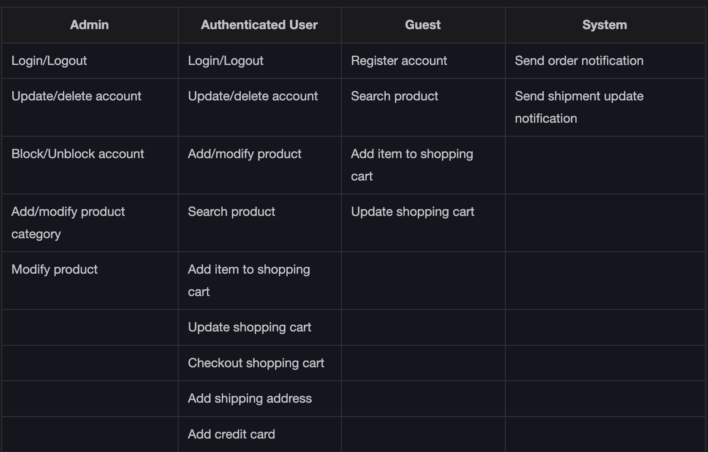
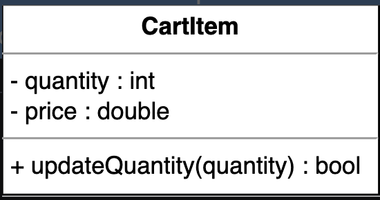

Getting Ready: The Amazon Online Shopping System

Problem definition

Amazon is an online retail platform that allows its users to buy from and sell products to other users in the system. There are numerous product categories that customers can search and choose from. Products have reviews and ratings that can help customers make a buying decision. Each customer has a shopping cart where they can add products they wish to order. Once customers have added their favorite products to the cart, they can check out the cart and choose a payment method to place their orders. The customers are notified about their order and shipment statuses until the order is delivered. The system also allows users to add products they want to sell.

Expectations from the interviewee

Numerous components are present in the Amazon online shopping system, each with specific constraints and requirements placed on them. The following provides an overview of some of the main things that the interviewer will want to hear you discuss in more detail during the interview.

Discoverability

For an online shopping system like Amazon, discoverability is one of the key features that distinguish it from others. You can ask the following questions to know more about the system:

How will the buyer discover a product?

How will the search surface result?

Cart and checkout

One of the most significant attributes of the online shopping system is the cart and checkout functionality that it provides to its customers. The interviewer expects the cart and checkout to behave in a certain way. You may ask the interviewer:

How will the design adhere to such known best practices while also introducing innovative checkout semantics like “one-click purchase?”

Payment methods

The interviewer expects you to ask questions about the payment methods to figure out the necessary requirements. You may ask the following questions:

How will the users pay? Will they use credit cards, gift cards, and so on?

How will the payment method work with the checkout process?

Product reviews and ratings

Product reviews and ratings help customers make informed decisions regarding what to buy. It is important to know how to make this feature an effective part of the system. You can ask the interviewer:

When can a user post a review and a rating?

How are useful reviews tracked and less useful reviews deprioritized?

Design approach

We will design this online shopping system using the bottom-up design approach. For this purpose, we will follow the steps below:

Identify and design the smallest components first, such as a product.

Use these small components to design bigger components, like a product category that contains different products.

Repeat the steps above until we design the whole system that contains multiple product categories and various users that use the system.

Design pattern

During an interview, it is always a good practice to discuss the design patterns that the amazon online shopping system falls under. Stating the design patterns gives the interviewer a positive impression and shows that the interviewee is well-versed in the advanced concepts of object-oriented design.

Requirements for the Amazon Online Shopping System

Requirement collection

The requirements for the Amazon online shopping system design problem are defined below:

R1: A customer can either be an authenticated user or a guest. The authenticated user is one with a registered account on the Amazon online shopping system, whereas a guest does not have a registered account.

R2: An authenticated user should be able to buy, sell, and search the products via the product name or category. A guest is only able to search for products.

R3: A product can have multiple reviews and ratings from multiple customers.

R4: An authenticated user should be able to add, remove, or modify product items in their shopping cart. The authenticated user can further check out and buy the items.

R5: The authenticated user should be able to specify a shipping address at the time of order.

R6: Payment can be made through credit cards, electronic bank transfers, or through cash on delivery.

R7: An order can be canceled, only in the case that it hasn’t been shipped.

R8: Notifications are sent whenever there is a change in the order or shipping status.

R9: Shipment can be tracked to see the current status and the estimated time of arrival for the order.

R10: An admin should exist that can add, modify, or remove product categories and block users.

Use Case Diagram for the Amazon Online Shopping System

System

Our system is the "Amazon shopping system."

Actors

Now, we’ll define the main actors of Amazon.

Primary actors

Authenticated user: This actor can search for products using the catalog, place or cancel orders, and add new products to sell.

Guest: The guest actor can search for products using the catalog, add items to a shopping cart and update it. However, it needs to become a registered/authenticated member to place an order.

Secondary actors

Admin: This can add, remove, or update an account as well as add, modify, or delete existing product categories.

System: This is responsible for sending out notifications for orders and shipping updates.

Use Cases

In this section, we will define the use cases for Amazon. We have listed down the use cases according to their respective interactions with a particular actor.

Note: You will see some use cases occurring multiple times because they are shared among different actors in the system.

Admin

Login/Logout: To log in or log out of your account on Amazon

Block/Unblock/Update/Delete account: To block, unblock, or delete an account as well as modify account details

Add/Modify/Delete product category: To add, modify, or delete product categories

Modify product: To modify the details of any existing product

Authenticated user

Login/Logout: To log in or log out of your account on Amazon

Update/Delete account: To delete an account or modify their own account details

Add/Modify/Delete product: To add a new product or modify the details of any existing product that a customer themselves added for selling. A user can also delete a product that they added for selling

Search product: To search for any particular product based on the given criteria (name or category)

Add item to shopping cart: To add an item to a shopping cart

Update shopping cart: To update the item quantities present in the shopping cart

Checkout shopping cart: To check out from the shopping cart into the payment section

Add shipping address: To add a shipping address

Add credit card: To pay the order amount via credit card

Guest

Register account: To register for an account on Amazon

Search product: To search for any particular product based on the given criteria (name or category)

Add item to shopping cart: To add an item to a shopping cart

Update shopping cart: To update the item quantities present in the shopping cart

System

Send order notification: To send a notification of an order after payment

Send shipment update notification: To send a notification of any updates in shipment

Relationships

Generalization

The “Authenticated User” actor has a generalization relationship with the “Guest” actor, as an authenticated user can perform all those tasks that a guest can perform.

We can search for a product by category and by product name. This shows that the “search product” use case has a generalization relationship with the “By product category catalog” and “By product name catalog” use cases.

Associations

Include

The “Add product” and “Modify product” use cases have an include relationship with the “Update catalog” use case since the catalog needs to be updated as well when any new product is added or the details of an existing product are modified.

The “Make payment” use case has an include relationship with the “Send order notification” use case, since once the payment has been made and verified, only then will the system generate a notification.

The “Cancel order” use case has an include relationship with the “Refund payment” use case, since this is part of the process.

Use case diagram

Class Diagram for the Amazon Online Shopping System

In this lesson, we’ll identify and design the classes, abstract classes, and interfaces based on the requirements that we have previously gathered from the interviewer in our Amazon shopping system.

Components of Amazon

As mentioned earlier, we should design the Amazon online shopping system using a bottom-up approach.

Customer

The Customer abstract class refers to a user trying to buy a product from Amazon. Hence, it can access the items present in the shopping cart through the getShoppingCart() function.

A customer can be one of the following:

Authenticated users

Guest users

The details of these are given below:

The AuthenticatedUser class refers to an individual that contains a registered account on Amazon.

The Guest class refers to an individual without an account who can only search for and view the products on the Amazon website and add them to the shopping cart. However, they need to register an account on Amazon to place an order.

R1: A customer can either be an authenticated user or a guest. The authenticated user has a registered account on the Amazon online shopping system, whereas a guest does not have a registered account.

Admin

The Admin class refers to an individual with a registered account on Amazon that can add, modify, or delete product categories and block users.

R10: An admin should exist that can add or modify product categories and block users.

Account

The Account class accesses and showcases the personal details of the authenticated user and the admin, who are the two types of registered accounts available in the system. Users with an account will have the option to add and access multiple shipping addresses as well as add and delete different products and product reviews.

R1: A customer can either be an authenticated user or a guest. The authenticated user is one with a registered account on the Amazon online shopping system, whereas a guest doesn’t have a registered account.

Product

The Product class contains the details of a particular product available on the Amazon shopping store. Each product will fall under a specific category present on Amazon and can have none, one, or more reviews.

R3: A product can have multiple reviews and ratings from multiple customers.

Product category

The ProductCategory class contains the names and descriptions of the various categories of products present on Amazon. It will also contain a reference to the list of products under a particular category.

R2: An authenticated user should be able to buy, sell, and search the products via the product name or category. A guest is only able to search for products.

Product review

The ProductReview class contains the rating and review attributes that a registered user can use to add a review about a particular product.

R3: A product can have multiple reviews and ratings from multiple customers.

Catalog

The Catalog class will contain a list of products of different names or categories.

R2: An authenticated user should be able to buy, sell, and search the products via the product name or category. A guest is only able to search for products.

Search

The Search class will be an interface that contains the functionalities relating to searching for products.

R2: An authenticated user should be able to buy, sell, and search the products via the product name or category. A guest is only able to search for products.

Cart item

The CartItem class refers to the items present in the shopping cart. It will have the price and quantity attributes which can be modified using the updateQuantity() function.

R4: An authenticated user should be able to add, remove, or modify product items in their shopping cart. The authenticated user can further check out and buy the items.

Shopping cart

The ShoppingCart class contains the list of cart items, upon which, actions such as adding items to the cart, removing items from the cart, and accessing all cart items can be performed.

R4: An authenticated user should be able to add, remove, or modify product items in their shopping cart. The authenticated user can further check out and buy the items.

Order

The Order class refers to a particular order of a customer and will keep track of the order status along with the option of sending the order to shipment. It will also be used to make the payment and log the order details.

R7: An order can be canceled, only in the case that it hasn’t been shipped.

Order log

The OrderLog class keeps a log of the order through its creation date and order status.

R7: An order can be canceled, only in the case that it hasn’t been shipped.

Shipment

The Shipment class keeps track of the date on which the order was shipped, its estimated arrival time, and the shipment method. It will also be used to log the shipment details.

R9: Shipment can be tracked to see the current status and the estimated time of arrival for the order.

Shipment log

The ShipmentLog class keeps a log of the shipment through its creation date and shipment status.

R9: Shipment can be tracked to see the current status and the estimated time of arrival for the order.

Payment

The Payment class will have three child classes: CreditCard, ElectronicBankTransfer, and Cash since these are the three payment methods available to a customer on Amazon.

R6: Payment can be made through credit cards, electronic bank transfers, or through cash on delivery.

Notification

The Notification class is responsible for sending order and shipment notifications to customers through either email or SMS

Note: Since the Notification class can be extended by adding various other options, we will implement it as an abstract class.

R8: Notifications are sent whenever there is a change in the order or shipping status.

Enumerations

The following is the list of enumerations required in Amazon:

AccountStatus: The account status tells about the user account status, whether it is active, inactive, or blocked.

PaymentStatus: The payment status tells about the user account status, whether it is confirmed, declined, pending, or refunded.

OrderStatus: The order status describes the status of a particular order of a customer, whether it is unshipped, pending, shipped, confirmed, or canceled.hipped, confirmed, or canceled.

ShipmentStatus: The shipment status tells us about the status of an order’s shipment, whether it is in a pending state, shipped state, delivered state, or on hold.

Custom data type

We need to create a custom data type, Address, that will store the location of a customer.

Relationship between the classes

Now, we’ll discuss the relationships between the classes we have defined in our Amazon shopping system above.

Association

The class diagram has the following association relationships:

The Guest class has a one-way association with Search.

The Notification class has a two-way association with ShipmentLog and OrderLog.

The Product class has a two-way association with Account and CartItem and a one-way association with ProductCategory and ProductReview.

The ShoppingCart class has a two-way association with CartItem.

The Order class has a two-way association with Payment and a one-way association with Shipment and ShoppingCart.

Composition

The class diagram has the following composition relationships:

The Shipment class is composed of the ShipmentLog class.

The Account class is composed of the CreditCard, ElectronicBankTranfer, Admin, and AuthenticatedUser classes.

The AuthenticatedUser class is composed of the Order class which itself is composed of the OrderLog class.

The Customer class is composed of the ShoppingCart class.

Aggregation

The following classes show an aggregation relationship:

The Product class contains the Catalog class.

Generalization

The following classes show a generalization relationship:

The Catalog class implements the Search class.

Inheritance

The following classes show an inheritance relationship:

Both Guest and AuthenticatedUser extend the Customer class.

Both EmailNotification and SMSNotification extend the Notification class.

Subclasses Cash, ElectronicBankTransfer, and CreditCard extend the Payment class.

Note: We have already discussed the inheritance relationship between classes in the component section above.

Class diagram of Amazon

Design pattern

In the Amazon online shopping system, we can use the Factory design pattern to maintain different orders and the bill generation process based on the products selected by a customer.

We know that in the Amazon-online shopping system, various items are on sale, or items can be bought using special coupons that give different percentage discounts. To effectively calculate prices for different discount types, we can use the Strategy design pattern. This pattern allows us to design a separate strategy or algorithm to calculate the prices for each discount type.

Additional requirements

The interviewer can introduce some additional requirements in the Amazon shopping system, or they can ask some follow-up questions. Let’s see some examples of additional requirements:

Wish list: Only users with an account (an authenticated user) can add a product to their wishlist. The WishList class can be used to move products to a cart and also check if it is currently available:

Discount: A discount will be applied to the payment depending on special events such as Christmas, Black Friday, and so on. The class diagram provided below shows the relationship of Discount with the Payment class:

Sequence Diagram for the Amazon Online Shopping System

Sequence challenge: Search and add items to the cart

Activity Diagram for the Amazon Online Shopping System

A customer buying a product

The following are the states and actions that will be involved in this activity diagram.

States

Initial state: The customer opens Amazon.

Final state: The customer proceeds with checkout.

Actions

The customer opens the website. They either search or browse the website, select a product, and proceed to buy it.

Activity challenge: The customer receives their order

Constants

The following code provides the definition of the various enums and custom data types being used in the Amazon design:

Account

The Account class refers to an account of a customer on Amazon and contains the personal details of a customer, such as their name, shipping address, credit card information, etc. It also provides authenticated users and admins with the functionality to add products, product reviews, and reset passwords. 

Admin

The Admin class refers to a person from the administration of Amazon that can block users, and add, modify, or delete product categories.

Customer

The Customer class is an abstract class that has the AuthenticatedUser and Guest classes derived from it

Product, product category, and product review

Shopping cart and cart items

The ShoppingCart and CartItem classes are used to add items to the shopping cart, update the quantities, and send the list of items to checkout.

Order and order log

The Order class is responsible for making the payment, updating the order status, and sending the particular order to shipment. The OrderLog class creates the log of the order and is referenced in the Order class to keep track of all the orders. 

Shipment and shipment log

The Shipment class keeps track of all the major details of the order’s dispatch and creates the shipment record using the ShipmentLog class. 

Payment

The Payment class is another abstract class with the ElectronicBankTranfer, CreditCard, and Cash classes as its child classes. This takes the PaymentStatus enum to keep track of the payment status.

Notification

The Notification class is responsible for sending notifications to customers about the order and shipment status either via SMS or email. Since you can extend this by adding more options, the Notification class will be an abstract class.

Search and catalog

The Catalog class contains the product information and implements the Search interface class to enable the search functionality based on the given criteria (name and category of product).

