Problem definition

An Automated teller machine (ATM) allows a bank customer to perform financial transactions remotely without the need for a teller or a bank branch. These transactions include deposits, withdrawals, balance inquiries, and account transfers. ATMs are located in convenient locations such as banks, grocery stores, airports, and other public places.

To use an ATM, users need a bank card associated with an account at a financial institution to use an ATM. To access their account, users must also know the personal identification number (PIN). The user can follow the prompts on the ATM's screen to complete the desired transaction with the PIN.

ATM components

To better understand an ATM system, you may ask the interviewer the following questions:

What are the components of an ATM?

Is the ATM necessarily placed inside a room?

Does an ATM have a fingerprint scanner?

ATM features

Different ATMs may vary in terms of features which is why it is important to clear the following questions from the interviewer:

What is the withdrawal limit of an ATM?

Can we check our account balance using an ATM?

Can we set a PIN using an ATM?

ATM processing

The interviewer would expect you to ask a question regarding the processing of transactions using an ATM. Therefore, you may ask the following questions:

What happens when the amount entered by the user for withdrawal is greater than the user's account balance?

What happens when the amount entered by the user for withdrawal is greater than the ATM's cash limit?

What happens when the amount entered by the user exceeds the total cash present in the ATM?

Can the ATM be used for online transactions?

Design approach

We are going to design this ATM system using the bottom-up design approach. For this purpose, we will follow the steps below:

Identify and design the smallest components first—the screen, keypad, cash dispenser, printer, and card reader.

Use these small components to design bigger ATM components—the state, machine, and room.

Repeat the steps above until we design the whole ATM system.

Design pattern

During an interview, it is always a good practice to discuss the design patterns that the ATM system falls under. Stating the design patterns gives the interviewer a positive impression and shows that the interviewee is well-versed in the advanced concepts of object-oriented design.

Requirements for the ATM System

Requirement collection

R1: Each user has a single account at the bank that they can access by inserting their card into the ATM.

R2: The main components of the ATM system that facilitate interactions between the user and the machine are listed below:

Card reader: To read the user's ATM card

Keypad: To enter information such as the user's PIN

Screen: To display messages to the user, such as prompts or error messages

Cash dispenser: To dispense cash to the user

Printer: To print receipts for the user

Network infrastructure: To connect with the bank's computer system in order to access account information and complete transactions

R3: The ATM system must authenticate the user based on the PIN they enter to ensure that only authorized users can access their accounts.

R4: All transactions are possible after the successful authentication of the ATM card.

R5: The user can have two types of accounts—current and savings—and can perform the following operations on the ATM:

Balance inquiry

Cash withdrawal

Funds/money transfer

R6: At the end of a transaction, the user has the option to start another transaction or end their session.

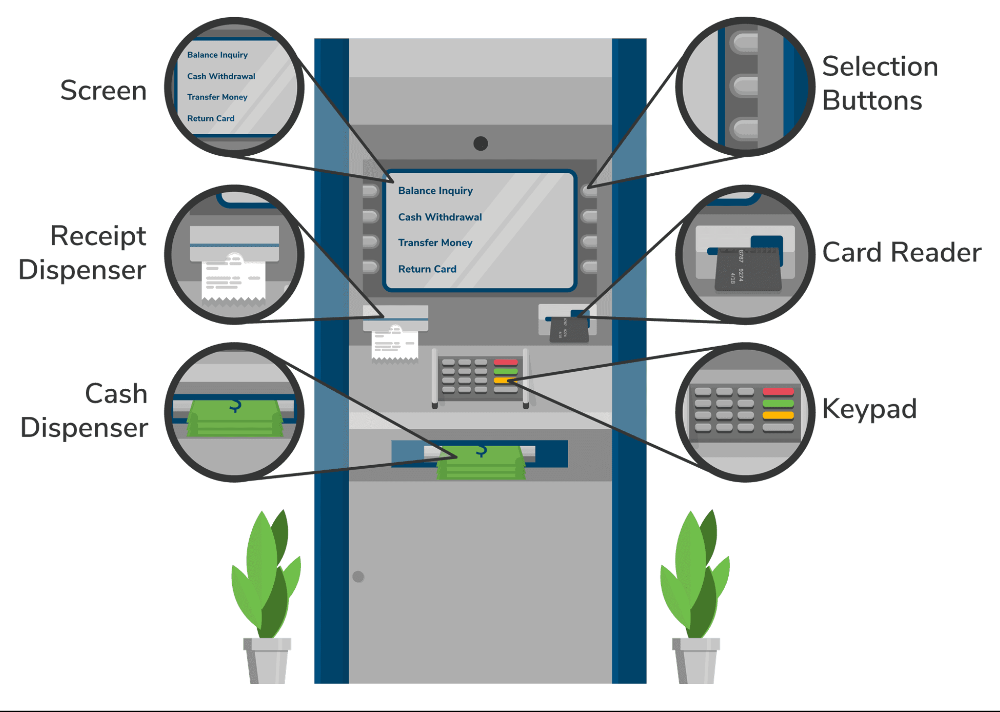

Use Case Diagram for the ATM System

System

Our system is an "ATM."

Actors

Let’s define the main actors of our ATM system.

Primary actors

Cardholder: This is the primary actor of the ATM who inserts or removes the ATM card, performs or cancels the transaction, and changes the PIN.

Secondary actors

Card issuer: This actor verifies the cardholder's identity, checks for sufficient funds, checks the cardholder's account transaction limit, and blocks/unblocks the cardholder's account.

System: This actor checks for sufficient funds in the ATM, checks the ATM’s transaction limit, and verifies the cardholder's identity. This actor also returns the card and dispenses the amount and receipts.

Operator: The operator is responsible for starting and shutting down the system. It can refill printer receipts and cash dispensers.

Use Cases

In this section, we will define the use cases for the ATM. We have listed the use cases according to their respective interactions with a particular actor.

Cardholder

Insert card: To insert an ATM card into ATM

Transaction: To perform an operation—balance inquiry, deposit, fund transfer, or cash withdrawal

Change pin: To change the PIN of the ATM card

Cancel transaction: To cancel a transaction

Card issuer

Verifying the cardholder's identity: To validate the card and cardholder's bank account details

Check sufficient funds in account: To check if the cardholder's bank account has more or equal funds than the fund being withdrawn or transferred

Check account transaction limits: To check if the transaction limits of the cardholder's bank account are more or equal to the funds being withdrawn or transferred

Block/Unblock account: To block or unblock the cardholder's bank account

System

Verifying the cardholder's identity: To validate the card and cardholder's bank account details

Check sufficient funds in ATM: To check if the ATM has more or equal funds than the fund being withdrawn or transferred

Check ATM withdrawal limits: To check if the transaction limits of the ATM are more or equal to the funds being withdrawn or transferred

Return card: To return the card after completing or canceling the transaction

Dispense money: To dispense cash in case of cash withdrawal from an ATM

Dispense receipt: To dispense cash after completing the transaction

Operator

System startup/shutdown: To start and shutdown the ATM session

Refill printer receipts: To refill the paper in the printer

Refill cash dispenser: To refill the cash in the dispenser

Relationships

This section describes the relationships between and among actors as well as their use cases.

The “Transaction” use case has a generalization relationship with the “Balance Inquiry,” “Deposit,” “Transfer,” and “Cash withdrawal,” because a cardholder can use any of these options to perform a transaction.

Associations

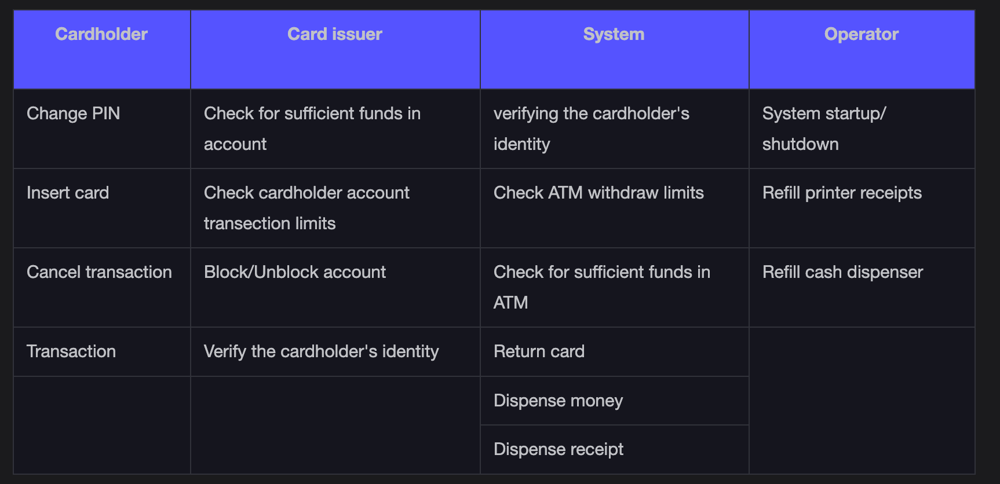

Extend

The “Transaction” use case has an extend relationship with the “Dispense receipt” use case because we have the option to get a receipt in the case of transactions.

Include

When the cardholder inserts the card into the ATM, both the bank and card issuer verify the card and the cardholder's account. Therefore, the “Insert card” use case has an include relationship with the “Verifying the cardholder's identity” use case.

When the cardholder performs a fund transfer from an ATM, the card issuer verifies two things—if the cardholder's bank account has sufficient funds and if the amount being transferred is within its account's transaction limits. Therefore, the “Transfer” use case has an include relationship with both “Check sufficient funds in account” and “Check account transaction limits.”

When the cardholder withdraws cash from an ATM, the card issuer verifies two things—if the cardholder's bank account has sufficient funds and if the amount being withdrawn is within its account's transaction limits. The bank also verifies two things—if the ATM has sufficient funds and if the amount being withdrawn is within ATM's withdrawal limits. Therefore, the “Cash withdrawal” use case has an include relationship with “Check sufficient funds in the account,” “Check account transaction limits,” “Check sufficient funds in ATM,” and “Check ATM withdrawal limits.”

The last cash withdrawal process is the system depositing the money. Therefore, the “Cash Withdrawal” use case has an include relationship with the “Dispense money’ use case.

When a transaction is performed or canceled, the ATM card is ejected by the ATM. Therefore, both the “Transaction” use case and the “Cancel Transaction” use case have an include relationship with the “Return card” use case.

Use case diagram

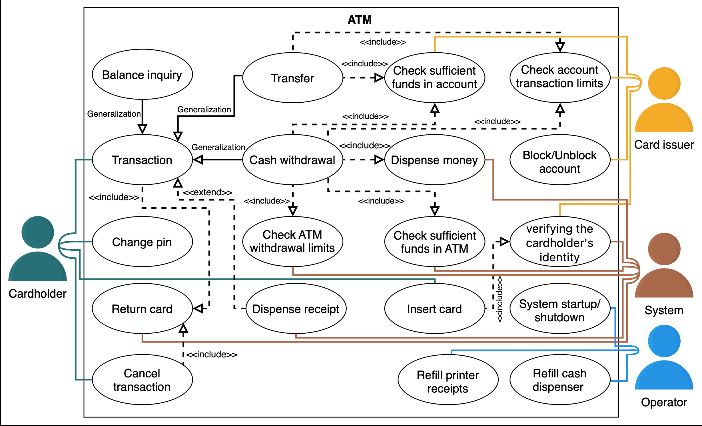

Class Diagram for the ATM System

User

The User class represents a user with an ATM card and a bank account.

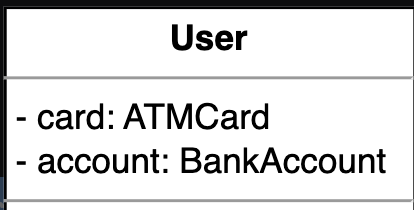

Each user has a single account at the bank that they can access by inserting their card into the ATM.

ATM card

The ATMCard class is identified by the card number, customer name, expiration date, and the user's PIN.

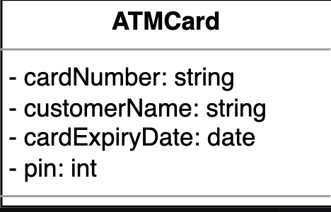

R4: All transactions are possible after the successful authentication of the ATM card.

Bank account

BankAccount is a parent class with two types: SavingAccount and CurrentAccount. These classes are derived from the BankAccount class. This class stores the account number, total balance, and the user's available balance.

SavingAccount: This derived class represents a saving account with a withdrawal limit.

CurrentAccount: This derived class represents a current/checking account with a withdrawal limit.

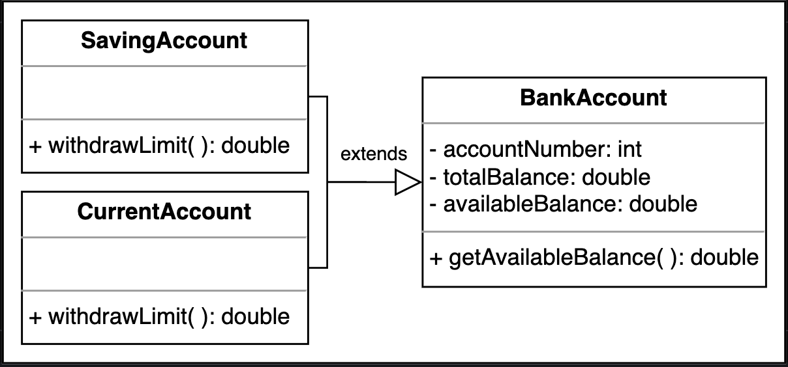

R1: Each user has a single account at the bank that they can access by inserting their card into the ATM.

R5: The user can have two types of accounts—current and savings—and can perform the following operations on the ATM:

Balance inquiry
Cash withdrawal
Funds/money transfer

Bank

The Bank class represents a bank with a name and a bank code. A bank may or may not have an ATM.

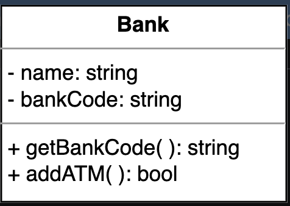

R1: Each user has a single account at the bank that they can access by inserting their card into the ATM.

Card reader, cash dispenser, keypad, screen, and printer

CardReader: This class accepts or rejects a card.

CashDispenser: This class provides the required amount specified by the user in cash.

Keypad: This class allows the user to enter the PIN.

Screen: This class represents a screen that displays information upon insertion of the card.

Printer: This class represents a printer that prints the transaction/withdrawal receipts for the user.

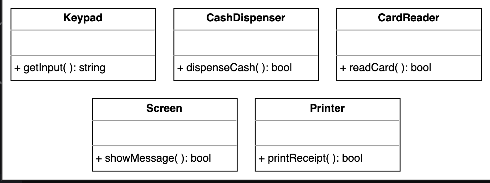

R2: The main components of the ATM system that facilitate interactions between the user and the machine are listed below:

Card reader: To read the user’s ATM card
Keypad: To enter information such as the user’s PIN
Screen: To display messages to the user, such as prompts or error messages
Cash dispenser: To dispense cash to the user
Printer: To print receipts for the user
Network infrastructure: To connect with the bank’s computer system in order to access account information and complete transactions

ATM state

ATMState is an abstract class with six types: CheckBalanaceState, CashWithdrawalState, TransferMoneyState, HasCardState, IdleState, and SelectOperationState. These classes are derived from the ATMState class. This class decides the state of the ATM system and several states including the return card and exit of the ATM system.

CheckBalanceState: This class represents the state that allows users to check their account balance.

CashWithdrawalState: This class represents the state that allows users to withdraw cash.

TransferMoneyState: This class represents the state that allows users to transfer money.

HasCardState: This class represents the state that checks whether or not the user has a valid card and authenticates the card’s PIN.

IdleState: This class represents the state where the ATM system is idle and is not performing any functions.

SelectOperationState: This class represents the state that allows users to select an operation for the ATM to perform.

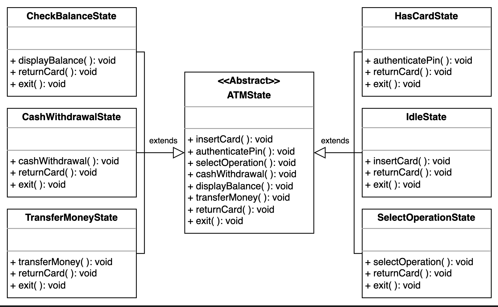

ATM

An ATM class can either have an idle state or can be performing an operation. It has a limited number of hundred, twenty, and two dollar bills.

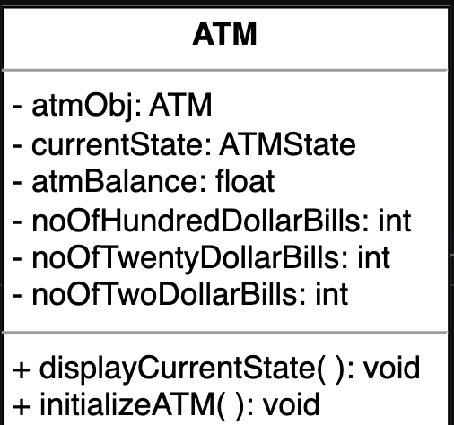

ATM room

An ATMRoom class has an ATM and may or may not have a user.

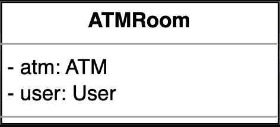

Enumerations and custom data types

The following provides an overview of the enumerations and custom data types used in this problem.

ATMStatus: This enumeration keeps track of the following states of an ATM:

Idle

Card inserted by the user

Option selected

Cash withdrawal

Transfer money

Display the account balance

TransactionType: This enumeration represents the following transactions:

Balance inquiry

Cash withdrawal

Funds/money transfer

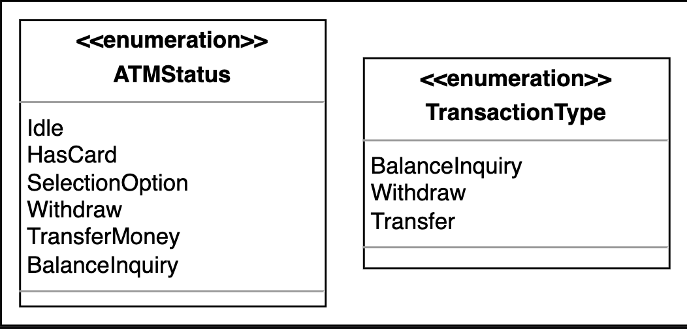

Relationship between the classes

Association

The class diagram has the following association relationships:

The ATMRoom class has a one-way association with User and ATM.

The User class has a one-way association with ATMCard and BankAccount.

The ATMCard class has a one-way association with BankAccount.

The ATM class has a one-way association with Bank and ATMState.

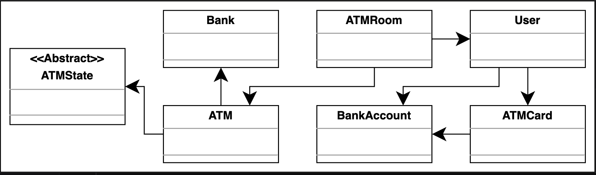

Composition

The class diagram has the following composition relationships.

The ATM class is composed of Printer, Keypad, Screen, CardReader, and CashDispenser.

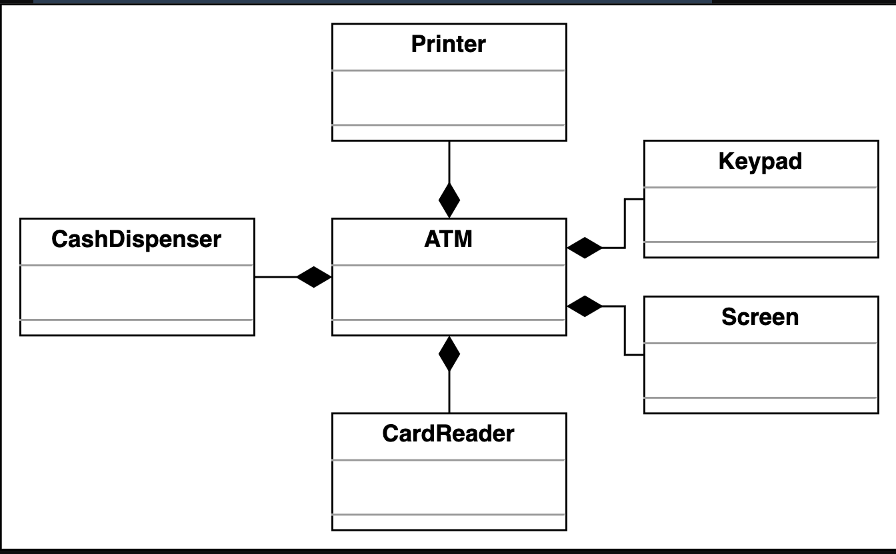

Inheritance

The following classes show an inheritance relationship:

Both, SavingAccount and CurrentAccount, extend the BankAccount class.

The CheckBalanceState, CashWithdrawalState, TransferMoneyState, HasCardState, IdleState, and SelectOperationState classes extend the abstract class, ATMState.

Class diagram for the ATM System

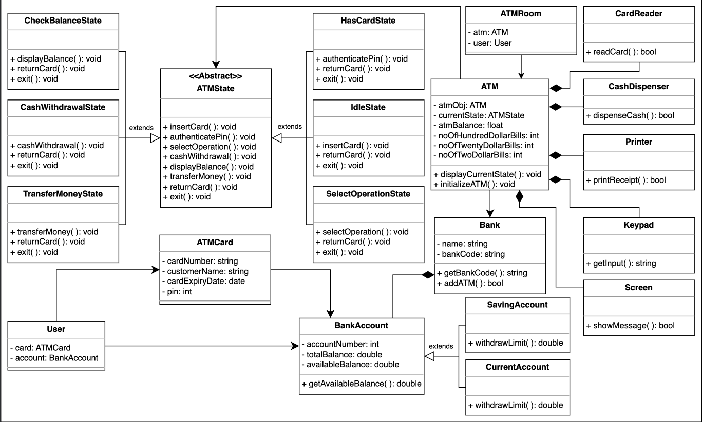

Design pattern

The following design patterns have been used in the class diagram:

The Singleton design pattern: This pattern ensures the existence of a single instance of the ATM at a given moment that can be accessed by multiple users, due to the shared nature of the ATM components.

The State design pattern: This pattern enables the ATM to alter its behavior based on the internal changes in the machine. This way, an ATM can transition from one state to another, like switching from an idle state to displaying an account balance or money withdrawal state, and as soon as all the operations have been performed, it can switch back to the initial idle state.

The following design patterns can also be used to design ATM:

The Composite design pattern can be used to combine different components of the ATM along with their functionalities.

The Builder design pattern allows the same processes for a complex object to have different representations. In the ATM system, it can help separate different kinds of transactions like withdrawals, deposits, etc.

Additional requirements

There is a chance that the interviewer might ask about the working of the cash withdrawal process. How can it be implemented in our ATM system? This addition is a bit challenging since we need a system that can withdraw the correct combinations of hundred, twenty, and two dollar bills, respectively, according to the amount specified by the user. The system also needs to work sequentially until the required amount is met.

We will use the Chain of Responsibility design pattern to tackle this addition to our system. This design pattern will ensure the correct division of the dollar bills in the ATM by creating a chain of handlers that forward the requests based on the situation until all the requirements are met.
We have created the following classes to implement the Chain of Responsibility design pattern:

CashWithdrawProcessor: This is associated with the CashWithdrawalState class. This abstract class is extended by HundredDollarWithdrawProcessor, TwentyDollarWithdrawProcessor, and TwoDollarWithdrawProcessor.

HundredDollarWithdrawProcessor: This class is derived from CashWithdrawProcessor and is responsible for withdrawing hundred-dollar bills based on the requirement.

TwentyDollarWithdrawProcessor: This class is derived from CashWithdrawProcessor and is responsible for withdrawing twenty-dollar bills based on the requirement.

TwoDollarWithdrawProcessor: This class is derived from CashWithdrawProcessor and is responsible for withdrawing two-dollar bills based on the requirement.

Valid Amount: If the amount entered by the user has a modulus equal to zero with any of the specified bills that the ATM can withdraw, then the amount is considered valid for the transaction. If the amount is invalid, then the transaction will not be processed.

For example, a user wants to withdraw $548. The HundredDollarWithdrawProcessor class will start the cash withdrawal using the cashWithdrawal() method by taking out five bills of hundred dollars. Now that we have $48 to withdraw for the user which is less than a hundred dollars, the TwentyDollarWithdrawProcessor class will start withdrawing dollar bills. This class will take out two bills of twenty dollars with $8 remaining. Since two dollars is less than twenty, the cashWithdrawal() method of the TwoDollarWithdrawProcessor will take out four bills of $2 for the user. The withdrawal, in this case, is successful.

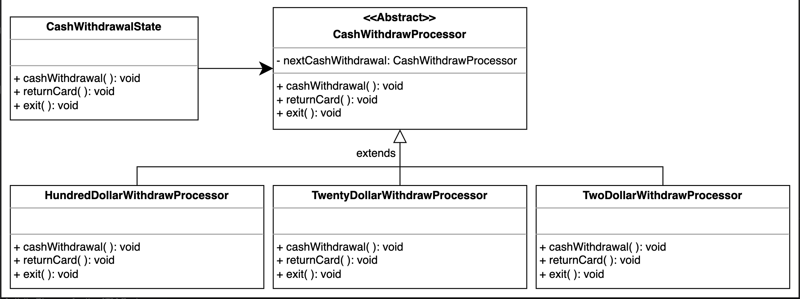

Sequence Diagram for the ATM System

Balance inquiry

objects that will interact with each other:

Actors: Cardholder, Card issuer

Objects: ATM and Printer

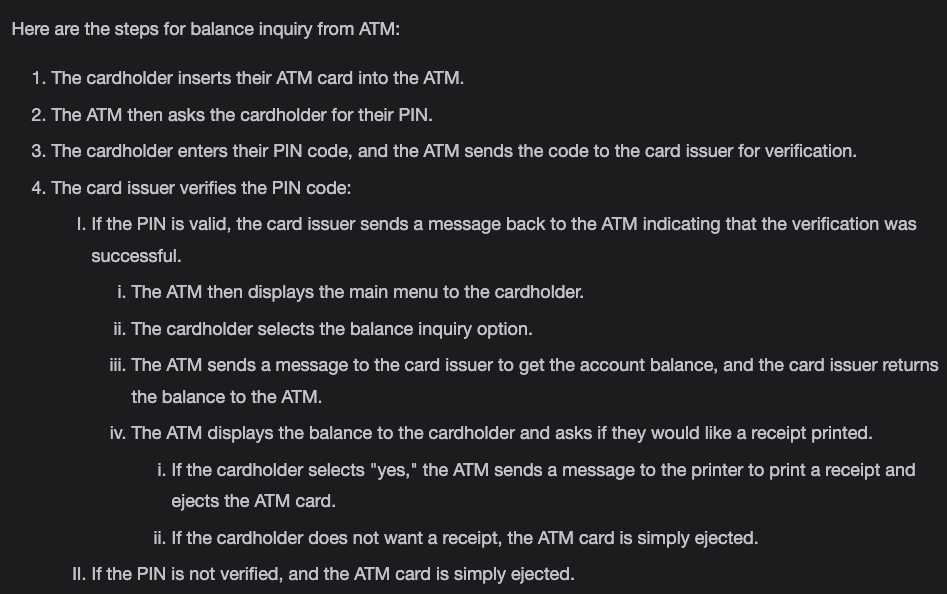

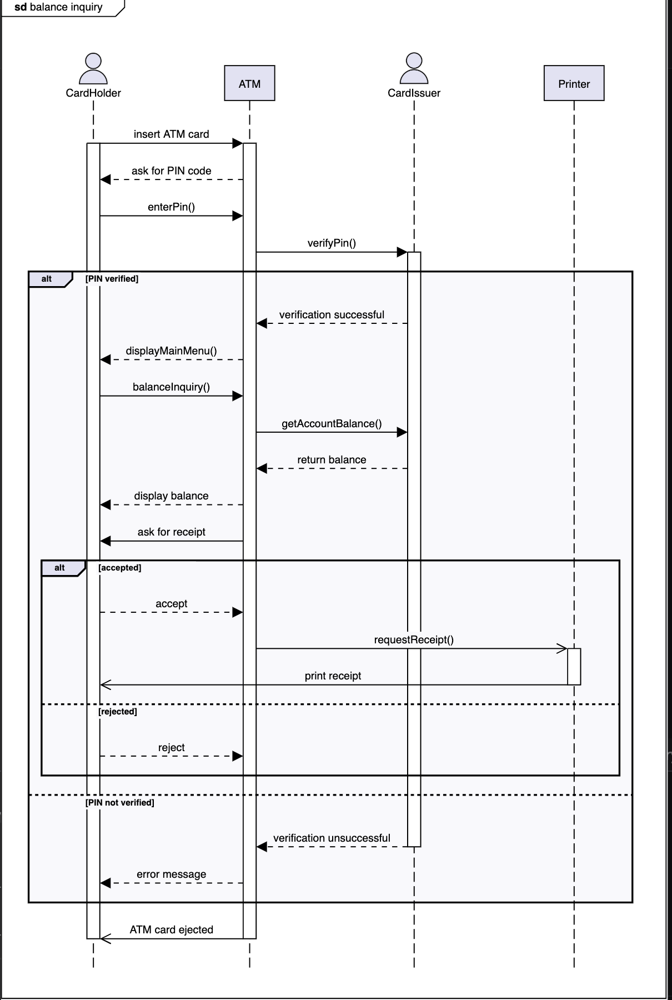

Activity Diagram for the ATM System

The cardholder performs ATM transactions

The followings are the states and actions that will be involved in this activity diagram.

States

Initial state: The cardholder inserts an ATM card.

Final state: There are two final states in this activity diagram as shown below:

The cardholder gets an error message for the wrong ATM PIN.

The cardholder performs a transaction successfully.

Actions

The cardholder approaches the ATM, inserts their card, and enters their PIN. If the PIN is correct, they are allowed to perform a transaction. If the PIN is incorrect, the ATM returns the card. The cardholder then has the option to select from four different transactions. After completing their chosen transaction, the cardholder receives their card back from the ATM.

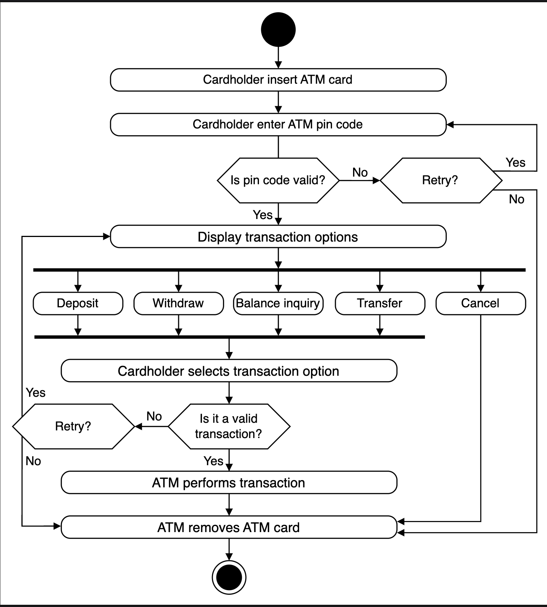

Activity challenge: The cardholder performs an ATM cash withdrawal

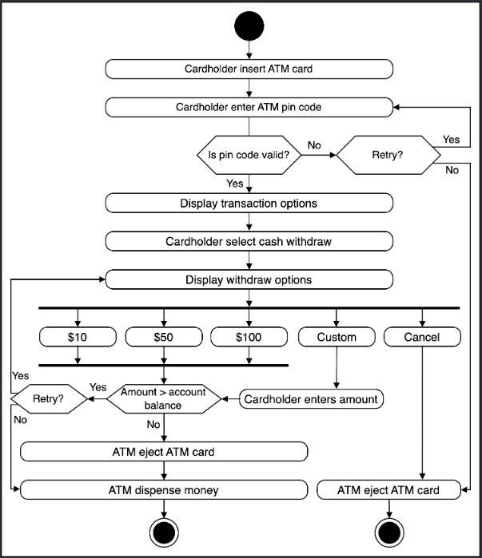

Code for the ATM System

Enumerations

The following code provides the definition of the enumeration used in the ATM system.

ATMStatus: This enumeration keeps track of the following states of an ATM:

Idle

Card inserted by the user

Option selected

Cash withdrawal

Money transfer

Display the account balance

User and ATM card

The User class stores the user's ATMcard and bank account, where the ATMCard class holds the card number, customer name, card expiration date, and PIN.

Bank and bank account

The Bank class represents a bank having a name and code and can also add an ATM. The BankAccount class represents a bank account that has two child classes: SavingAccount and CurrentAccount. These derived classes have a method for finding the withdrawal limit

Card reader, card dispenser, printer, screen, and keypad

The CardReader, CashDispenser, Keypad, Screen and Printer classes compose the ATM and have the following functionalities:

CardReader: It reads the card inserted by the user.

CashDispenser: It dispenses cash upon withdrawal request.

Keypad: It is used by the user to enter the PIN for authentication.

Screen: It displays messages.

Printer: It prints receipts.

ATM state

ATMState is an abstract class that is extended by IdleState, HasCardState, SelectOperationState, CheckBalanceState, CashWithdrawalState and TransferMoneyState. All of these derived classes override the returnCard() and exit() functions of the ATMState class. The derived classes individually override the following functions:

IdleState: This class overrides the insertCard() function.

HasCardState: This class overrides the authenticatePin() function.

SelectOperationState: This class overrides the selectOperation() function.

CheckBalanceState: This class overrides the displayBalance() function.

CashWithdrawalState: This class overrides the cashWithdrawal() function.

TransferMoneyState: This class overrides the transferMoney() function.

ATM and ATM room

An ATMRoom has an ATM and a User with the following:

A specific state at a given moment

Balance

A limited number of hundred, fifty, and ten dollar bills

