Blackjack is one of the most played games in casinos. In this game, several players play against the dealer. The objective of the game is to get closer to 21 than the dealer without exceeding the 21 points. This game is played with a deck of cards. Each card has a specific value associated with it, and these values are compared. The value of an ace card can be 1 or 11 points while cards of 10, Jack, Queen, and King value 10 points. Whereas, cards 2-9 have the same values as the number written on them. Hence, the player having one ace and a face card (King, Queen, or Jack card.) or a 10 card has 21 points. This is called Blackjack.

At the start of the game, a bet is placed by a player, and then the dealer will create hands (Each player and the dealer get two cards each.). All players have both cards exposed while the dealer has one card exposed and one card hidden. Now, both the dealer and the player can hit (Draw an additional card.) a card and ensure that they should not get over 21. Anyone exceeding 21 points, busts and loses the bet. The player can stand pat (Stop taking cards) at any time. When a player stops taking cards, if the player has more points than the dealer but less than 22, they win the bet.

Players in the game

How many players can play Blackjack?

Can players play the game against each other?

Point dynamics

Upto how many points can the player or the dealer hit the card?

What will happen if the dealer and the player both get the same points?

Card limit

Is there a limit on the number of cards the player take?

Design approach

We are going to design this Blackjack game system using the bottom-up design approach. For this purpose, we will follow the steps below:

Identify and design the smallest components first–the card, and player.

Use these small components to design bigger components, for example, the deck and controller.

Repeat the steps above until we design the whole Blackjack game.

bottom-up design approach

Requirements

R1: The Blackjack game contains the shoe of cards which contains one or more decks of cards in it.

R2: The deck will consist of 52 cards in four suits, where each suit contains 13 cards: The ace, 1, 2, 3, 4, 5, 6, 7, 8, 9, 10, Jack, Queen, and King.

R3: Every card has points associated with it. The criteria to calculate the face value of the card is as follows:

Ace - 1 or 11
From 2 to 10 equals
Face cards King,Queen and Jack - 10

R4: There can be two types of users that can play the Blackjack game, i.e., the dealer and the player.

R5: The player places a bet at the start of the game.

R6: The dealer will deal two cards to themselves and two to each player at the start of the game.

R7: The player will have both cards exposed, while the dealer has one card facing up and the other card down.

R8: The player can hit (Draw an additional card.)  if their hand has less than 21 points.

R9: The dealer can hit if their hand is less than 17.

R10: If a player or the dealer’s hand is more than 21, they bust and lose the game.

R11: The player can decide to not get a further card by standing pat.

R12: At the end, if the points of the player are more than that of the dealer but less than 21, then they win the game and get 100 percent profit.

R13: If a player gets 21 points by winning an ace and a face card or 10, then they are called a Blackjack and get 150 percent profit.

R14: If the player and the dealer have the same points at the end of the game, the player can take their bet money back or can replay the game.

R15: If the player left a game in the middle of the game, the dealer will win the game.

use case diagram

System

Our system is a "Blackjack game."

Actors

Now, we’ll define the main actors of our Blackjack game.

Primary actors

Player: This actor is the main player of the game. This actor plays the game, which includes placing a bet, hit or stand, or quitting the game. This can also create, edit, or update its account.

Secondary actors

Dealer: This is the secondary actor of the game, who manages the Blackjack table, dealing cards, and completing the payout of earnings. This actor can also manage the accounts and memberships of members.

Player

Join a game: To join a new Blackjack game

Place bet: To place a bet for the game

View open games: To view open games that are waiting for the player to start

Resigns a game: To leave a game in the middle of the game

Hit: To request an extra card from the dealer

Stand: To hold your cards and skip your turn

Create account: To create a new account in the Blackjack game

Update account: To update account information or password in the Blackjack game

Reset password: To update the account password in the Blackjack game

Cancel membership: To cancel membership in the Blackjack game

Login/Logout: To log in and out of the Blackjack game

Dealer

Create a new game: To start a new Blackjack game

View open games: To view open games that are waiting for the player to start

Create hands: To give two cards to the player and two cards to the dealer

Draw card: To add cards from the deck to the player and dealer's hand

Collect or payout: To give or take money after the game ends, depending upon the game's result

Block member: To block any member to ensure they can't play the game

Create account: To create a new account in the Blackjack game

Update account: To update account information or password in the Blackjack game

Reset password: To update the account password in the Blackjack game

Cancel membership: To cancel membership in the Blackjack game

Login/Logout: To log in and out of the Blackjack game

Include

The "Create hand" use case and the "Hit" use case has an include relationship with the "Draw card" use case because, at the start of the game, we draw cards to create hands, and in the middle, we draw cards when the player chooses to "Hit."

Whenever a player chooses to "Stand," their turn is skipped. Then, if the dealer card total is more than 16, the dealer and player's card total is compared with each other. According to the result of the game, the dealer either collects or pays the money. So the "Stand" use case has an include relationship with the "Collect or payout" use case.

Extend

The "Cancel membership" use case and "Block member" use case have an extend relationship with the "Modify member" use case, because whenever we cancel someone's membership or block someone, we modify the member status.

Whenever the account password is changed, the account is updated. Hence, the "Reset password" use case has an extend relationship with the "Update account" use case.

use case diagram

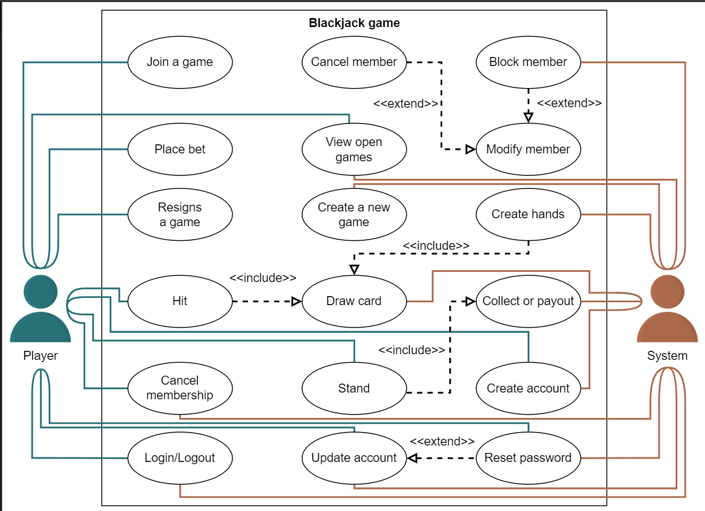

Class Diagram for the Online Blackjack Game

Card

Card belongs to a suit and has a face value. The face value of the card is according to the card number. For example, if we have a number card 5, its face value is also 5. The face value for the King, Queen, and Jack is 10, and 1 or 11 for the Ace, depending on the situation.

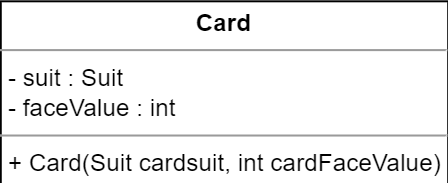

R3: Every card has points associated with it. The criteria to calculate the face value of the card is as follows:

Deck

Deck has 52 cards of four suits, and one suit contains nine number cards (2–10) and four face cards (King, Queen, Jack, and Ace). The Deck class contains a list of cards where the top card is in the first index.

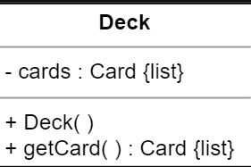

R2: The deck will consist of 52 cards in four suits, where each suit contains 13 cards: Ace, 1, 2, 3, 4, 5, 6, 7, 8, 9, 10, Jack, Queen, and King.

Shoe

Shoe is a device to hold multiple Deck, and it has a shuffle operation.

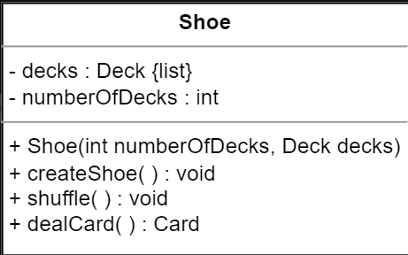

R1: The Blackjack game contains the shoe of cards which contains one or more decks of cards in it.

Hand

The Hand class represents a Blackjack hand used in this game which can contain multiple cards.

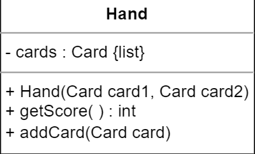

R8: The player can draw the additional card if their hand has less than 21 points.

R9: The dealer can draw an additional card if their hand is less than 17.

R10: If a player or the dealer’s hand is more than 21, they bust and lose the game.

Players

Player is an abstract class. There are two types of players: BlackjackPlayer and Dealer. These classes can be derived from the Player class.

BlackjackPlayer: They place the first wager and update the stake with winning and losing sums. They can choose between hit and stand options.

Dealer: They are primarily in charge of dealing cards and following the Blackjack rules.

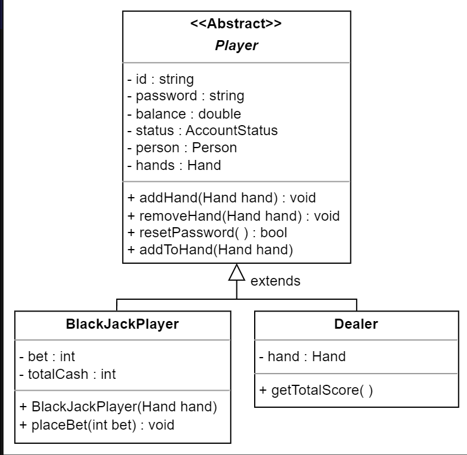

R4: There can be two types of users that can play the Blackjack game, i.e., dealer and the player.

Blackjack controller

The BlackjackController class validates the action(hit, stand) and responds accordingly.

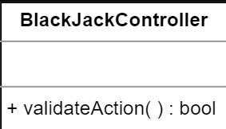

Blackjack game view

The BlackjackGameView class represents the game view. The BlackjackGame class updates the BlackjackGameView class.

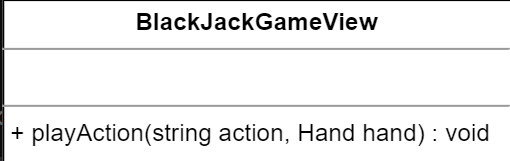

Blackjack game

The BlackjackGame class represents how we can play this game or its basic sequence of play. It controls the game, accepts wagers from players, and distributes cards from the Shoe to hands, updates the game's status, gathers lost wagers, pays winning wagers, divides hands, and responds to player decisions to hit or stand.

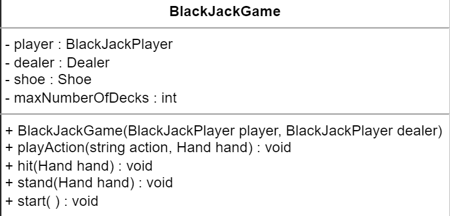

R1: The Blackjack game contains the shoe of cards which contains one or more decks of cards in it.

Enumerations and custom data types

Suit: We need to create an enumeration to keep track of the suit of the card, whether it is diamond, spade, heart, or club.

AccountStatus: We need to create an enumeration to keep track of the account status, whether it is active, canceled, closed, blocked, or none.

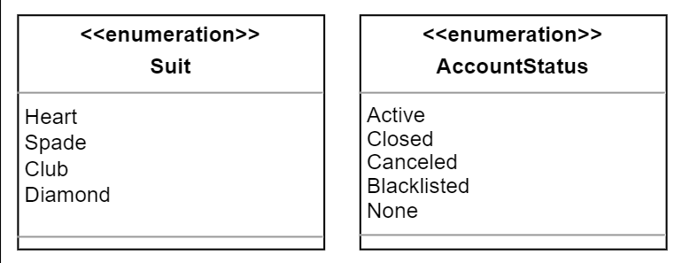

Person: Used to store information related to a person like a name, street address, country, etc.

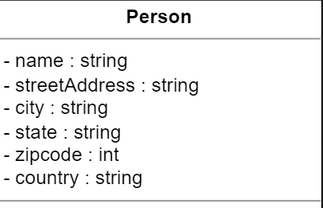

Association

The class diagram has the following association relationships:

The Shoe class has a one-way association with Deck.

The BlackjackGame class has a one-way association with BlackjackGameView.

The BlackjackController class has a one-way association with BlackjackGame.

The Player class has a one-way association with BlackjackGame and BlackjackController.

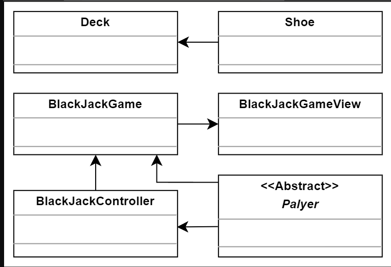

Aggregation

The class diagram has the following aggregation relationships.

The BlackjackGame class contains the Dealer and BlackjackPlayer.

Both the Deck and Hand classes contain the Card class.

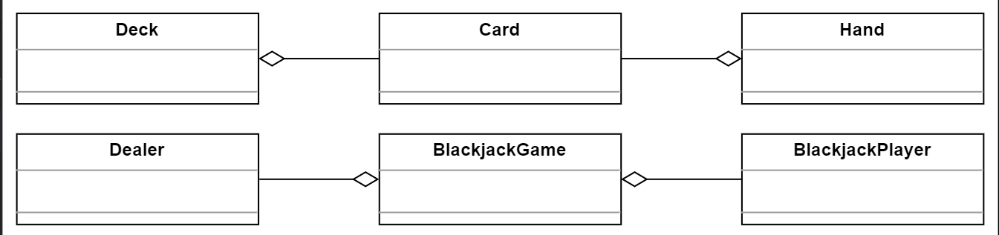

Composition

The class diagram has the following composition relationships.

The BlackjackGame class is composed of Shoe.

The Player class is composed of Hand.

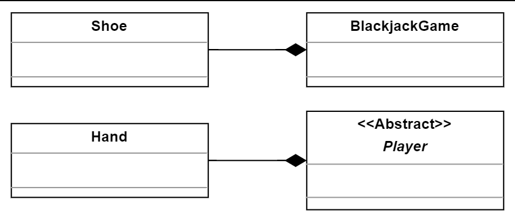

Inheritance

The following classes show an inheritance relationship:

Both the BlackjackPlayer and Dealer classes extend the Player class.

class diagram of online blackjack game

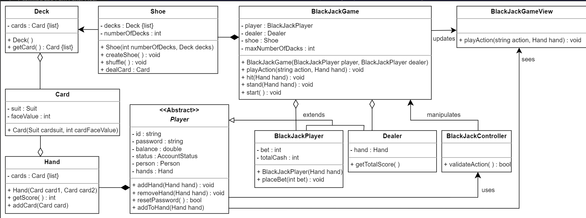

Design pattern

The Iterator design pattern can be applied, since cards are assigned to the players from the deck of cards by just iterating through the list of cards.

We can also use the State design pattern for our online Blackjack game because this game has a finite number of states. Some of these states are as follows:

Shuffle the deck

Draw a card and give it to the dealer

Draw a card and give it to the player

Deal cards

Player hit 

Player stand

activity diagram

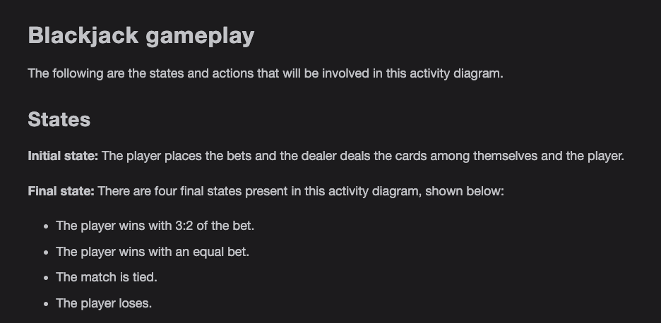

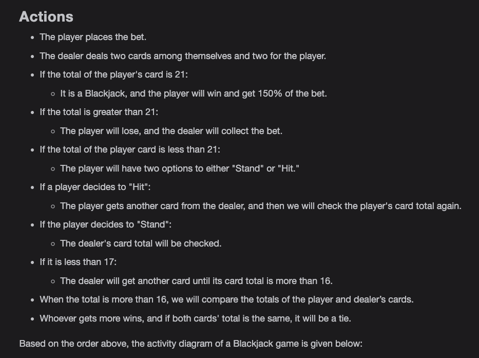

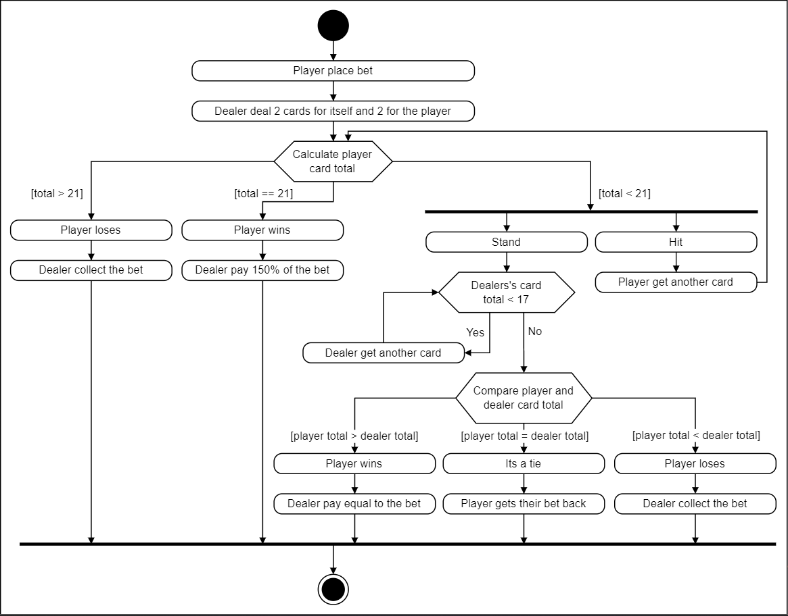

Code for the Online Blackjack Game

Enumerations and custom data type

The following code provides the definition of the enumeration and custom data type used in the Blackjack game.

Suit: We need to create an enumeration to keep track of the suit of the card, whether it is diamond, spade, heart, or club.

AccountStatus: We need to create an enumeration to keep track of the status of the account, whether it is active, canceled, closed, blocked, or none.

The Person class is used as a custom data type. The implementation of the Person class can be found below:

Card

This class contains the playing cards or cards used in the Blackjack game.

Deck and shoe

Shoe is a device to hold multiple Deck and a Deck has 52 cards of four suits. One suit contains nine number cards (2–10) and four face cards (King, Queen, Jack, and Ace).

Hand

The Hand class represents a Blackjack hand used in this game and contains multiple cards.

Players

The Player is an abstract class and the BlackjackPlayer and Dealer classes extend the Player class.

BlackjackPlayer: They place the first wager and update the stake with winning and losing sums. They can choose between the hit and stand options.

Dealer: They are primarily in charge of dealing cards and following the Blackjack rules.

Blackjack controller and game view

The BlackjackController class validates the actions (hit or stand) and responds accordingly. The BlackjackGameView class represents the game view.

Blackjack game

The BlackjackGame class represents how we can play this game or its basic sequence of play.