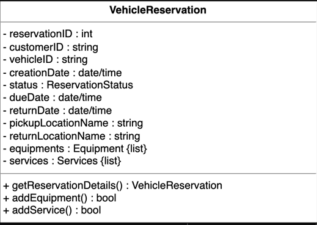
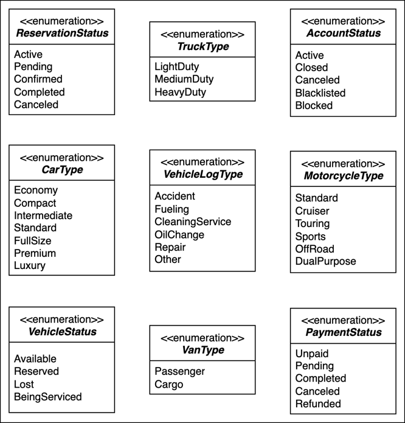

A car rental system is an application that manages the renting of automobiles for a short period of time—a few hours to a few weeks. A car rental system has a number of offices in different locations within each city. It allows the users to reserve and return a vehicle from different locations and is primarily located near airports or city areas.The car rental system keeps a list of all its clients in a database. The database includes the name, address, and contact number of each new customer.A member can reserve a car for a certain number of days, hire a car, or return the car that was rented. A member makes a reservation by supplying the pickup and drop-off locations, the kind of vehicle, and the day and time of the reservation.

Vehicle types

- What types of vehicles will that system support?

- How can we identify the specific vehicle?

Search interface

- Is it possible to search a vehicle using its name or type?

- Can we search for a vehicle by its model number?

Services

- Does a car rental system assign a driver to its customer?

- Does a car rental system provide roadside assistance to its customer?

Reservation cancelation

- Can the member be able to cancel a reservation?

- Which member is allowed to request a vehicle reservation cancelation and when?

Payment flexibility

- How can customers pay at different branch locations and by different methods (cash, credit, or cheque)?

- If there are multiple branches of the car rental system, how will the system keep track of the customer having already paid at a particular branch?

Design approach

bottom-up design approach

Design pattern

Requirements

- R1: There can be two types of users in the car rental system, i.e., customers and receptionists.

- R2: The system should handle multiple types of vehicles. Initially, the system should cater to the following vehicles: cars, trucks, vans, and motorcycles.

- R3: There can be multiple subtypes for vehicles. The car type can be economy, luxury, standard, and compact. The van type can be passenger or cargo. Moreover, the motorcycle type can be cruiser, touring, or sports.The truck type can be light, medium, or high-duty.

- R4: The system should be able to keep a record of who reserved a particular vehicle and on which date the vehicle was issued.

- R5: The system should be able to find out how many vehicles have been rented out by the specific customer.

- R6: The customers should be able to cancel their reservations.

- R7: To keep track of all events related to the vehicle, the system should maintain a vehicle log.

- R8: The system should allow the users to add equipment to the reservations like a ski rack, child seat, and navigation.

- R9: The system should allow the users to add services to the reservations like a driver, Wi-Fi, and roadside assistance.

- R10: The system should send a notification to the customer and generate a fine if the vehicle is not returned within the due date.

- R11: The system should allow the user to search the vehicles by type or model.

- R12: A system should be able to manage the multiple branches of the car rental system.

- R13: Every branch of the car rental system should have parking stalls to park the vehicles.

User Case Diagram

System

- Our system is “rent a car.”

Primary actors

- Member: This is the primary actor of the system who can reserve a vehicle, make payment, and change or cancel the reservations of the vehicle.

Secondary actors

- Receptionist: This actor acts as the system’s admin and can perform any task a “Member” can perform. This can also add, remove, or modify the vehicle or its reservations and update logs.

- Worker: This actor can update logs, return vehicles, and pay bills.

- System: This can send notifications related to reservation to members.

Use cases

Member

- Create a new account: To create a new account on the system

- Update/cancel account: To update account information or to cancel an account

- Login/Logout: To log in and out of the car rental system

- Search vehicle inventory: To search for vehicles from the inventory

- Make a reservation: To make a reservation for a vehicle

- Cancel reservation: To cancel the reservation of the vehicle

- Update reservation: To update the reservation information of the vehicle

- Return vehicle: To return the vehicle to the car rental facility

- Pickup vehicle: To pick up the vehicle from the car rental facility

- Pay bill: To pay vehicle rent

Receptionist

- Create a new account: To create a new account on the system

- Update/cancel account: To update account information or to cancel an account

- Login/Logout: To log in and out of the car rental system

- Search vehicle inventory: To search for vehicles from the inventory

- Make a reservation: To make a reservation for a vehicle

- Cancel reservation: To cancel the reservation of the vehicle

- Update reservation: To update the reservation information of the vehicle

- Add vehicle: To add a new vehicle to the car rental system

- Remove vehicle: To remove a vehicle from the car rental system

- Modify vehicle: To modify a vehicle status or information from the car rental system

- Update log: To update the vehicle log

System

- Send overdue notification: To send a notification if the date and time for vehicle return are passed

- Send reservation notification: To send a notification of the reservation made

- Send reservation canceled notification: To send a notification of any canceled reservation

Generalization

We’ll use the generalization relationship if we want to add, remove, or modify a vehicle. We also need to specify the vehicle type we want to add, remove or modify.

- “Add vehicle” has a generalization relationship with the “Add car,” “Add truck,” “Add van,” and “Add motorbike” use cases.

- “Remove vehicle” has a generalization relationship with the “Remove car,” “Remove truck,” “Remove van,” and “Remove motorbike” use cases.

- “Modify vehicle” has a generalization relationship with the “Modify car,” “Modify truck,” “Modify van,” and “Modify motorbike” use cases.

Include

When a car is returned, the bill is paid. Therefore, “Return vehicle” has an include relationship with “Pay bill.”

Extend

Whenever a reservation is made, we need to add its details like rental insurance, additional driver, service, and equipment. Therefore, the “Add rental insurance,” “Add additional driver,” “Add service,” and “Add equipment” use cases have an extend relationship with “Make a reservation.”

Use case diagrams

class diagram

bottom-up approach

Address and person

The Address is a custom data type that is required to store any address. The Address contains attributes like a street address, city, state, etc. In the car rental system, this class will be used to specify the address of any person or a car rental location or branch. The Person class stores information related to a person like a name, email, phone number, and address. In the Person class, there is an object of the Address type to specify the person’s address

Account

Account is an abstract class that is used to store the account information of a person. This class has members like account ID, password, the status of an account, etc. There can be two types of accounts, i.e., customer and receptionist. The Customer class represents the customers who reserve the vehicle for themselves, while the Receptionist class represents the receptionist in the car rental system. Both of them can create any vehicle reservation and can cancel the reservation as well.

Driver

Since we are designing the car rental problem, we will have a Driver class. A customer can request an additional driver at the time of reservation

Vehicle

Our car rental system should have a vehicle object according to the requirements. The vehicle can be of four types: a car, truck, van, and motorcycle. For this purpose, we’ll create Vehicle as an abstract class and Car, Truck, Van, and Motorcycle as its subclasses,

Equipment

Equipment is an abstract class that stores information about different types of equipment that can be added to the reservation. For simplicity, we’ll assume three types of equipment, i.e., navigation, child seat, and ski rack. The class diagram for Equipment and its subclasses

Service

Service is an abstract class that represents the services provided to the customers along with the vehicle. While reserving a vehicle, the customers can add a service to their reservation. Every service has its fixed cost. We have three types of services, i.e., driver, roadside assistance, and Wi-Fi. The UML diagram of Service, along with its subclasses DriverService, RoadsideAssistance, and Wi-Fi

Notification

Notification is an abstract class responsible for sending notifications to customers. Every notification has an ID, creation date, and content in it. The notification can either be an SMS notification or an email notification. The SMSNotification class requires the phone number of the customer to send a notification, while EmailNotification is sent to the email address of the customer

Parking stall

Each car rental location has parking stalls where the vehicles are parked. Each parking stall is identified by its ID and its location is specified by a location identifier.

Vehicle log

VehicleLog is a class that is used to keep track of all the events related to a vehicle. Every vehicle log has its ID, log type, description, and creation date

Vehicle reservation

Vehicle reservation is one of the most important requirements of the car rental system. To fulfill this functionality, we have a VehicleReservation class. This class is responsible for managing the vehicle reservation status of vehicles. The customer can add any equipment or service at the time of reservation as well.

Payment

The Payment class will be an abstract class and will have two child classes: CreditCard and Cash. These represent the two payment methods in the car rental system

Fine

The system needs the Fine class to calculate the fine on the vehicle reservation in case the customer returns the vehicle after the due date, the fuel in the vehicle is less than the limit value, or there is any damage to the vehicle.

Search interface and vehicle inventory class

Search is one of the most important functionalities of the system. It is the interface that allows the user to search for any vehicle and return the list of vehicles upon searching by any of the following methods:

Search car by its type

Search car by its model

The VehicleCatalog is a class where the search function is implemented. In each catalog, the vehicles are sorted according to one of the given search techniques, i.e., either the vehicle type or model

Car rental system and branch

CarRentalSystem is the main class of the car rental system and is the central part of the design. There can be multiple branches and locations of the car rental system. The CarRentalBranch class will represent each of these branches.

Enumerations

The list of enumerations required in the car rental system is provided below:

- VehicleStatus: The vehicle status describes the status of the particular vehicle for the user, whether it is available, reserved, lost, or being serviced.

- AccountStatus: The account status tells about the user account status, i.e., active, closed, canceled, banned, or blocked.

- ReservationStatus: The reservation status tells about the reservation state of any vehicle, whether it is in an active state, pending state, confirmed state, completed state, or canceled state.

- PaymentStatus: The payment status checks if the customer’s payment falls in any of the following stages: unpaid, pending, completed, canceled, or refunded.

- VanType: The van type specifies that the van can only be of two types, i.e, passenger or cargo.ifies that the van can only be of two types, i.e, passenger or cargo.

- CarType: The car type tells about the different types of cars, whether it is economy, compact, intermediate, standard, full size, premium, or luxury.

- MotorcycleType: Similar to the car type, the motorcycle type tells about the different types of motorcycles, whether it is standard, cruiser, touring, sports, off-road, or dual purpose.

- TruckType: The truck type specifies that the truck can be of three types, i.e, light-duty, medium-duty, or heavy-duty.

- VehicleLogType: The vehicle log type describes the type of a particular log of a vehicle, whether it is an accident, fueling, cleaning service, oil change, repair, or other.

Association
The class diagram has the following association relationships.

One-way association

- Both the Account and VehicleReservation classes have a one-way association with the Vehicle class.
- The Fine class has a one-way association with Payment.

Two-way association

- The VehicleReservation class has a two-way association with Payment and Notification.

Composition

The class diagram has the following composition relationships:

- The CarRentalBranch class is composed of the ParkingStall class.

- The Vehicle class is composed of the VehicleLog class.

Aggregation

The following classes show an aggregation relationship:

- The CarRentalSystem class contains the CarRentalBranch class.

- Both the ParkingStall and VehicleCatalog classes consist of the Vehicle class.

- The VehicleReservation class has an aggregation relationship with the Equipment and Service classes.

Inheritance

The following classes show an inheritance relationship:

- Both the Receptionist and Customer classes extend the Account class. Whereas, Account and Driver extend the Person class.

- The Car, Truck, Van, and Motorcycle classes extend the Vehicle class.

- The Driver, RoadsideAssistance, and Wi-Fi classes extend the Service class.

- The Navigation, ChildSeat, and SkiRack classes extend the Equipment class.

- Both the SMSNotification and EmailNotification classes extend the Notification class.

- Both the Cash and CreditCard classes extend the Payment class.

- The VehicleCatalog class implements a Search interface.

Class diagram of the car rental system

Design pattern

We can use the Decorator design pattern for our car rental system. We can design it using the following decorators:

- Discount decorator: It can be used to apply discounts to all types of vehicles in our car rental system.

- Peak season decorator: It can be used to increase the fare of all types of vehicles in our car rental system.

- Damage fine decorator: When the vehicle is returned, this decorator can help in calculating the fine due to car damage.

- Partially filled fuel tank fine decorator: When the vehicle is returned, this decorator can help calculate the fine due to the partially filled fuel tank.

Similarly, we can make several other decorators according to the system needs. These decorator fulfill the SRP and OCP design principles.

Additional requirements

The interviewer can introduce some additional requirements in the car rental system, or they can ask some follow-up questions. Let's see an example of additional requirements:
Barcode Scanner: Each vehicle should have a unique barcode associated with it, and the system should be able to scan the barcode of every vehicl

Sequence Diagram for the Car Rental System

Sequence diagrams are a great way to understand the interactions between different entities and objects in the system. There can be different sequence diagrams that we can create for our car rental system. For the sake of this lesson, we will create sequence diagrams for the following two interactions:

Vehicle reservation: The member reserves a vehicle.

Sequence challenge: The member cancels their reservation.

Vehicle reservation
The sequence diagram for vehicle reservation should have the following actors and objects that will interact with each other:

Actor: Member

Objects: Catalog, Reservation, and Payment

System

activity diagrams for the following two activities:

Vehicle pickup

Activity challenge: Vehicle return

Vehicle pickup

The states and actions that will be involved in this activity diagram are given below.

States

Initial state: A member with a vehicle booking comes to the rent-a-car reception to pick up the vehicle.

Final state: The guest either successfully gets the vehicle or the system shows a reservation error.

Actions

The member with a vehicle reservation arrives at the rent-a-car reception. The receptionist validates the reservation and updates the vehicle status.

Code for the Car Rental System

Car rental system classes

In this section, we will provide the skeleton code of the classes designed in the class diagram lesson.

Enumerations
First, we will define all the enumerations required in the car rental system. According to the class diagram, there are seven enumerations used in the system, i.e., VehicleStatus, AccountStatus, ReservationStatus, PaymentStatus, VanType, CarType, and VehicleLogType

Address, person, and driver
This section contains the Address, Person, and Driver classes, where the first two classes are used as a custom data type.

Account

Account is an abstract class that represents the various people or actors that can interact with the system. There are two types of accounts: receptionist and customer

Vehicle

Vehicle will be another abstract class, which serves as a parent for four different types of vehicles: Car, Van, Truck, and MotorCycle

Equipment

Equipment is an abstract class, and this section represents different equipment: Navigation, ChildSeat, and SkiRack added in the reservation.

Service

Service is an abstract class, and this section represents different services: DriverService, RoadsideAssistance, and Wi-Fi added to the reservation

Payment

The Payment class is another abstract class, with the Cash and CreditCard classes as its child. This takes in the PaymentStatus enum to keep track of the payment status.

Vehicle log and Vehicle reservation

VehicleLog is a class responsible for keeping track of all the events related to a vehicle. VehicleReservation is a class responsible for managing the reservation of vehicles.

Notification

The Notification class is another abstract class responsible for sending notifications, with the SMSNotification and EmailNotification classes as its child

Parking stall and fine

ParkingStall is a class used to locate vehicles in the car rental branch while the Fine class represents the fine applied on payment.

Search interface and vehicle catalog

Search is an interface and the VehicleCatalog class is used to implement the search interface to help in vehicle searching. 

Car rental system and car rental branch

The CarRentalSystem class is the base class of the system that is used to represent the whole car rental system (or the top-level classes of the system). CarRentalBranch represents the single branch of the system.

