Getting Ready: The Chess Game

Problem definition

Chess is a board game for two players that involves strategy and is played on a checkered board made up of 64 squares in an 8x8 grid. Each player starts with 16 pieces, including a king, queen, two rooks, two knights, two bishops, and eight pawns. The goal is to checkmate the opponent's king. This occurs when the king is in a position to be captured (check), and there is no way to move the king out of capture (checkmate).

Each piece has its own unique movements. The rook can move horizontally or vertically, the knight can move in an L-shape position, the bishop can move diagonally, the queen can move in any direction, and the king can move one square in any direction. Pawns have the most complex movement rules and can move forward one square but capture diagonally.

The game can also end in a draw if the king is not in checkmate, and it is not possible for either player to force a win. A draw happens if there are not enough pieces on the board to force a checkmate (except the two kings), the same position is repeated three times, or both the players agree to a draw.

Note: There are numerous variations of the game of chess that are played globally. In this design problem, we'll focus on creating a digital version of the two-player chess game that can be played online.

Chess pieces

The chess pieces have their own specifications according to the rules of the game that need to be clarified by the interviewer. Therefore, you may ask the following questions:

How many chess pieces are there in the game?

What are the different chess pieces, and what are their respective moves?

Which piece is the weakest in chess?

Which piece is the strongest in chess?

Gameplay

In chess, the two opposing teams try to achieve the state of checkmate to win the game, or they face some special cases like a stalemate that need to be clarified by the interviewer. You may ask the following questions regarding them:

Which player takes the first turn?

What are the rules of the game?

What is a checkmate?

How does a stalemate happen?

Can a player forfeit/resign from the game?

Design approach

We'll design this chess game system using the bottom-up design approach. For this purpose, we will follow the steps below:

Identify and design the smallest components first – the box and piece.

Use these small components to design bigger components, for example, the chessboard and move.

Repeat the steps above until we design the whole chess game.

Design pattern

During an interview, it is always a good practice to discuss the design patterns that the Chess game falls under. Stating the design patterns gives the interviewer a positive impression and shows that the interviewee is well-versed in the advanced concepts of object-oriented design.

Requirements for the Chess Game

Requirement collection

R1: The purpose of this system is to enable multiplayer in a game of chess via an online platform.

R2: The game will be played according to the official rules of an international chess game.

R3: Each player is randomly assigned the color—either black or white

R4: At the start of the game, each player will have eight pawns, two rooks, two bishops, two knights, one queen, and one king on the board.

R5: The player with the white pieces will make the first move.

R6: It is not possible for a player to retract or undo their move once it has been made.

R7: The system will keep a record of all moves made by both players.

R8: The game may end in a checkmate, forfeiture, stalemate (a draw), or resignation.

International chess rules

The following table represents the basic rules of chess:

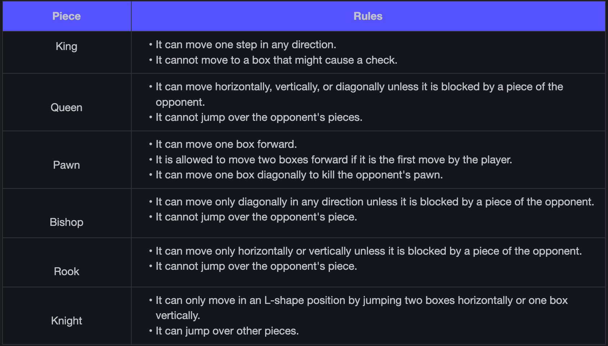

The following table represents certain situations we might face while playing chess:

Rules for situations

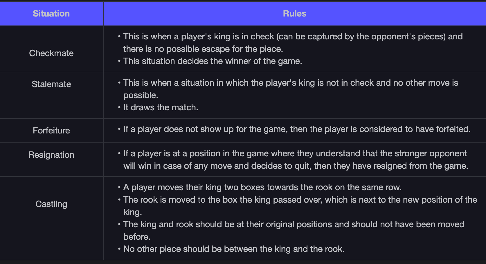

Use Case Diagram for the Chess Game

System

Our system is a "Chess game."

Actors

Here are the main actors of our chess game.

Primary actors

Player: This is the primary user and is responsible for playing the chess game. It can start a new game, make move or resign/forfeit a game.

Secondary actors

Admin: This can add, remove, or update a player's account and membership, view open games, and validate player moves.

Use Cases

In this section, we'll define the use cases for the chess game. We have listed down the use cases according to their respective interactions with a particular actor.

Note: You will see some use cases occurring multiple times because they are shared among different actors in the system.

Player

Create/Update account: To create a new account to play a chess game or to update account information of an existing account

Login/Logout: To log in to or log out from an account

View open games: View available games that are waiting for players to join

Join a game: Join an open game

Create a new game: To create a new game to start playing

Make move: To make a move in the game

Resign or forfeit a game: To resign or forfeit a game so that it ends

Admin

Block/unblock member: To block or unblock a member from playing the chess game

Cancel/Update membership: To cancel the membership or to update the membership of an account

Add/modify member: To add a new member or update member information

Login/Logout: To log in to or log out from an account

View open games: View available games that are waiting for players to join

Validate Moves: To validate player move

Declare results: To declare the result of the game when the game is over

Relationships

This section describes the relationships between and among actors and their use cases.

Include

The “Make move” has an include relationship with the “Validate move” because the admin has to validate if the move was as per the rules set.

The “Resign or forfeit a game” use case has an include relationship with the “Declare result” use case because the game will be over, and results will be declared when a player either resigns or forfeit from the game.

Extend

The “Block/unblock member” has an extend relationship with the “Cancel/Update membership” since when the admin unblocks a member, there is a chance that their membership will be updated. When the admin blocks a member, its membership might be canceled.

The “Validate move” use case has an extend relationship with the “Declare result” use case as there is a chance that the game will be over and results will be declared when a player makes a validate move and checkmate another player.

Generalization

The “Make move” has a generalization relationship with the “Play pawn”, “Play bishop”, “Play king”, “Play queen”, “Play knight”, and “Play rook”, since a player can make any of these six moves.

Associations

The table below shows the association relationship between actors and their use cases.

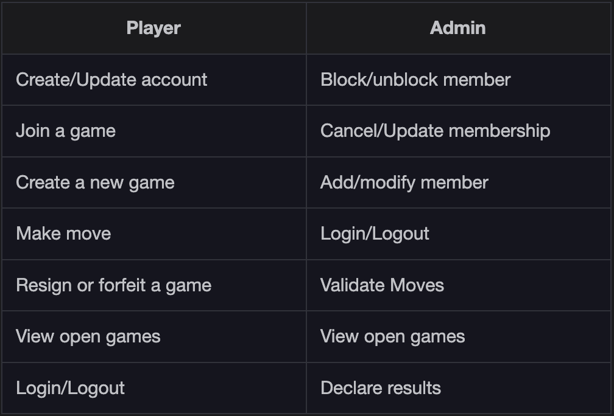

use case diagram

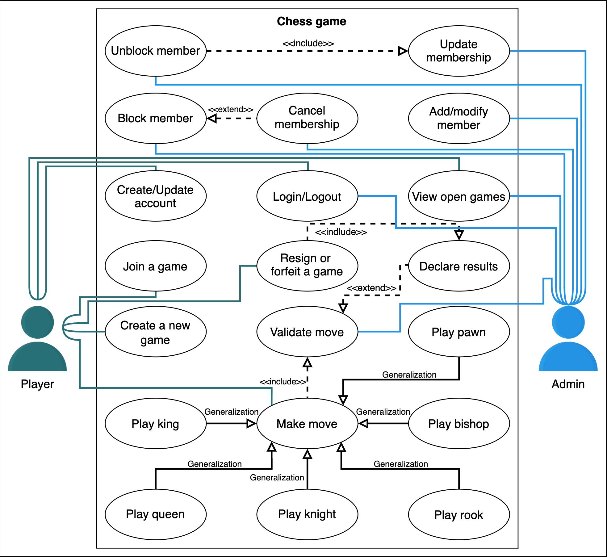

Class Diagram for the Chess Game

Components of Chess

As mentioned earlier, we'll follow the bottom-up approach to designing a class diagram for the chess game.

Box

A Box is a specific position/block on the 8x8 chessboard which is defined by row x and column y, respectively.

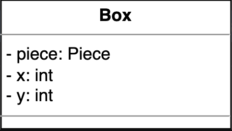

Chessboard

A Chessboard is the 8x8 board that stores all the current game's active pieces. It is identified by the date of its creation and can be updated or reset.

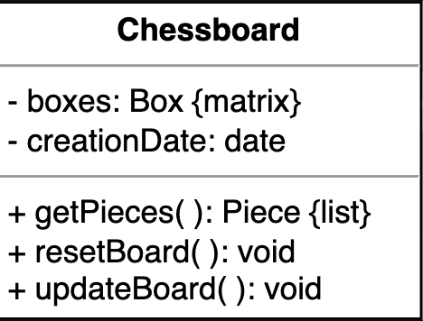

Piece
A chess Piece can only be black or white in color. It might be alive or killed depending on the moves made by the opposition. There can be six types of pieces (Rook, Pawn, King, Queen, Knight, and Bishop derived from Piece) that have their respective moves based on the rules of the game which decides whether they are eligible to move or not.

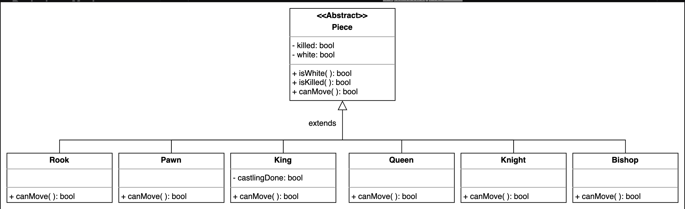

R4: At the start of the game, each player will have eight pawns, two rooks, two bishops, two knights, one queen, and one king on the board.

Move

A Move is the displacement of a Piece from one Box to another on the chessboard. It may or may not kill a piece of the opposing player.

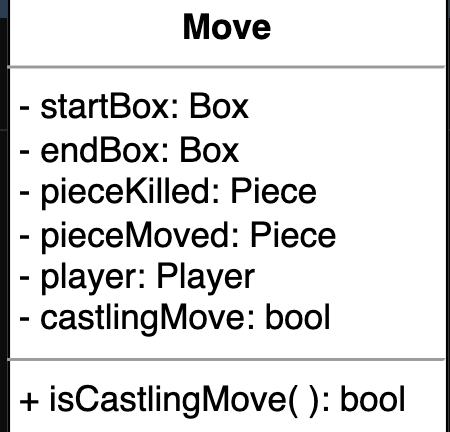

R5: The player with the white pieces will make the first move.

R6: It is not possible for a player to retract or undo their move once it has been made.

Account, Player, and Admin

The Account class is a parent class that has two types: Player and Admin. These classes are derived from the Account class. This class stores the user ID, password, and account status.

Player: This derived class represents the players of the game and all records of the games played. It also keeps track of whether or not the player's chosen color is white.

Admin: This derived class decides whether or not a user account is blocked.

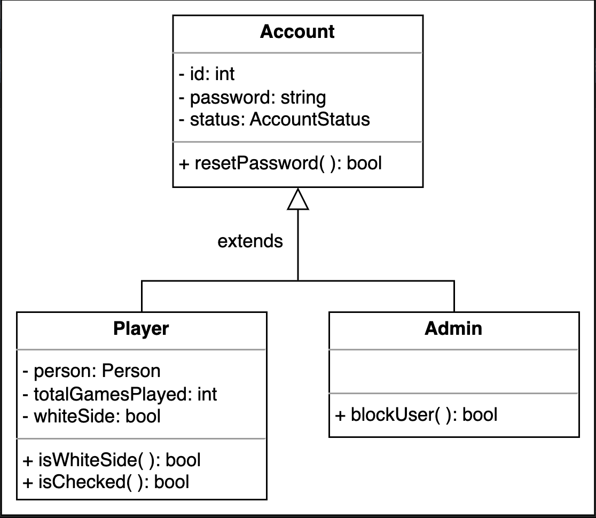

R1: The purpose of this system is to enable multiplayer in a game of chess via an online platform.

Chess move controller

The ChessMoveController class validates the moves made by a player and responds accordingly.

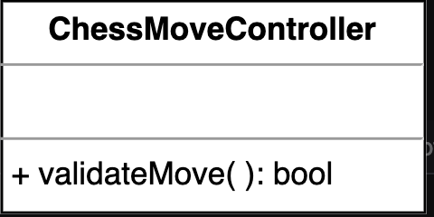

R2: The game will be played according to the official rules of an international chess game.

Chess game view

The ChessGameView class represents the game view. The ChessGame class updates the ChessGameView class.

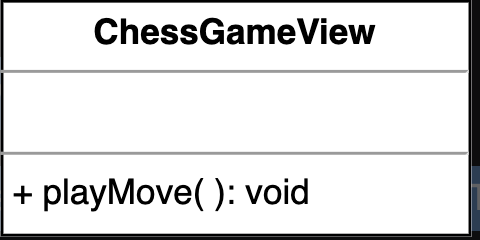

Chess game

The ChessGame represents the gameplay of chess. It keeps track of the moves played by both the players, the turns, and the game status.

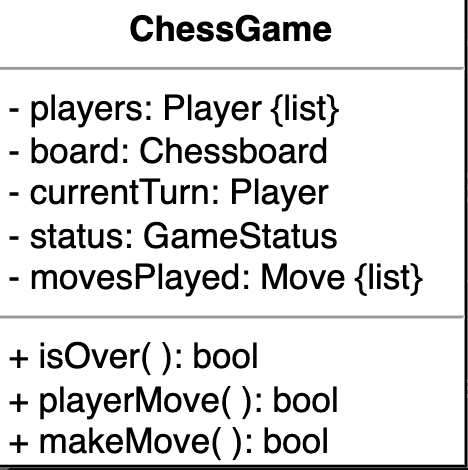

Enumerations and custom data types

The enumerations and custom data types required in the chess game design problem are listed below:

GameStatus: This enumeration keeps track of the active status of the player and the game, i.e., who wins and whether or not the game is a draw.

AccountStatus: We need to create an enumeration to keep track of the account status, whether it is active, canceled, closed, blocked, or none.

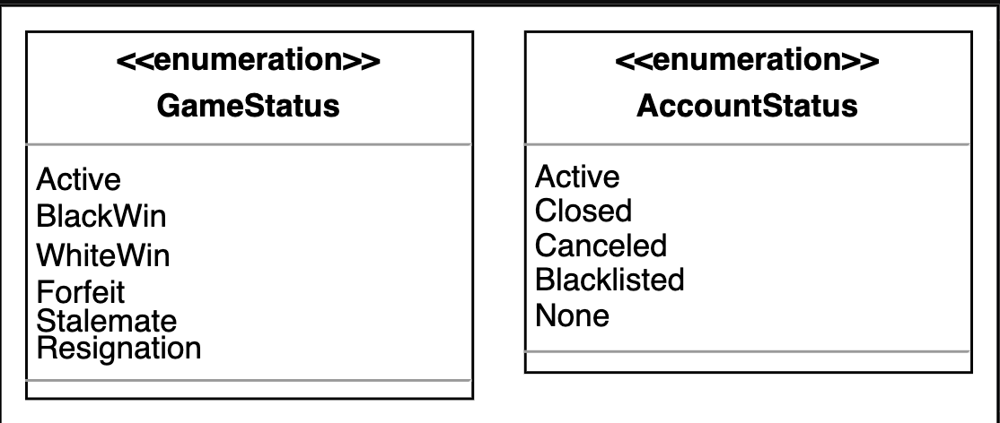

Person: This is used to store information related to a person like a name, street address, country, etc.

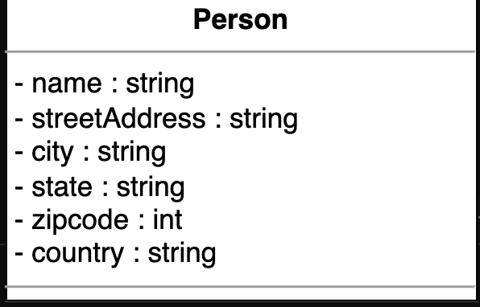

Relationship between the classes

Now, we'll discuss the relationships between the classes we have defined above for our chess game design.

Association

The class diagram has the following association relationships:

The Move class has a one-way association with Player.

The Player class has a one-way association with ChessMoveController.

The ChessMoveController class has a one-way association with ChessGame.

The ChessGame class has a one-way association with ChessGameView.

The ChessGameView class has a one-way association with Player.

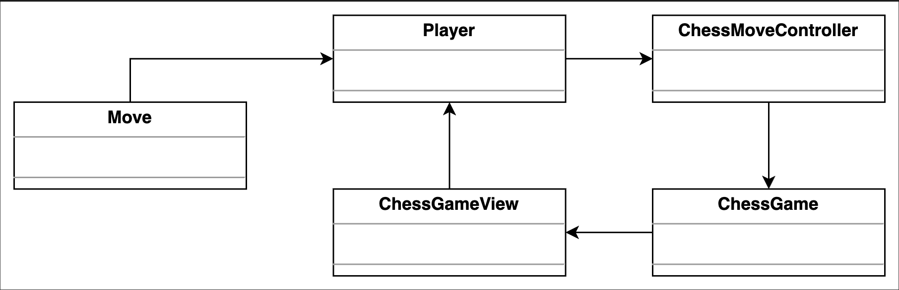

Aggregation

The class diagram has the following aggregation relationships:

The ChessGame class contains the Player.

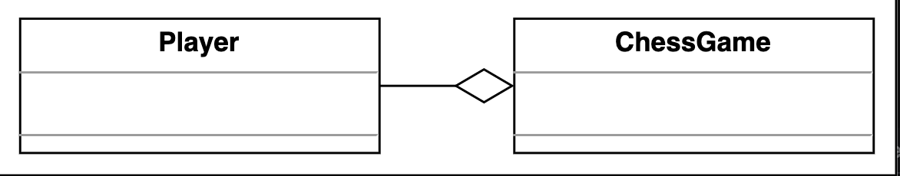

Composition

The class diagram has the following composition relationships.

The Box class is composed of Piece.

The ChessBoard class is composed of Box.

The ChessGame class is composed of ChessBoard.

The ChessGame class is composed of Move.

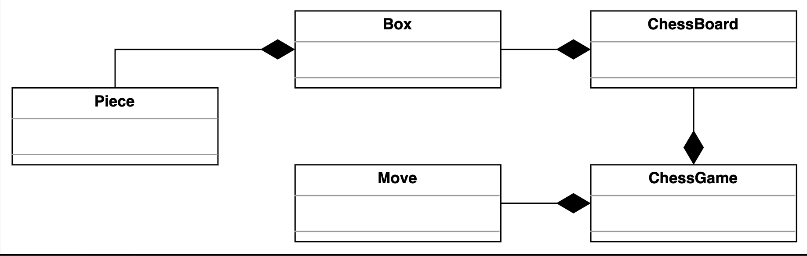

Inheritance

The following classes demonstrate an inheritance relationship:

Both, Admin and Player extend the Account class.

The King, Queen, Knight, Bishop, Rook, and Pawn classes extend the Piece class.

Class diagram for the Chess game

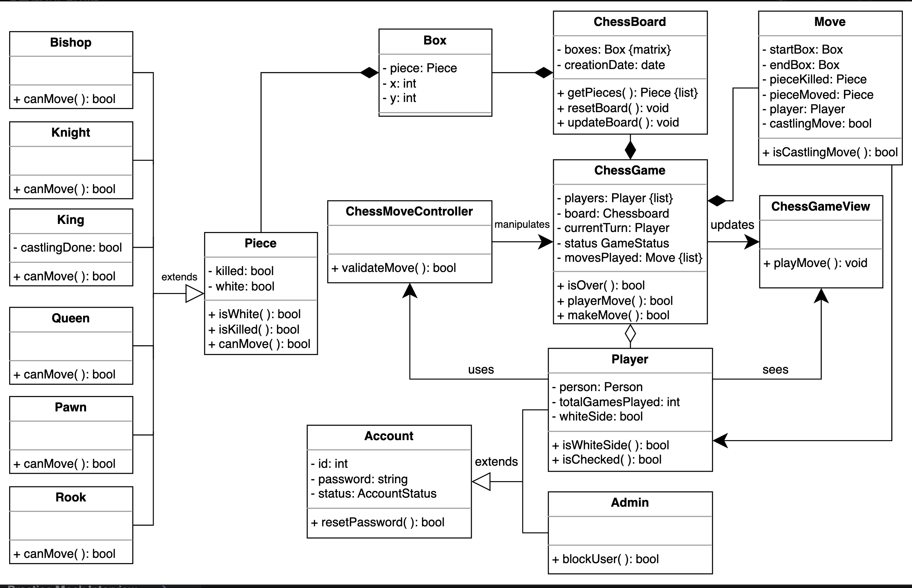

Design pattern

The following design patterns have been used in the class diagram:

Singleton design pattern: This pattern ensures the existence of a single instance of the chessboard at a given moment due to the shared nature of the chessboard as a resource. Multiple instances can cause the game state to become inconsistent.

Command design pattern: This pattern is used to encapsulate the move logic for each chess piece. Each chess piece has its own implementation of the move command, which allows it to move according to the rules defined for it. For example, the knight moves in an L-shape pattern, or the rook can move only horizontally or vertically on any number of boxes.

The following design patterns can also be used to design chess:

The Iterator design pattern would enable the game to move sequentially by allowing the pieces to behave in a uniform manner where the user does not need to know the specifications or underlying logic behind the moves of the pieces.

The State design pattern ensures the encapsulation of the state logic of each piece, since all the chess pieces have their own respective implementations of checkmate states which makes them behave differently from each other depending on the situation.

The Observer design pattern enables the chess pieces to act as observers where the chessboard is the subject. As soon as the state of the board changes, the pieces are notified to adapt to the changes accordingly. This decouples the pieces from the chessboard.

Activity Diagram for the Chess Game

Chess game

The following states and actions will be involved in this activity diagram.

States

Initial state: The player makes the first move.

Final state: Any of the game-over condition are met.

Actions

The player initiates a new game. The board appears, and the player takes a turn. The system validates the move, then system checks if any of the game-over conditions are applicable. If the game is not over, the other player takes his turn, and the game continues until any of the game-over conditions are met.

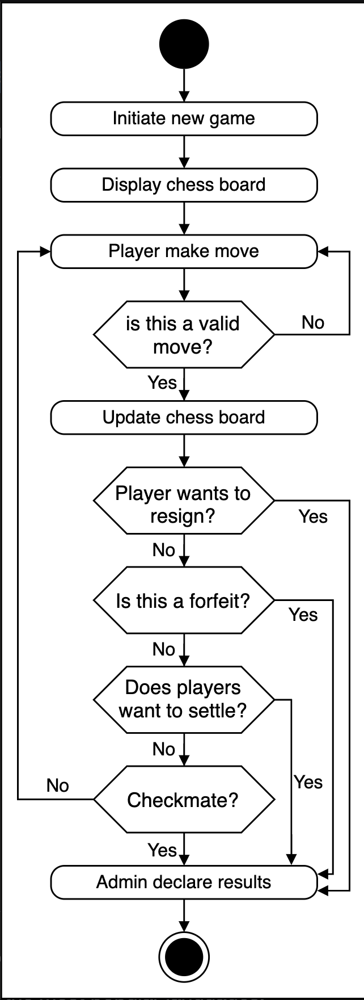

Code for the Chess Game

Chess game classes

In this section, we will provide the skeleton code of the classes designed in the class diagram lesson.

Note: For simplicity, we are not defining getter and setter functions. The reader can assume that all class attributes are private and accessed through their respective public getter methods and modified only through their public method functions.

Enumerations and custom data type

The following code provides the definition of the enumeration and custom data type used in the chess game.

GameStatus: This enumeration keeps track of the active status of the player and the game, i.e, who wins and whether or not the game is a draw.

AccountStatus: We need to create an enumeration to keep track of the status of the account – whether it is active, canceled, closed, blocked, or none.

The Person class is used as a custom data type. The implementation of the Person class can be found below:

Box and chessboard

The Box class holds the piece where the Chessboard contains the boxes and has the functionality of updating or resetting the board.

Piece

Piece is an abstract class that is extended by King, Queen, Knight, Bishop, Rook and Pawn. These derived classes override the canMove() function of Piece.

Move

The Move class represents the move that will be taken by the player. It can tell the source and destiation box of the active Piece and whether or not it was a castling move. It also identifies the captured piece

Account, player, and admin

The Account class is extended by the Player and Admin classes.

The Player class records the player's information by storing the Person object, along with the chosen color, i.e., – whether or not the player is playing with white pieces.

The Admin class decides whether or not the user is blocked.

Chess move controller and the game view

The ChessMoveController class validates the moves and responds accordingly. The ChessGameView class represents the game view. 

Chess game

The ChessGame class represents the current situation of the game while keeping track of turns and moves, and also decides when the game ends. 

