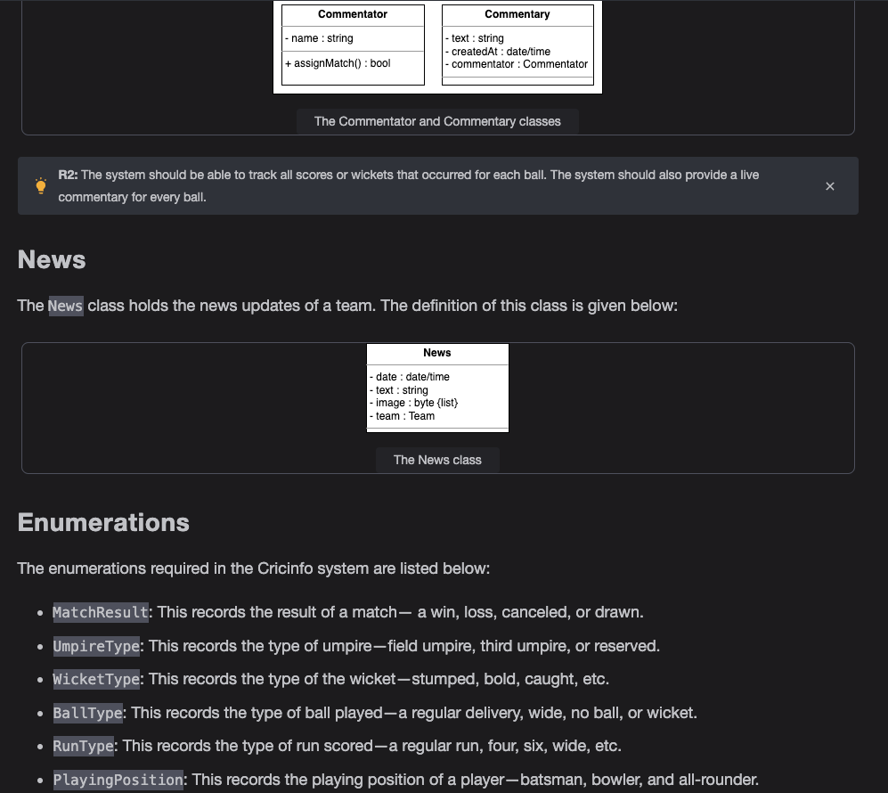

Getting Ready: The Cricinfo System

Problem definition

Cricinfo also known as ESPNcricinfo, is one of the leading cricket-related websites in the world. The platform provides a live coverage of cricket matches, along with ball-by-ball commentary. This website has a database including historical matches from the 18th century till the present. This website provides cricket content globally and is followed by millions around the world. Users can find match updates, live cricket scores, match results on this website. This website also provides articles and news about cricket. Moreover, people can search for matches, teams, players, tournaments, etc. In short, this is a website for cricket lovers.

Live matches

Coverage of a live match is one of the most important features of a cricket website. The user must be able to see the live matches on the platform. To get a better understanding of live matches, you can ask interviewer questions like this:

How is information of the match updated?

What is the process for adding commentary?

At what intervals is the commentary added?

Statistics

It is crucial to store the statistics of the matches in the Cricinfo system. Therefore, you can ask the following questions:

What kind of stats does the system record?

Does the system record the statistics of players and teams?

People

There are different people involved in cricket matches. Therefore, to get an idea of the type of people in the system, you can ask the following questions:

What kind of people does our system need to store the information about, for example, players, coaches, etc?

Will the umpire data be stored in the system?

Who will input data into the Cricinfo system? What are the actors of the Cricinfo system?

Tournament

A tournament is a series of matches played between a number of teams. Therefore, the interviewer would expect you to ask the following questions:

How does the system keep track of different tournaments?

How are the tournament points and rankings stored in the system?

Design approach

We’ll design Cricinfo using the bottom-up approach. For this purpose, we will follow the steps below:

Identify and design the smallest components first, like a ball and run.

Use these small components to design bigger components, for example, an over, team, and an umpire.

Repeat the steps above until we design the complete Cricinfo platform.

Design pattern

During an interview, it is always a good practice to discuss the design patterns that the Cricinfo falls under. Stating the design patterns gives the interviewer a positive impression and shows that the interviewee is well-versed in the advanced concepts of object-oriented design.

Requirements for Cricinfo

R1: The system should be able to track the stats of all players, teams, and matches.

R2: The system should be able to track all scores or wickets that occurred for each ball. The system should also provide a live commentary for every ball.

R3: The system should be able to keep track of all matches—Test, T20, and ODI matches.

R4: The system should be able to keep track of ongoing and previous tournaments. The system should also be able to show a points table for all teams participating in a tournament.

R5: The system should be able to show the result of all previous televised matches.

R6: All teams should select some players who will participate in the tournament known as the tournament squad.

R7: For every match, the teams should be able to select 11 players to play on the field from the tournament squad, known as the playing eleven.

R8: The admin of the system should be able to add tournaments, matches, teams, players, and news to the system.

Use Case Diagram for Cricinfo

System

Our system is "Cricinfo."

Actors

Now, we’ll define the main actors of Cricinfo.

Primary actors

Admin: The admin is in charge of performing numerous operations—adding or modifying tournaments, innings, updating stats, etc.

Commentator: This actor can add commentary to the match or modify it.

Secondary actors

There is no secondary actor in the system.

Use cases

Admin

Add/modify team: To add a team in the system or modify it

Add/modify player: To add a player to the team or modify it

Add/modify tournament: To add a tournament in the system or modify it

Add/modify team squad: To add a team squad or modify it

Add/modify innings: To add innings in the match or modify it

Add/modify over: To add an over in the match or modify it

Add/modify ball: To add a ball in the match or modify it

Add match: To add a match in the system

Add/update news: To add the match news in the system or update it

Add/modify stadium: To add a stadium in the system or modify it

Add/modify umpire: To add an umpire in the system or modify it

Add/update stats: To add stats of a player, match, or tournament to the system

Commentator

Add/modify commentary: To add a commentary to the match or modify it

Relationships

We describe the relationships between and among actors and their use cases in this section.

Generalization

The admin can add/update stats by adding/updating player, match, or tournament stats. This shows “Add/update stats” use case has a generalization relationship with the “Add/update player stats,” “Add/update match stats,” and “Add/update tournament stats” use cases.

The admin can add the match type—T20, test, or ODI. Hence, the “Add match” use case has a generalization relationship with the “Add T20,” “Add test,” and “Add ODI” use cases.

Associations

Extend

While adding/modifying the ball, either a run, wicket, or both are added/modified. Therefore, the “Add/modify ball” use case has an extend relationship with the “Add/modify run” and “Add/modify wicket” use cases.

Use case diagram

Class Diagram for Cricinfo

Class diagram of Cricinfo

Design pattern

In the Cricinfo system, we need to create different types of matches, tournaments, and squads at runtime. To do this, we can use the Factory design pattern. This pattern provides a way to create objects without specifying the exact class of object that will be created.

Sequence Diagram for Cricinfo

Add a match

Activity Diagram for Cricinfo

Make a record of a ball

The states and actions that will be involved in this activity diagram are provided below.

States

Initial state: The system adds a ball to the over.

Final state: The ball record is saved.

Actions

The system adds a ball to the over. The system chooses the ball type that was bowled. The system determines if the batter got out. If they did not, it adds the score that was made. Finally, the commentary is added to the ball, and the ball record is saved.

Code for Cricinfo

Constants

The following code defines the various enums and custom data types used in the Cricinfo design:

Admin, player, coach, and umpire

The definitions of the Admin, Player, Coach and Umpire classes are as follows:

Run, ball, wicket, over, and innings

In cricket, the mandatory concepts can be of five types: run, ball, wicket, over, and innings. To store information about these identities, we defined the Run, Ball, Wicket, Over, and Innings classes

Match

The Match is an abstract class representing matches in Cricinfo. Matches can be of three types: T20, Test, and ODI.

Team, tournament squad, and playing11

The definitions of the AdminTeam, TournamentSquad, and Playing11 classes 

Tournament, points table, and stadium

The definitions of the Tournament, PointsTable, and Stadium classes

Commentator, commentary, and news

The definitions of the Commentator, Commentary, and News classes

Statistics

The Stat is an abstract class which represents the statistics in the Cricinfo. Statistics can be of three types: PlayerStat, MatchStat, and TeamStat. 

