An elevator is an integral part of buildings that have multiple floors. The elevator car could be in different states, either up or down, or could be stopped on some floor. Anyone can request an elevator car from any floor using the buttons on the panel. The elevator car’s algorithm will set the priority and take action accordingly, so the wait time is minimum. Inside an elevator, there will be a panel for passengers to select the floor on which they want to go. The elevator car will have a fixed capacity for the number of passengers and a display to show on which floor the elevator car is currently located.

1 - ask

Multiple elevators
Can there be multiple elevator cars in the building?
How could a one-elevator system be different from a multi-elevator system in terms of user wait time and running cost?

Display

How can passengers see the status of the elevator car and request an elevator car?
Would the display be the same inside and outside of the elevator?

Optimization

What would be an optimized solution to minimize the wait time of the passengers?
How are we going to minimize the running cost of the elevator system?

Design approach

bottom-up design approach

Identify and design the smallest components first, like, the button and door.
Use these small components to design bigger components, for example, the panel, elevator car, and building.
Repeat the steps above until we design the whole system.

Design pattern

- Strategy design pattern
- State design pattern
- Delegation design pattern

2 - Requirements

R1: There exist multiple elevator cars and floors in the building.
R2: The building can have a maximum of 15 floors and three elevators.
R3: The elevator car can move up or down or be in an idle state.
R4: The elevator door can only be opened when it is in an idle state.
R5: Every elevator car passes through each floor.
R6: The panel outside the elevator should have buttons to call an elevator car and to specify whether the passenger wants to go up or down.
R7: The panel inside the elevator should have buttons to go to every floor. There should be buttons to open or close the lift doors.
R8: There should be a display inside and outside the elevator car to show the current floor number and direction of the elevator car.
R9: The display inside the elevator should also show the capacity of the elevator car.
R10: Each floor has a separate panel and a display for each elevator car.
R11: Multiple passengers can go to the same or different floors in the same or opposite direction.
R12: The elevator system should be able to control the elevator car movement and the door functioning and monitor the elevator car.
R13: The elevator control system should be able to send the most appropriate elevator to the passenger when the passenger calls the elevator car.
R14: The elevator car can carry a maximum of eight persons or 680 kilograms at once.

3 - use case

actors - passenger and system

Passenger

Press elevator panel button -> inside(door open/close request and call emergency)
Press hall panel button

System

Dispatcher algorithm
Open/close door
Display (inside/outside)
Move/stop elevator

4 - class diagram

Button is an abstract class. There can be two types of buttons i.e., the elevator button and the hall button. The status of the button determines whether the button is pressed or unpressed. We can press the button or check the status of the button through the Button class.

The ElevatorButton subclass is inherited from the Button class and represents the buttons that are inside the elevator. When the elevator button is pressed, it specifies what would be the destination floor of the elevator car or where the passenger wants to go.

Similar to ElevatorButton, HallButton is also a subclass of the Button class. This class represents the buttons that are outside the elevator. This class used the enumeration Direction to specify whether the button is for going up or down. The hall button has two important pieces of information, the floor from where the button is pressed and the direction in which the passenger wants to move.

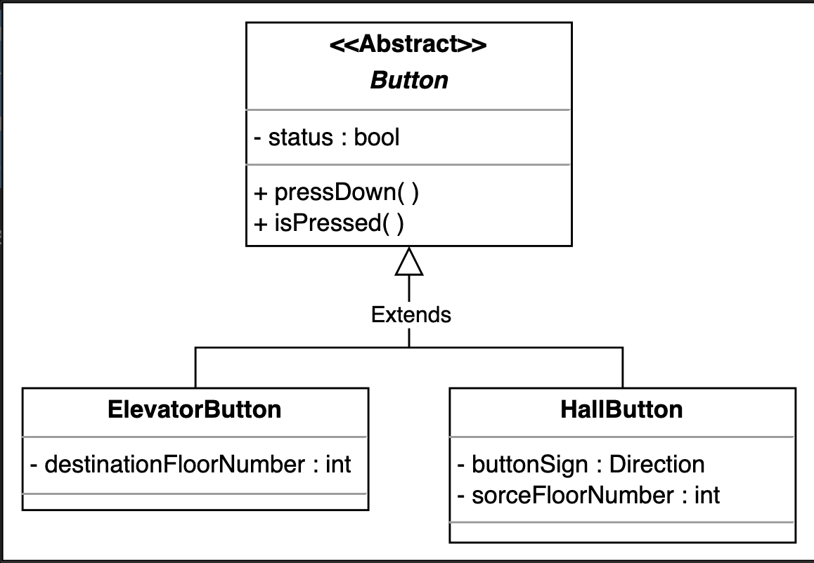

ElevatorPanel is a class which is used to represent the complete grid of buttons inside the elevator. In the elevator panel, we will have a list of buttons for selecting the destination floor of the elevator and two buttons for closing and opening the elevator.

While the HallPanel class represents the buttons that are outside the elevators. The hall panel consists of only two buttons: up and down.

Both the elevator panel and the hall panel are used to take input from the passenger

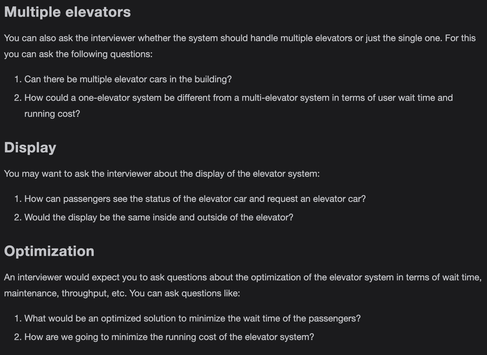

Display
Every elevator has a display to represent the current floor number and direction (up or down) of an elevator. It also gives information about the capacity of the elevator. So we will use the Display class which represents this information. The Display class consists of floor number, capacity, and direction. It has separate methods for both elevator display and hall display. The showHallDisplay() will present only the current floor the lift is in and the direction of the lift while the showElevatorDisplay() will display all of the class attributes.

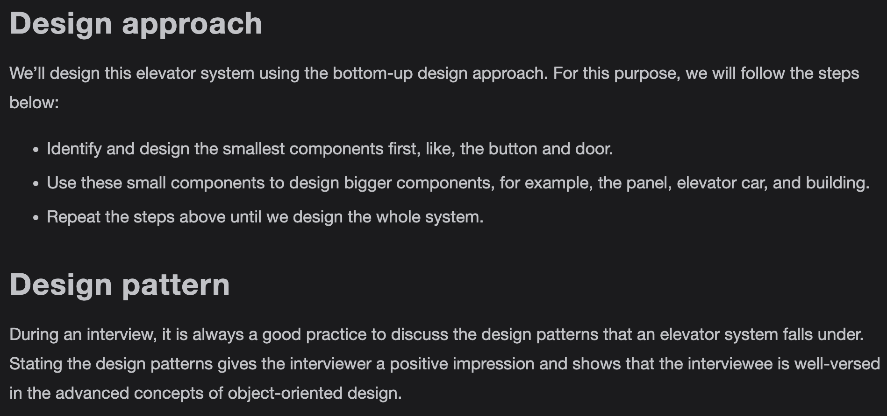

Door

The Door class symbolizes the door of an elevator. This class has a reference to enum DoorState which depicts that the status of the door can be either open or closed.

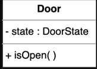

ElevatorCar is the class that expresses the elevators of the building. Each elevator has a unique ID. This class consists of an enumeration named state that tells the present state of the elevator. Moreover, in every elevator car, there is a door, an elevator panel, and a display. The elevator car can start moving or stop on any floor.

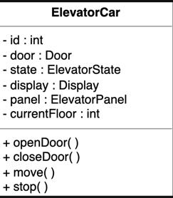

The Floor class represents the floors of a building. Each floor consists of a number/list of hall panels to call the lift and has displays to indicate the current floor and direction of the lift since there is a separate panel and display for each elevator. Moreover, we will have isBottomMost() and isTopMost() functions to check if the floor is at the bottom or top, respectively. The down button will be disabled if the floor is at the lowest of the building and the up button will be disabled if the floor is topmost

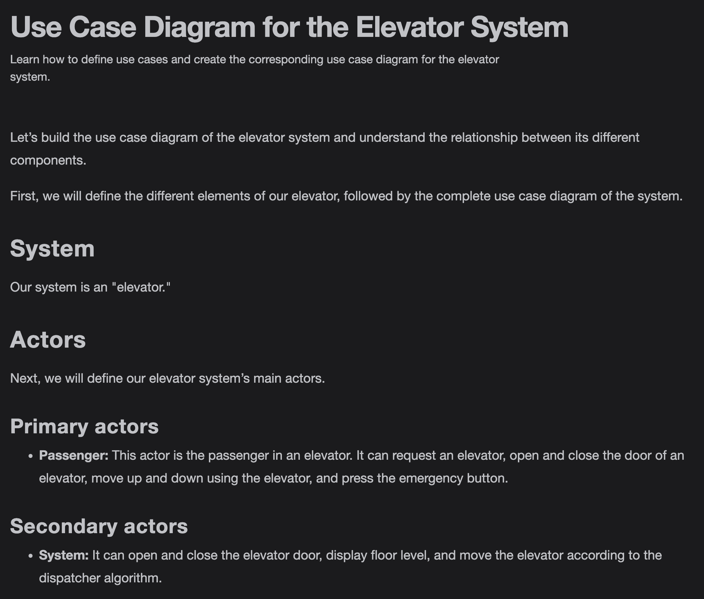

Building

The Building class represents an actual building that consists of the number of floors and elevators.

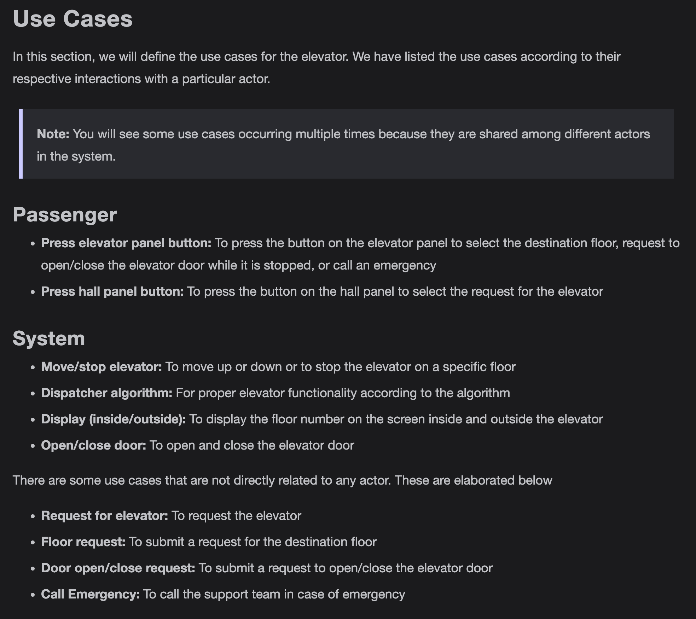

ElevatorSystem is the main functional class of the whole elevator control system. The elevator system has a display of each elevator and monitors the elevator cars. The elevator system has a dispatcher to select the best elevator car. Moreover, the system takes control of the elevator doors.

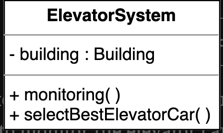

Enumerations

ElevatorState: It describes the state of an elevator, which could be idle, up, or down.

Direction: When the elevator is not in an idle state, it describes the direction of the motion of an elevator which could be up or down.

DoorState: When the elevator is in an idle state, it describes the status of a door of an elevator that could be open or close.

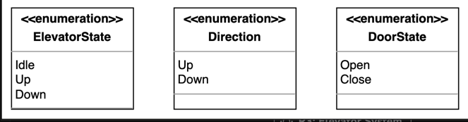

Relationship between the classes

Aggregation

The ElevatorSystem has an aggregation relationship with Building.

Composition

The Building is composed of ElevatorCar and Floor.
The ElevatorCar is composed of Door, ElevatorPanel, and Display.
The Floor is composed of HallPanel and Display.
The HallPanel is composed of the HallButton.
The ElevatorPanel is composed of the ElevatorButton.

Inheritance

Both ElevatorButton and HallButton extend the Button class.

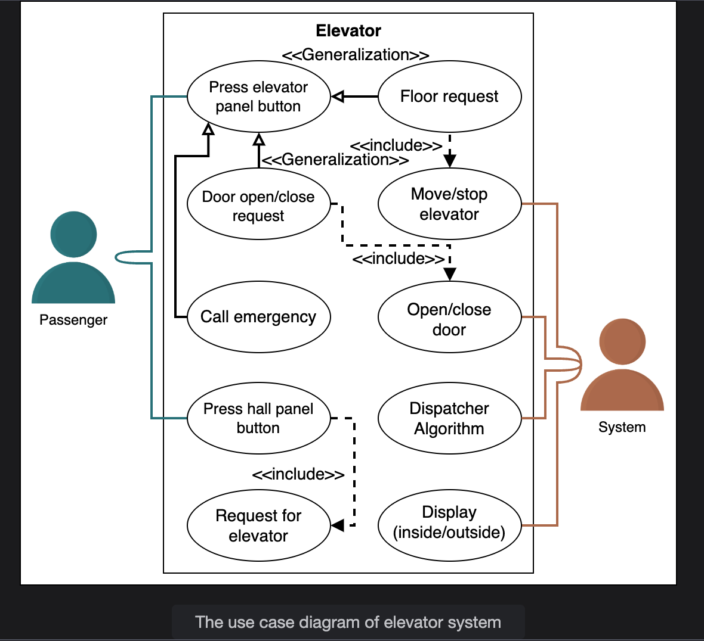

Design pattern

The Strategy design pattern can be applied here since the system could have multiple dispatch request strategy classes. Therefore, depending on the particular layout of the building and its scenarios, we choose a set of dispatch request strategy classes.

We can also use the State and Delegation design pattern for this problem. Instead of implementing all methods on its own, the context object stores a reference to one of the state objects that represents its current state and delegates all the state-specific tasks to that object. For example, elevators have multiple states like working or idle, etc. Based on the state, the system infers which method or behavior of the elevator should be invoked

Additional requirements

The interviewer can introduce some additional requirements in the elevator control system, or they can ask some follow-up questions. The additional requirement can be about how the dispatcher works in the elevator system. The interviewer can ask to devise an algorithm to optimize any of these:

- To minimize the wait time of the system
- To minimize the wait time of the passenger
- To maximize throughput
- To minimize the power usage or cost

To optimize the elevator system, we have different dispatching algorithms

FCFS

First Come First Serve (FCFS) is a scheduling algorithm by which the passenger who comes first gets the elevator car and reaches the destination. There are four states of an elevator car with respect to the passenger:

FCFS use this 2 states
- The elevator car is in an idle state.
- The elevator car is moving towards the passenger and in the same direction the passenger wants to go.

FCFS ignre this 2 states - because this states already taken the person before me
- An elevator car is moving towards the passenger but in the opposite direction the passenger wants to go.
- The elevator car is moving away from the passenger.

The advantage of this algorithm is that it is simple and easy to implement. The drawback of this algorithm is that extra elevator movements occur by this algorithm which results in more power usage and cost. To implement FCFS, we can use a queue data structure to keep track of which passenger comes first

SCAN

SCAN is also known as the Elevator Algorithm. The elevator car starts from one end of the building and moves towards the other end, servicing requests in between. The advantage of this method is that it serves multiple requests in parallel. However, it results in increased cost as the elevator car only changes its direction at either the top floor, or the lowest floor. The implementation of SCAN can be done using two boolean arrays or a single HashMap, or two priority queues data structures to track the floor where the elevator should stop.

LOOK

LOOK is also known as the look-ahead SCAN algorithm. It is an improved version of the SCAN Algorithm. In this algorithm, the elevator car stops when there is no request in front of them. It will move again on the basis of the request. The advantage of this algorithm is that the elevator car does not always go till the end of the building but can change its direction in between. This algorithm can be implemented using a HashMap, TreeMap, or binary search tree data structure.

sequence diagram

Here are the steps in the elevator call interaction:

The passenger presses the hall button to call the elevator.

The hall button signals the elevator system to call an elevator car to the passenger's floor.

The elevator system informs the dispatcher to select the best car.

The dispatcher returns the best car to the system.

The elevator system signals the elevator car to move to the passenger's floor.

The elevator car signals the system when it arrives on the floor.

The system signals the hall button that the elevator has arrived.

The hall button is unpressed.

The elevator system signals the doors to open.

The door opens for the passenger.

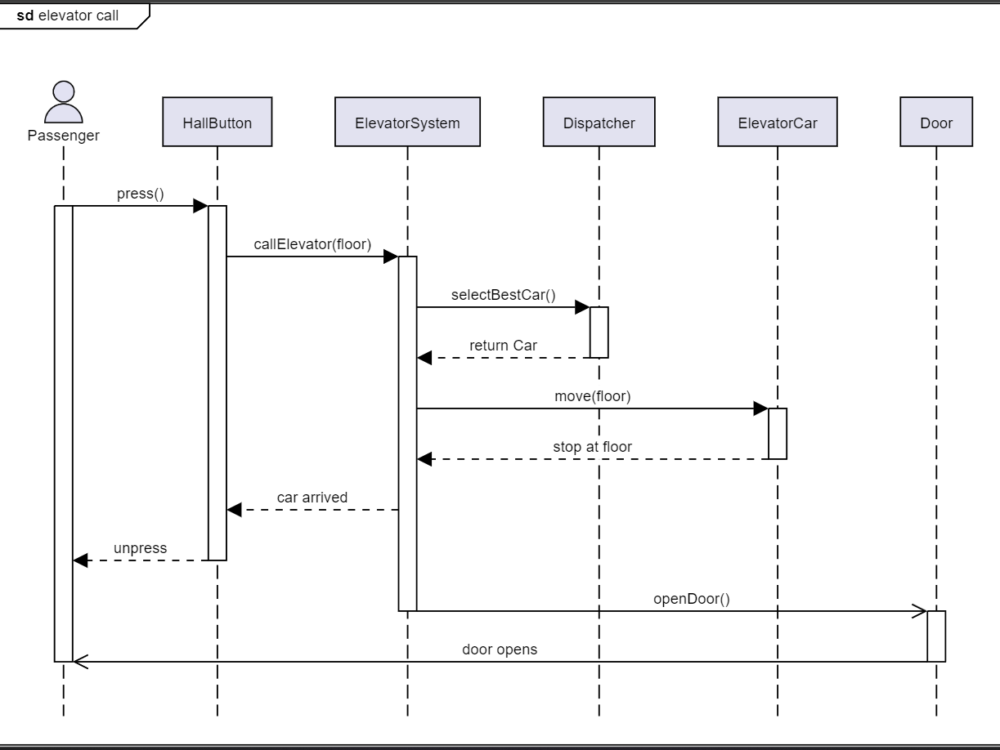

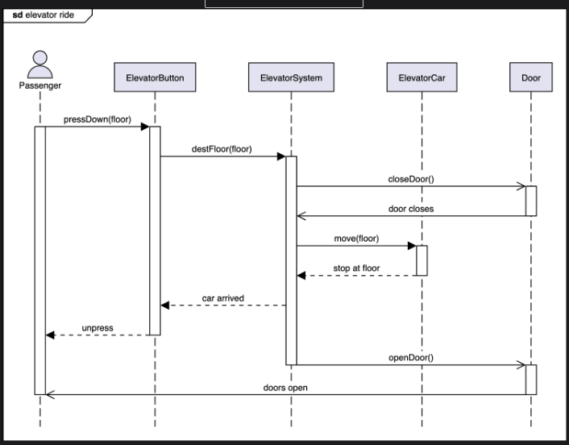

activity diagram

The passenger arrives at the desired floor

States

Initial state: The passenger enters the elevator car.

Final state: There are two final states present in this activity diagram. These are shown below:

The passenger arrives at the destination floor.

The passenger is not allowed due to max load/capacity issues.

Actions

The passenger enters the elevator car. The elevator car checks if the safety limits are met. The elevator car stops at other passengers’ floors. Finally, the elevator car reaches the passenger’s desired floor.

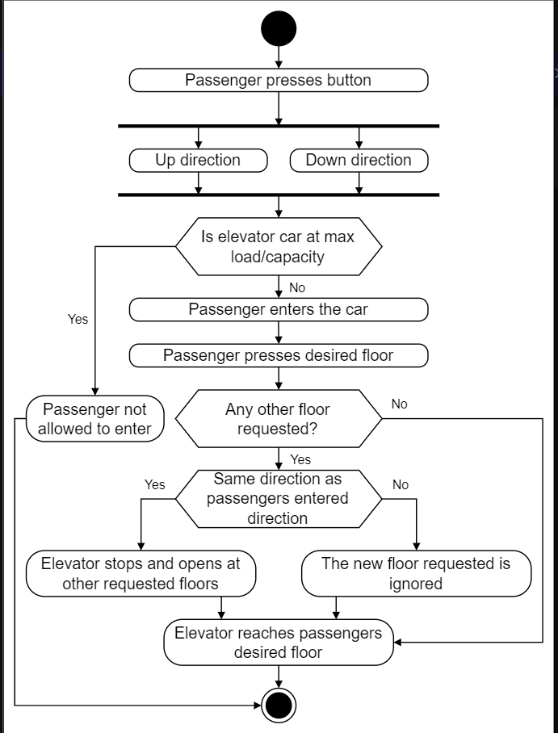

