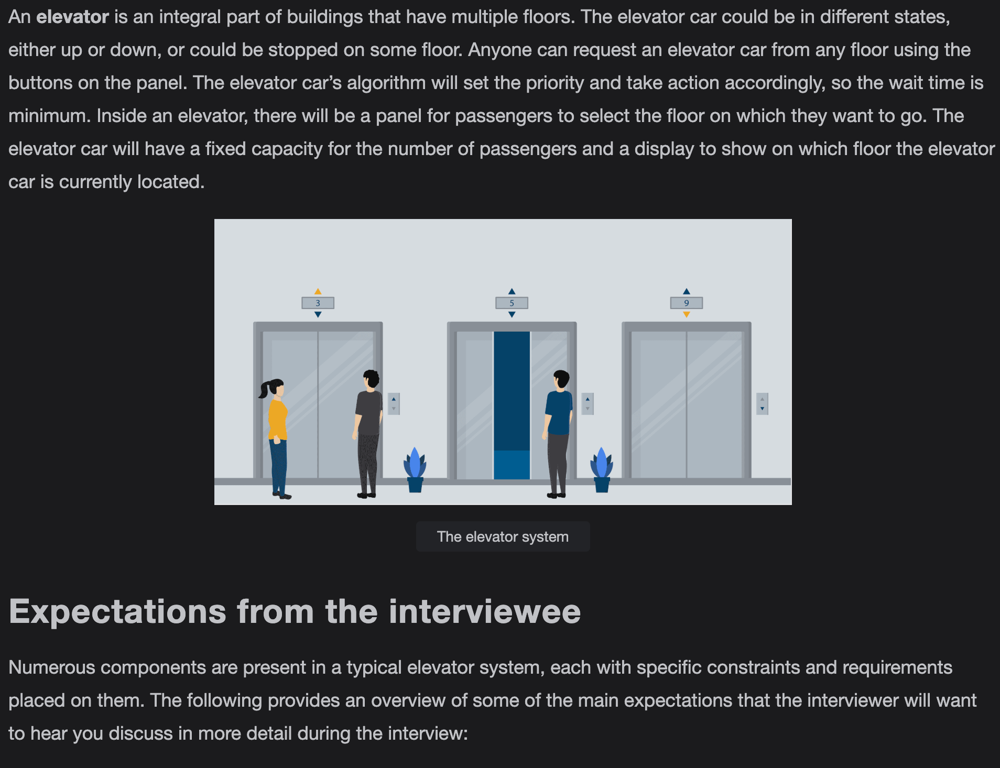
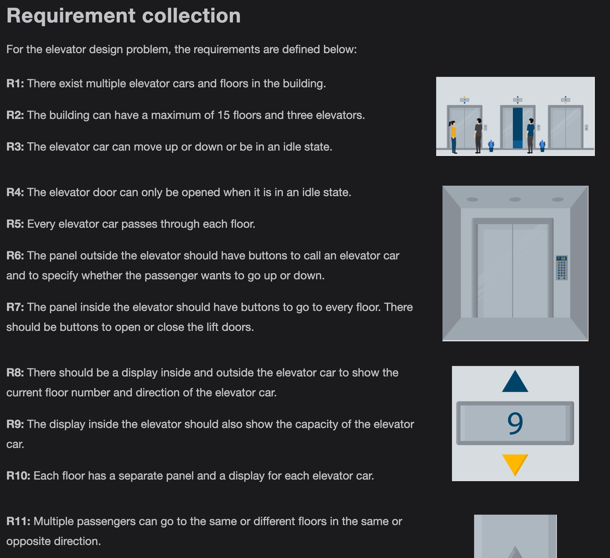
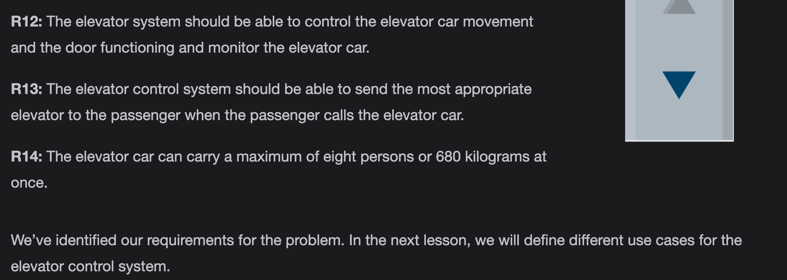
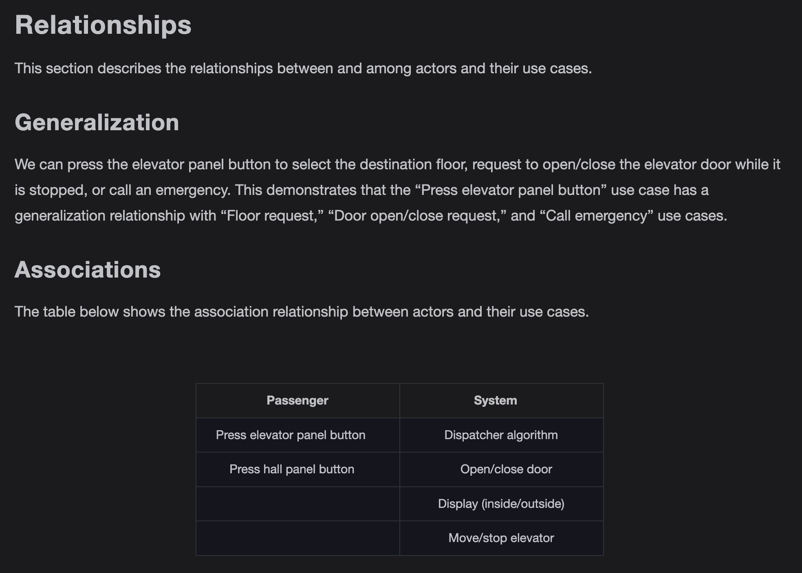

Getting Ready: Elevator System

Problem definition

Requirements for the Elevator System

In this lesson, we’ll list the requirements of the elevator system. This is a very crucial step as requirements define the scope of a problem, so getting them right from the interviewer and understanding them well will make the design of the rest of the system smooth and easy.

We’ll use the notational convention to identify each requirement with a unique label "Rn", where "R" is short for Requirement and "n" is a natural number.

Class Diagram for the Elevator System

Note: We have already discussed the inheritance relationship between classes in the component section.

Class diagram of the elevator system

Here’s the complete class diagram for our elevator system:

Design pattern

The Strategy design pattern can be applied here since the system could have multiple dispatch request strategy classes. Therefore, depending on the particular layout of the building and its scenarios, we choose a set of dispatch request strategy classes.

We can also use the State and Delegation design pattern for this problem. Instead of implementing all methods on its own, the context object stores a reference to one of the state objects that represents its current state and delegates all the state-specific tasks to that object. For example, elevators have multiple states like working or idle, etc. Based on the state, the system infers which method or behavior of the elevator should be invoked.

The advantage of this algorithm is that it is simple and easy to implement. The drawback of this algorithm is that extra elevator movements occur by this algorithm which results in more power usage and cost. To implement FCFS, we can use a queue data structure to keep track of which passenger comes first.

SSTF

Shortest Seek Time First (SSTF) is an algorithm in which the passenger who is closest to the elevator car would get the elevator car. This algorithm is considered better than FCFS since less elevator movement is required as compared to the FCFS algorithm. This algorithm also results in an increased throughput. However, there is a loophole in this method where it always chooses the minimum distant passengers and ignore the farther ones completely. To implement this algorithm, we can use a priority queue, min-heap, or an array data structure.

SCAN

SCAN is also known as the Elevator Algorithm. The elevator car starts from one end of the building and moves towards the other end, servicing requests in between. The advantage of this method is that it serves multiple requests in parallel. However, it results in increased cost as the elevator car only changes its direction at either the top floor, or the lowest floor. The implementation of SCAN can be done using two boolean arrays or a single HashMap, or two priority queues data structures to track the floor where the elevator should stop.

LOOK

LOOK is also known as the look-ahead SCAN algorithm. It is an improved version of the SCAN Algorithm. In this algorithm, the elevator car stops when there is no request in front of them. It will move again on the basis of the request. The advantage of this algorithm is that the elevator car does not always go till the end of the building but can change its direction in between. This algorithm can be implemented using a HashMap, TreeMap, or binary search tree data structure.

Sequence Diagram for the Elevator System

Sequence challenge: Elevator ride

You will complete a sequence diagram for an elevator ride from one floor to another. A skeleton of the sequence diagram for an elevator ride is given below:

Activity Diagram for the Elevator System

Activity challenge: The passenger calls for the elevator

You will create an activity diagram of a passenger calling for the elevator.

Code of Elevator System

We’ve discussed different aspects of the elevator system and observed the attributes attached to the problem using various UML diagrams. Let’s explore the more practical side of things, where we will work on implementing the elevator system using multiple languages. This is usually the last step in an object-oriented design interview process.

Elevator system classes

Enumerations

First of all, we will define all the enumerations required in the elevator system. According to the class diagram, there are three enumerations used in the system i.e., ElevatorState, Direction and DoorState.

Button

This section contains the implementation of a Button class and its subclasses which are HallButton and the ElevatorButton. The Button class has a pure virtual function isPressed() in it. 

Elevator panel and hall panel

ElevatorPanel and the HallPanel are classes which use the instance of ElevatorButton and HallButton respectively. 

Display

This component shows the implementation of the Display class. This class is responsible for showing the display inside and outside of the elevator cars.

Elevator car

This section contains the definition of the ElevatorCar class. An elevator car contains the instance of Door, Display, and ElevatorPanel. 

Door and floor

This section contains the code for the Door and Floor classes. In the Door class, the enumeration DoorState is used and the Floor class contains the instances of Display and HallPanel.

Elevator system and building

The final class of an elevator system is the ElevatorSystem class which will be a Singleton class, which means that the entire system will have only one instance of this class. Moreover, there is a Building class that contains the instances of Floor and ElevatorCar. 

