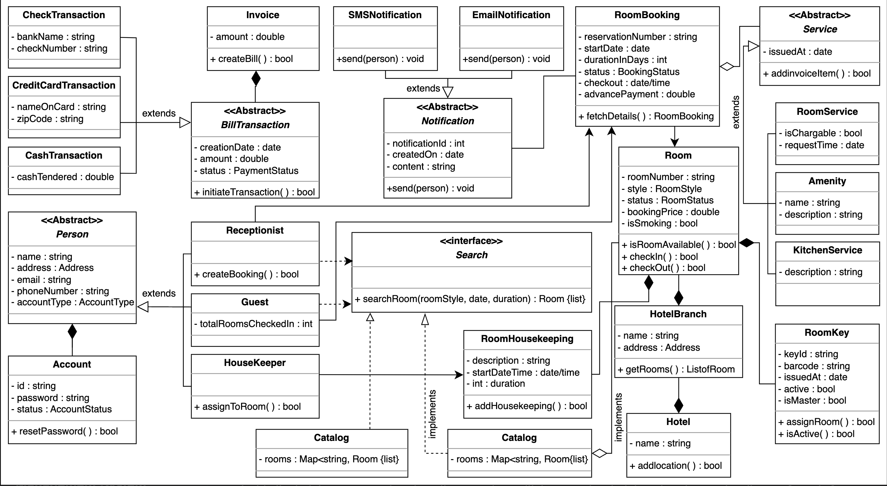
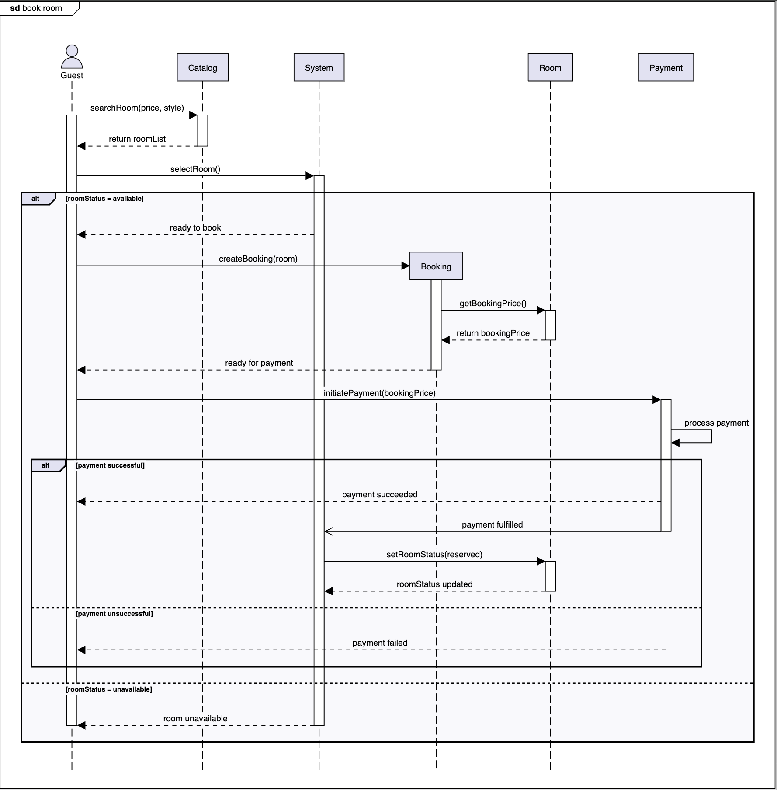

Getting Ready: The Hotel Management System

Problem definition
The hotel management system is a software used to manage all hotel activities efficiently and smoothly. Almost all popular hotels have an online management system to digitize the process of booking rooms, managing staff, and performing other necessary hotel management features. Through this system, the notification and payment process is made flexible and automated. In the hotel, there is usually a fixed number of rooms, and the booking system has information about all rooms present and their availability.

For the hotel manager, controlling all the hotel activities manually is a difficult task. With the help of an online hotel management system, the manager can keep track of rooms, customers, and workers through a single portal. The manager can also post available rooms to the system and generate bills. The system also allows customers to search for and book a room of their choice and cost range. The system provides complete information about rooms to the customers so they can view the available rooms and book them online. The guest is charged on the basis of the time duration the hotel room is booked. In this way, the system facilitates both customers and the manager of the hotel.

Room booking

Booking a room is an essential part of the hotel management system. The system has to ensure that no two people can book the same room. The interviewer expects you to ask questions to identify how the system will work in such situations:

How will the system ensure that multiple users do not book the same room?

What type of users are allowed to book a room in the hotel?

Can users book a room in advance?

Payment handling

One of the hotel management system's most significant attributes is its payment structure to its customers. This can vary, so the interviewer would expect you to ask the questions listed below:

What payment methods can the customer use (for example, credit card or cash)?

How is the payment performed? Does the customer pay online or through a receptionist at the hotel?

Will the customer be able to pay in advance for a room booking, or is a just-in-time(JIT) payment system available?

Price variance

We touched upon the payment methods of the hotel management system. Now, the pricing model needs to be clarified by the interviewer. Therefore, you may ask the questions listed below:

How will the booking price be calculated? Or which factors affect the price of a room in the hotel?

How does the location and size of the room affect its price?

How does the booking duration affect the payment?

Booking cancelation

There will be many duplicate instances in our system. The interviewer expects you to ask the questions provided below:

Can the user cancel a room booking?

Which type of users are allowed to request a room booking cancelation?

Design approach

We’ll design this hotel management system using the bottom-up design approach. For this purpose, we will follow the steps below:

Identify and design the smallest components first, such as a room.

Use these small components to design bigger components, such as building a hotel that can be composed of multiple rooms.

Repeat the steps above until we design the whole hotel management system.

Design pattern

During an interview, it is always a good practice to discuss the design patterns that the hotel management system falls under. Stating the design patterns gives the interviewer a positive impression and shows that the interviewee is well-versed in the advanced concepts of object-oriented design.

Requirements for the Hotel Management System

Requirement collection

The requirements for the hotel management system are defined below:

R1: There can be four types of accounts in the system such as housekeeper, receptionist, guest, or server.

R2: The rooms can be of different styles like standard, deluxe, family suite, or business suite.

R3: The system should allow the guests to search for any room and book any of the available rooms.

R4: During room booking, the user will enter the check-in date and the duration of the stay. The user would also have to give some advance payment.

R5: The customer can cancel the booking and a full refund will be provided if the booking is canceled before 24 hours of the check-in time.

R6: The system should send a notification to the customers about the booking status or other information.

R7: All the housekeeping tasks should be logged in and managed by the system.

R8: The system should allow the customer to add services of their own choice like room service, food or kitchen service, or amenity.

R9: Every room should have its own specific key, and there can be a master key that opens a specific set of rooms.

R10: A hotel can have multiple branches of it.

Use Case Diagram for the Hotel Management System

System

Our system is a "hotel."

Actors

Now, we will define the main actors of our hotel management system.

Primary actors

Guest: This is the hotel's primary actor who can book a room, make payment, and change or cancel the reservations.

Receptionist: This actor acts as the admin of the system and can perform any task a “Guest” can perform. This can also add, remove, or update the room, check in/check out guests, and issue room keys for guests.

Manager: This actor can add or modify an employee and issue a card to an employee of the hotel.

Housekeeper: This can add or update the room’s housekeeping status.

Secondary actors

System: This can send booking notifications to guests.

Server: This can add or update room status according to the room change request.

Use cases

In this section, we will define the use cases for the hotel. We have listed the use cases according to their respective interactions with a particular actor.

Guest

Book room: To book a room in the hotel

Update booking: To update a room booking in the hotel

Login/Logout: To log in and out of the hotel management system

Cancel booking: To cancel a room booking in the hotel

View booking: To view and verify a room booking

Print booking: To print booking details from the hotel management system

Search room/booking: To search for a room or a booking in the hotel management system

Payment: To pay the room rent to the hotel

View account: To view account details and booking status

Register new account: To register a new account for new guests

Return room key: To return the room key before checkout

Receptionist

Add room: To add rooms to the hotel management system so guests can book them

Update room: To update room status from available to booked or vice versa

Remove room: To remove a room from the hotel management system so guests can't book it

Book room: To book a room in the hotel

Update booking: To update a room booking in the hotel

Login/Logout: To log in and out of the hotel management system

Cancel booking: To cancel a room booking in the hotel

View booking: To view and verify a room booking

Print booking: To print booking details from the hotel management system

Search room/booking: To search for a room or a booking in the hotel management system

View account: To view account details and booking status

Register new account: To register a new account for new guests

Check in guest: To check in guests to the hotel

Check out guest: To check out guests from the hotel

Issue room key: To issue room keys to guests who checked in

Manager

Issue employee card: To issue employee cards so one can be identified

Add/modify employee: To add a new employee to the hotel management system or to modify the employee's status

Add room: To add rooms to the hotel management system so guests can book them

Update room: To update room status from available to booked or vice versa

Remove room: To remove a room from the hotel management system so guests can't book it

Book room: To book a room in the hotel

Update booking: To update a room booking in the hotel

Login/Logout: To log in and out of the hotel management system

Cancel booking: To cancel a room booking in the hotel

View booking: To view and verify a room booking.

Print booking: To print the booking details from the hotel management system

Search room/booking: To search for a room or a booking in the hotel management system

View account: To view account details and booking status

Register new account: To register a new account for new guests

Check in guest: To check in guests to the hotel

Check out guest: To check out guests from the hotel

Issue room key: To issue room keys to guests who checked in

System

Add/update room charge: To update the status of the room charge

Send booking notification: To send booking notification to guests

Housekeeper

Add/update room housekeeping: To update the housekeeping status of rooms

Relationships

We describe the relationships between and among actors and their use cases in this section.

Generalization

The manager is the boss of the receptionist and has access to everything a receptionist has. Therefore, “Manager” has a generalization relationship with “Receptionist.”

“Cash” and “Credit card” use cases are used for payments. Hence, both have a generalization relationship with the “Pay ticket” use case.

Associations

Include

Whenever a guest books a room, the payment will be processed. Hence, the “Book room” use case has an include relationship with “Payment.”

When a receptionist checks in a guest, a key is issued to the guest. Hence, “Check-in guest” has an include relationship with “Issue room key.”

When a guest checks out, the key is returned to the receptionist. Hence, “Check-out guest” has an include relationship with “Return room key.”

If a booking is canceled, the payment will be refunded. Hence the “Cancel booking” use case has an include relationship with “Refund payment.”

Use case diagram

Class Diagram for the Hotel Management System

Components of a hotel management system
In this section, we’ll define the classes for a hotel management system. Since we are following the bottom-up approach to designing a class diagram, we will create the classes of small components first. Next, we will integrate these components and create the class diagram for the entire hotel management system.

Address and Account

The Address is a class that is required to store any address. The Address is a custom data type that has attributes like a street address, city, etc. In the hotel management system, this class will be used to specify the address of the users and the hotel.

Account is a class that is used to store the account information of the user. This class has three members, i.e., account ID, password, and the status of the account. The class representation of Address and Account classes is as follows:

Person

Person is an abstract class used to store information related to a person like a name, email, phone number, etc. In this class, there is an object of the Address type to specify the person’s address. The Person class specifies the accounts in the system. There can be four types of accounts in the system,i.e., housekeeper, receptionist, guest, and server.

There are multiple functions of the Person class’s subclasses. First, the Housekeeper class will keep track of the housekeeping records of a room. Second, the Receptionist class represents the hotel receptionist. The methods in this class depict the actions that can be performed by the receptionist. Moreover, the Guest class describes the guests of the hotel. Guests are the customers of the hotel who can search for and book a room. Whereas, the Server class will handle the room service.

R1: There can be four types of accounts in the system such as housekeeper, receptionist, guest, or server.

Service

Service is an abstract class that encapsulates the details of different types of services that guests have requested. There are three types of services provided—amenity, room service, and kitchen service.

The Amenity class is a subclass of Service having two members; name and description. Similarly, RoomService is also inherited from the Service class. This class stores information about room services whether these services are chargeable or not and what is the request time of the service. Furthermore, the last child class of the Service is the KitchenService.

R8: The system should allow the customer to add services of their own choice like room service, food or kitchen service, or amenity.

Invoice

The Invoice class represents the billing system in the hotel management system

Room booking

The RoomBooking class is responsible for managing the bookings for a room. This class consists of attributes like reservation number, start date, duration, etc. Moreover, this class has a member of the BookingStatus type that is used to store the status of the room booking.

R4: During room booking, the user will enter the check-in date and duration of the stay. The user would also have to give some advance payment.

Notification

Notification is an abstract class. This class is responsible for sending notifications to guests whenever the booking is nearing the check-in or check-out date. Every notification has an ID, creation date, and content in it. The notification can either be an SMS notification or an email notification.

The SMSNotification class requires the phone number of the member to send a notification. On the other hand, the EmailNotification needs the email address of the member to send a notification

R6: The system should send a notification to the customers about the booking status or other information.

Room, room key, and room housekeeping

The Room class is the basic building block of the system. Every room has a room number and price associated with it. The Room class uses the RoomStyle and RoomStatus enums to specify the style and status of the rooms, respectively.

Each room has an electronic key card associated with it. The RoomKey class expresses the electronic key card. Each card has its own unique ID and barcode on it. The RoomKey class also has members to store the issue date, to check whether or not the key is active, and to check whether or not a key is a master key. Whereas, RoomHousekeeping is a class used to keep track of all housekeeping records for the rooms.

R9: Every room should have its own specific key, and there can be a master key that opens a specific set of rooms.

R7: All the housekeeping tasks should be logged in and managed by the system.

Search interface and catalog

Search is one of the most important components of the hotel management system. In the diagram below, Search is the interface that allows the guest to search for any room of their choice and pay range. The receptionist can also use this interface to search for any room. The Catalog class contains a list of all rooms and implements the Search interface.

R3: The system should allow the guests to search for any room and book any of the available rooms.

Bill transaction

After generating an invoice, a customer needs to pay the bill to confirm the booking of the room. A BillTransaction class is required to store the information of bill payment. Three ways to pay the bill are check transaction, cash transaction, and credit card transaction. We can define the bill payment functionality through any payment method

Hotel and hotel branch

In this section, we’ll look at the Hotel and HotelBranch classes. According to the requirements, there can be multiple branches of the hotel. HotelBranch is a class used to represent the location of the hotel branch. This class consists of two members: name and Address. The string type name is used to store the name of the hotel branch, while the complex object Address is used to store the complete address of a branch.

The Hotel class is the base class of the system which is used to represent the hotel. 

R10: A hotel can have multiple branches of it.

Enumerations

Here is the list of enumerations required in the hotel management system:

BookingStatus: This status describes the status of the booking whether the booking is requested, pending, confirmed, canceled, or abandoned.

PaymentStatus: This status describes the status of the booking’s payment, whether it is unpaid, pending, completed, failed, declined, canceled, abandoned, setting, settled, or refunded.

RoomStatus: This status describes the status of the room, whether it is available, reserved, occupied, not available, being serviced, or any other possibility.

RoomStyle: This describes the style of the room that the user wants to book. The style could be standard, deluxe, family suite, or business suite.

AccountStatus: This status tells the status of the user account whether it is active, closed, canceled, or blocklisted.

AccountType: The account type tells the type of the account of the user, whether it is a member, guest, manager, or receptionist.

R2: The rooms can be of different styles like standard, deluxe, family suite, or business suite.

Relationship between the classes

Now, we’ll discuss the relationships between the classes we have defined above in our hotel management system.

Association

The class diagram has the following association relationships:

One-way association

The Housekeeper class has a one-way association with RoomHousekeeping.

Both Receptionist and Guest have a one-way association with RoomBooking.

The RoomBooking class has a one-way association with Room.

Two-way association

The RoomBooking class has a two-way association with Notification.

Aggregation

The RoomBooking class is an aggregate of Service.

Composition

The RoomBooking class is composed of Invoice.

The Invoice class is composed of BillTransaction.

The Person class is composed of Account.

The Room class is composed of RoomHousekeeping and RoomKey.

The HotelBranch class is composed of Room.

The Hotel class is composed of HotelBranch.

Inheritance

The following classes show an inheritance relationship:

Receptionist, Guest, Housekeeper, and Server classes extend the Person class.

Amenity, RoomService, and KitchenService classes extend the Service class.

Both PostalNotification and EmailNotification classes extend the Notification class.

The Catalog class implements the Search interface.

Class diagram of the hotel management system

Design pattern

The Strategy design pattern is applied here, which will design a separate strategy or algorithm to calculate the rate of each room.

The Hotel class follows the Singleton design pattern, because there will only be a single instance of the Hotel class.

Inside the hotel management system, there can be multiple rooms in a hotel, and each room has its own formula for calculating the booking cost. Therefore, Room and related classes incorporate the properties of the Factory design pattern.

Additional requirements

The interviewer can introduce some additional requirements in the given hotel management system, or they can ask some follow-up questions. Let's see examples of the additional requirements:

Discount: A discount will be applied to the payment depending on special events such as the new year, branch opening, and so on. The class diagram provided below shows the relationship of Discount with the BillTransaction class:

Sequence Diagram for the Hotel Management System

Sequence diagrams are a great way to understand the interactions between different entities and objects in the system. There can be different sequence diagrams that we can create for our hotel management system. In this lesson, we will create sequence diagrams for the following two interactions:

Book a room: The guest books a hotel room online.

Sequence challenge: The guest checks out of their room at the reception.

Book a room

The sequence diagram for the room booking should have the following actors and objects that will interact with each other:

Actor: Guest

Objects: Catalog, Booking, Room, and Payment

System

Here’re the steps in the book room interaction:

The guest searches for a room based on some price and style.

The catalog returns a list of rooms.

The guest selects a room they wish to book.

If the room is available:

The guest creates a booking for the room.

The booking fetches the booking price for the room.

The guest is informed that the booking is ready for payment.

The guest initiates a payment against the booking price.

The payment is processed, and the guest is informed of the status.

If the payment is successful:

The guest is informed that the payment has succeeded.

The system is informed that payment is complete.

The system updates the room status to reserved.

Else if the payment is unsuccessful:

The guest is informed that the payment has failed.

Else if the room is unavailable:

The system informs the guest that the room is unavailable.

Activity Diagram for the Hotel Management System

Activities diagrams are a great way to visualize the flow of messages from one activity to the other in the system. There can be different activity diagrams that we can create for our hotel management system. In this lesson, we’ll create activity diagrams for the following two activities:

Hotel check-in

Activity challenge: Cancel room booking

Hotel check-in

The following are the states and actions that will be involved in this activity diagram.

States
Initial s
tate: A guest with a room booking comes to the hotel reception for check-in.

Final state: The guest successfully checked in at the hotel.

Actions

The guest has a room booked and arrives at the hotel reception. The receptionist validates the booking and checks if the room is ready. The receptionist then issues room keys and updates the room status.

Code for the Hotel Management System

Hotel management system classes

In this section, we’ll provide the skeleton code of the classes designed in the class diagram lesson.

Note: For simplicity, we are not defining getter and setter functions. The reader can assume that all class attributes are private and accessed through their respective public getter methods and modified only through their public methods function.

Enumerations

First, we will define all the enumerations required in the hotel management system. According to the class diagram, there are six enumerations used in the system, i.e., RoomStyle, RoomStatus, BookingStatus, AccountStatus, AccountType, and PaymentStatus.

Address and account

This section contains the Address and Account classes. Here, the Address class is used as a custom data type.

Person

Person is an abstract class that represents the various people or actors that can interact with the system. There are four types of persons: Guest, Receptionist, Server, and Housekeeper.

Service

Service is an abstract class, and this section represents different charges, Amenity, RoomService, and KitchenService), against a booking

Invoice

This section contains information on the Invoice class to create a bill.

Room booking

RoomBooking is a class responsible for managing the bookings for a room. 

Bill transaction

After generating an invoice, a customer needs to pay the bill to confirm the booking of the room. A BillTransaction class is required to store the information of bill payment. Three ways to pay the bill are check transactions, cash transactions, and credit card transactions.

Notification

The Notification class is another abstract class responsible for sending notifications, with the SMSNotification and EmailNotification classes as its child.

Room, room key and room housekeeping

The Room class represents a room in the hotel. RoomKey is a class used to express the electronic key card and the RoomHousekeeping is a class used to keep track of all the housekeeping records for the rooms.

Search and catalog

Search is an interface, and the Catalog class implements the search interface to help in the room search

Hotel and hotel branch

The Hotel class is the base class of the system that represents the hotel.

