A library management system (LMS) aims to automate all library activities. It is a software that helps manage all the primary functions of library management. With the help of a library management system, we can organize, handle, and maintain the record of numerous books and the members in a comprehensive and systematic way.

A librarian can use this software to track the number of books in the library. They can also use it to retain several records including, the new books, borrowed books with due dates, the member who borrowed books, returned books, fine on the late returned books,

LMS also supports maintaining the physical library. The user can keep track of the position of the book in the library and can search for whether or not the specific book is currently available in the library

Efficient searching

Searching for books is one of the most crucial functions of LMS. The user must be able to search for any book. Different users may want to search for a book through different methods. Therefore, the interviewer can ask questions like these:

- Would the user be able to search for a book using attributes other than the book name?
- How will the user be able to search for a book by its author name, publication date, etc.?
- How will the user search a specific category of books like magazines, journals, newspapers, etc.?

Versatility

Before designing the system, it is mandatory to specify the actors of the system. Hence, the interviewer can ask about the actors of the system as follows:

- Can the software only be used by a librarian or by all library members?

Book reservation

- What is the mechanism of book reservation?
- Can a member reserve a book again if it is already reserved?
- How does the status of the book change when a member returns a book?

Book renewal

- What is the mechanism of book renewal if a member wants to hold a book for a longer period of time?

Fine management

- How is the calculation and deduction of fines handled if the book is returned late?

Design approach

Bottom-up

- Identify and design the smallest components first.
- Use these small components to design bigger components.
- Repeat the steps above until we design the whole system.

Design pattern

Requirements

R1: The system should be able to store the information about books and members of the library. Moreover, the complete log of the book borrowing process should also be stored.

R2: Every book is supposed to have a unique identification number and other details including a rack number to help locate the book physically.

R3: Every book should have an associated ISBN, title, author name, subject, and publication date.

R4: There can be multiple copies of the book. Each copy will be recognized as a book item.

R5: There can be two types of users, i.e., the librarian and the members.

R6: Every user must have a library card with a unique card number.

R7: One member can issue a maximum of 10 books at a time.

R8: The member can issue a book for a maximum of 15 days.

R9: Each book item can only be reserved by a single member.

R10: The system should be able to keep a record of who issued or reserved a particular book and on which date.

R11: The system should allow the user to renew the reserved book.

R12: The system should send a notification if the book is not returned within the due date.

R13: If the book is currently not available, then the member should be able to reserve it for whenever it is available.

R14: The system should allow the user to search a book by its title, author name, subject, or publication date.

Use Case Diagram for the Library Management System

System is library

Actors

Primary actors

Member: This actor is the client of the library. It can search, reserve, renew, or return a book and modify its library membership.

Librarian: It acts as an admin in a library management system. It can add or remove a book as well as modify the status of members or books. It can also issue and return books.

Secondary actors

System: It can send alerts related to reservations and late returns of books.

Librarian

- Add book: To add a new book to the library

- Remove book: To remove an existing book from the library

- Edit book: To modify a book

- Register new account: To register a new library member

- Cancel membership: To cancel the library membership of a member

- Register/Update account: To create or update an account

- Login/Logout: To log in or log out account

- Issue book: To issue a book to a member

- Remove reservation: To remove reservation of books

- Renew book: To renew the issuance of the book

- Reserve book: To reserve a book that is currently not available

- View account: To view the account and access all account details

Member

- Search catalog: To search for a book in the library

- Cancel membership: To cancel the library membership of a member

- Register/Update account: To create or update an account

- Login/Logout: To log in or log out of the account

- Checkout book: To complete the issue book process

- Remove reservation: To remove the reservation of books

- Renew book: To renew the issuance of the book

- Reserve book: To reserve a book that is currently not available

- View account: To view the account and access all account details

- Return book: To return a book to the library

System

- Overdue notification: To send an alert if the book is not returned on time

- Reservation available notification: To send an alert when the book is available for reservation

- Reservation canceled notification: To send an alert when a book reservation is canceled

There are some use cases that are not directly related to any actor. They are elaborated below.

- Add book item: To add an item of a book in the catalog

- Edit book item: To edit the details of a book item in a catalog

- Remove book item: To remove a book item from the catalog

- Update catalog: To update (add, edit, or remove) a book item or book from the catalog

- Issue library card: To issue a library card to new members that will be for identification.

- By subject name: To search for a book in the catalog by its subject name

- By book title: To search for a book in the catalog by its title

- By author name: To search for a book in the catalog by its author name

- By publication date: To search for a book in the catalog by its publication date

- Pay fine: To pay a fine if the book is returned after the due date

Generalization

We can search for a book with the title, subject name, author name, or publication date. This shows that the “Search catalog” use case has a generalization relationship with “By subject name,” “By book title,” “By author name,” and “By publication date” use cases.

Associations

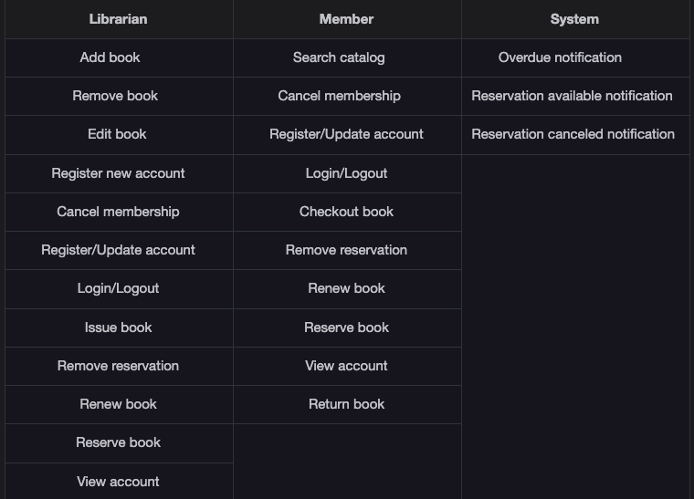

Include

- To add a new book, we add its copies (book items), so the "Add Book" use case has an include relationship with the "Add book item" use case.

- To edit a book, we need to edit its items, so the "Edit Book" use case has an include relationship with the "Edit book item" use case.

- To remove a book from the library, we need to remove its items, so the "Remove Book" use case has an include relationship with the "Remove book item" use case.

- To update a catalog, we need to update all the book items. This will include adding, editing, or removing a book item since “Edit book item,” “Add book item,” and “Remove book item” have an include relationship with the “Update catalog” use case.

- To issue a book, we need to go through a checkout process, so the “issue book” use case has an include relationship with the “Checkout book” use case.

- Whenever we go through the checkout process, our book reservation will be removed as it had been issued. So the "Checkout book" use case has an include relationship with the "Remove reservation" use case.

Extend

- When a new member is registered, a library card is issued. So the "Register new member" use case has an extend relationship with the "Issue library card" use case.

- Whenever a member returns a book, the librarian will check if the submission is late or not and will ask the member to pay for a fine if it exists, so the "Return book" use case has an extend relationship with "Pay fine" use case.

use case diagram

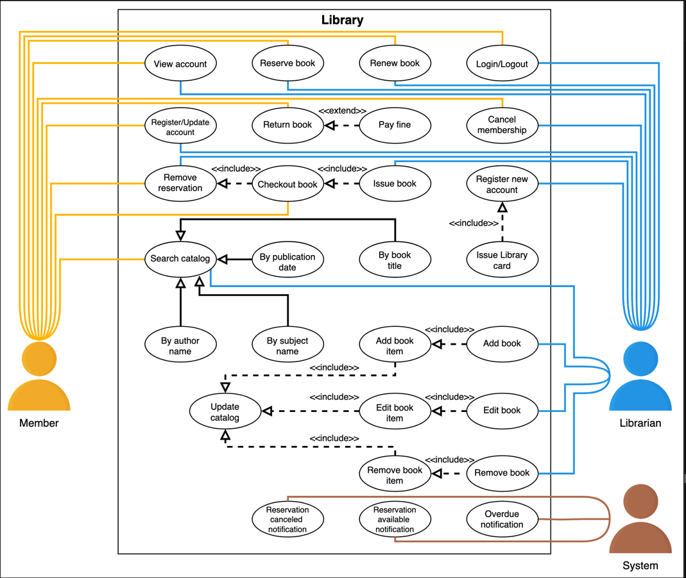

class diagram

Book and book item

The Book class represents the conceptual essence of a book. This includes the metadata or descriptive information about a book, which isn’t specific to any single physical copy. It’s a blueprint that captures the shared attributes of all instances or copies of the book as they exist in the world or within the library’s collection.

The BookItem class, on the other hand, represents a specific physical or digital instance of a Book in the library’s collection. This class extends the concept represented by the Book class to the practical level of inventory and circulation management. It deals with the properties and behaviors associated with individual copies of a book that patrons can borrow, reserve, or reference within the library. Each BookItem has its unique attributes that manage and track its status within the library system

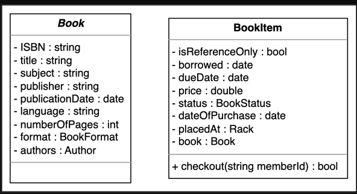

R3: Every book should have an associated ISBN, title, author name, subject, and publication date.

R4: There can be multiple copies of the book. Each copy will be recognized as a book item.

Rack

We have seen a complex object Rack that was defined in the BookItem class. Now, we are going to create a Rack class. This class is used to identify the physical location of any book item in the library. Every rack has a specific rack number assigned to it and a location identifier to represent the exact location of the book item in the library.

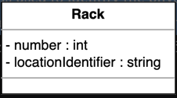

R2: Every book is supposed to have a unique identification number and other details including a rack number to help locate the book physically.

Person and author

The Person class is used to store information related to a person like a name, email, phone number, etc. In the person class, there is an object of the Address class to specify the person’s address.

There is also a class named Author that stores the author’s data like the author’s name and description. The author’s information is also used in the Book class.

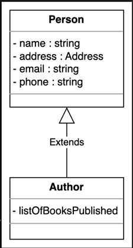

User, librarian, and library member

User is an abstract class that represents the system users of LMS. There can be two types of users: librarians and library members.

The Librarian class is a derived class of the User class. This class is responsible for adding a new book item and blocking or unblocking any library member.

Similar to the Librarian class, the Member class also extends the User class. The variable totalBooksCheckedout is used to store the number of books a certain member has already checked out. A member can reserve a book, return a book, or renew an already reserved book.

Since the Librarian and Member classes extend the User class

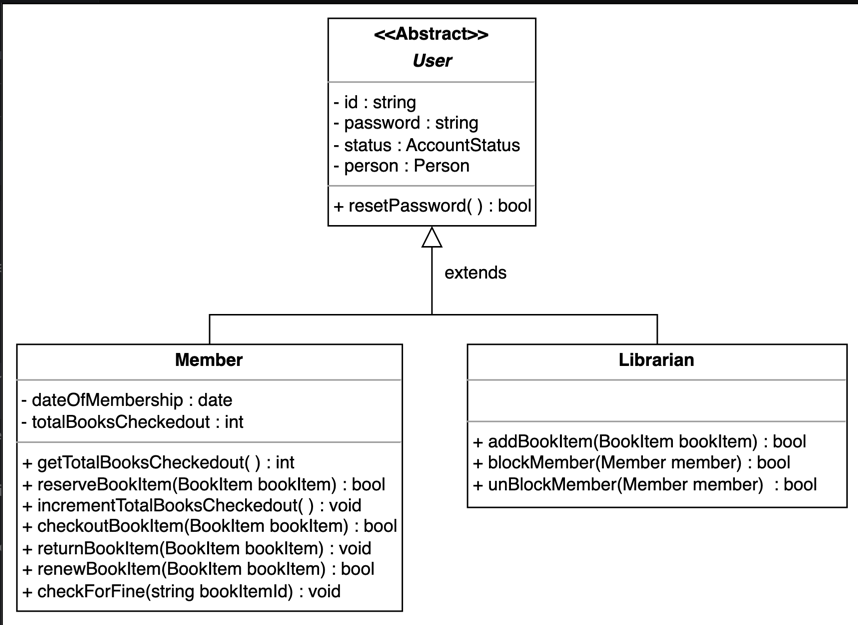

R5: There can be two types of users: the librarian and the members.

R11: The system should allow the user to renew the reserved book.

Library card

To manage each user’s library card information, we have a LibraryCard class. Each library card has an identification number, issue date, and information on whether or not it is active

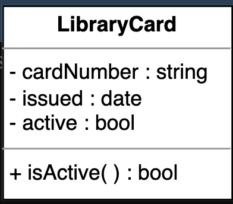

R6: Every user must have a library card with a unique card number.

Book reservation

Book reservation is one of the most important requirements of the library management system. To fulfill this functionality, we have a class named BookReservation. This class is responsible for managing the book reservation status of the book items.

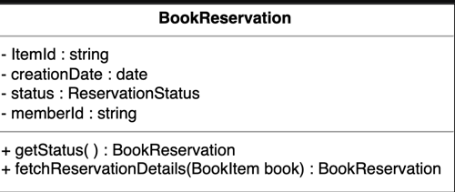

R10: The system should be able to keep a record of who issued or reserved a particular book and on which date.

Book lending

Similar to book reservations, book lending is also a part of the system since the BookLending class manages the process of checking out the book items. The information like the book lending date, due date, return date, etc. is being handled or processed in this class.

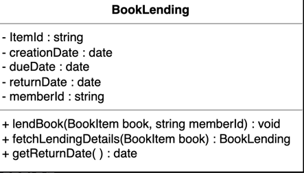

Notification

Notification is an abstract class. If the book is not returned within the due date, then the class notification is responsible for informing library members by sending a notification. Every notification has an ID, creation date, and content in it. The notification can be either a postal notification or an email notification.

The PostalNotification class requires the address of the library member to send a notification while EmailNotification needs the email address of the library member to send a notification.

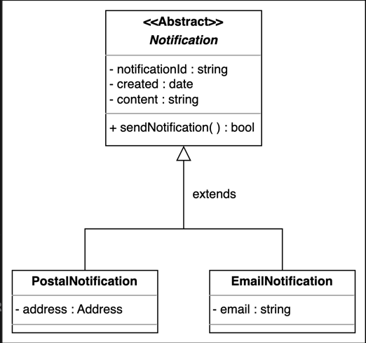

R12: The system should send a notification if the book is not returned within the due date.

Search and catalog

Search is one of the most important functionalities of the system. Search is the interface that allows the user to search for any book and return the list of books upon searching by any of the following methods:

- Search a book by its title.

- Search a book by its author name.

- Search a book by its subject.

- Search a book by its publication date.

Catalog is a class where the search functionality is implemented. In each catalog, the books are sorted according to one of the given search techniques, i.e., on the basis of the book’s title, author, subject, or publication date.

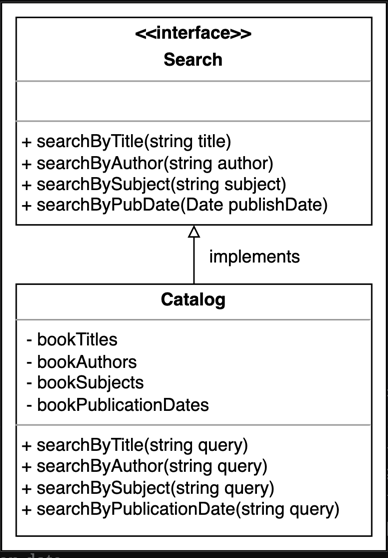

R14: The system should allow the user to search a book by its title, author name, subject, or publication date.

Library

The Library class is the base class of the system which is used to represent the library. It is a central part of the organization. This class consists of two members: name and Address. The string type name is used to store the name of the library, while the complex object Address is to store the complete address location of the library

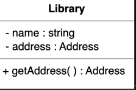

Enumerations

BookFormat: This describes that a book can only be of one of the specified formats. It can be a hardcover, paperback, audiobook, e-book, newspaper, magazine, or journal.

BookStatus: The book status describes the status of the particular book item for the user, whether it is available, reserved, loaned, or lost.

ReservationStatus: This tells about the reservation state of any book item, whether it is in a waiting state, pending state, canceled state, or none of them.

AccountStatus: The account status tells about the user account status, whether it is active, closed, canceled, blacklisted, or none.

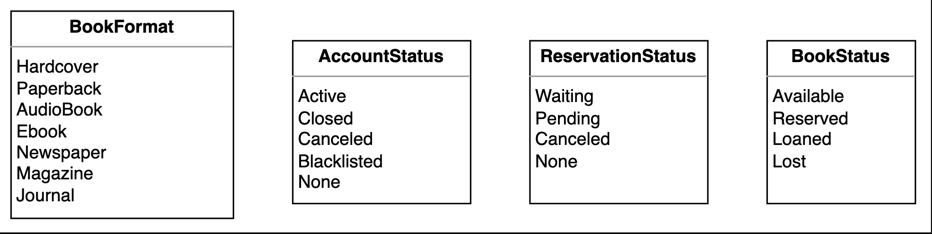

Custom data type

The Address is a custom data type, that will store the address of a library and the library users.

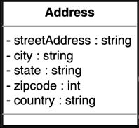

Relationship between the classes

One-way association

- The User has a one-way association with BookItem and BookReservation.

- Both BookReservation and BookLending have a one-way association with the BookItem.

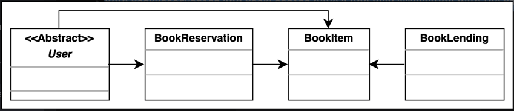

Two-way association

- Author has a two-way association with Book.

- Both Rack and Librarian have a two-way association with BookItem.

- The Notification has a two-way association with BookLending and BookReservation.

- The BookLending has a two-way association with BookReservation and User.

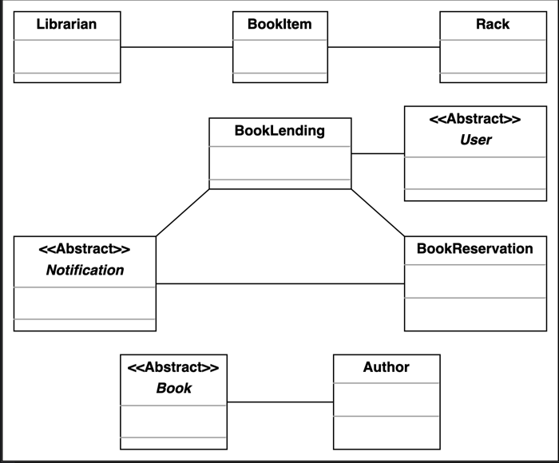

Composition

- Library is composed of BookItem.

- User is composed of LibraryCard.

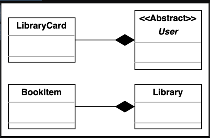

Aggregation

- The Catalog class contains the Book class.

- The BookItem class contains the Book class.

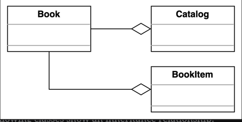

Inheritance

The following classes show an inheritance relationship:

- Both Librarian and Member classes extend the User class.

- Both EmailNotification and PostalNotification classes extend the Notification class.

- The Catalog class implements the Search interface.

class diagram

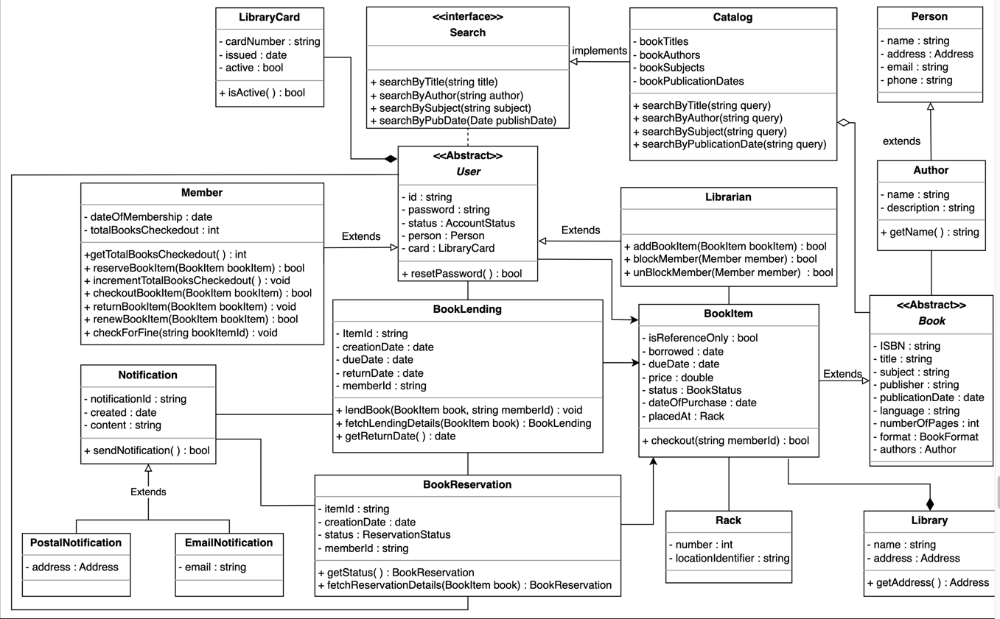

Design pattern

We can apply the Factory design pattern to create objects and mandate that they go via a single factory. For example, we can create a BookFactory class to create a book object in an arranged manner.

Similarly, we can use the Delegation design pattern to delegate a task from one class to another class. For example, librarian functionalities like adding book items, deleting book items, or modifying book items are actually implemented in the BookItem class. The Librarian class uses the BookItem class and has access to its data and methods.

Moreover, we can use the Observer design pattern to notify library members. For example, if a member searches for a book that is unavailable at that time, then the observer interface system will notify the member when that book is available for reservation.

Additional requirements

The interviewer can introduce some additional requirements in LMS, or they can ask some follow-up questions. Let’s see an example of additional requirements:

Barcode Reader: Each member should have a unique barcode on their library card and each book should also have a distinct barcode associated with it, and the system should be able to scan the barcode of every book and member. To fulfill this requirement, we have the class diagram shown below:

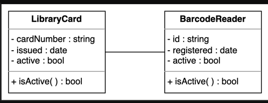

FineTransaction: Since there is a fine for not returning the book within the time, there should exist some mechanism to pay the fine. There are three ways to pay the fine: check transaction, cash transaction and credit card transaction.

The fine payment functionality follows the Decorator pattern as the fine keeps on adding upon the increased number of days. The class diagram provided below shows the relationship of FineTransaction with the Fine class

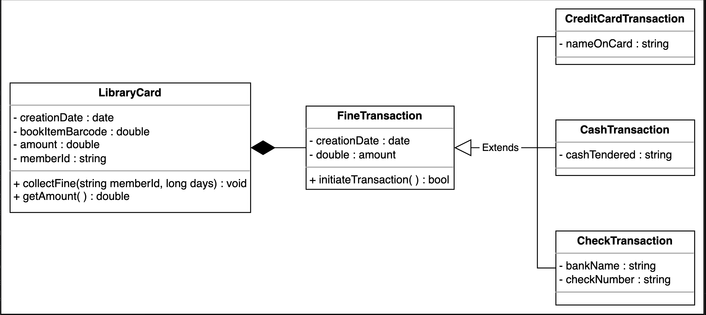

Sequence Diagram for the Library Management System

Sequence diagrams are a great way to understand the interactions between different entities and objects in the system. There can be different sequence diagrams that we can create for our library management system.

- Lend a book: The member requests the librarian to lend them a book.

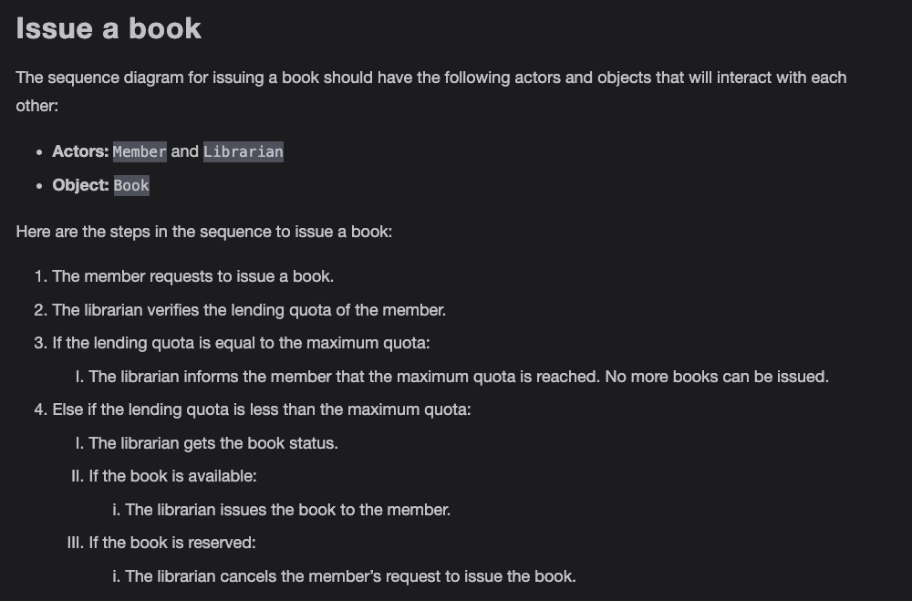

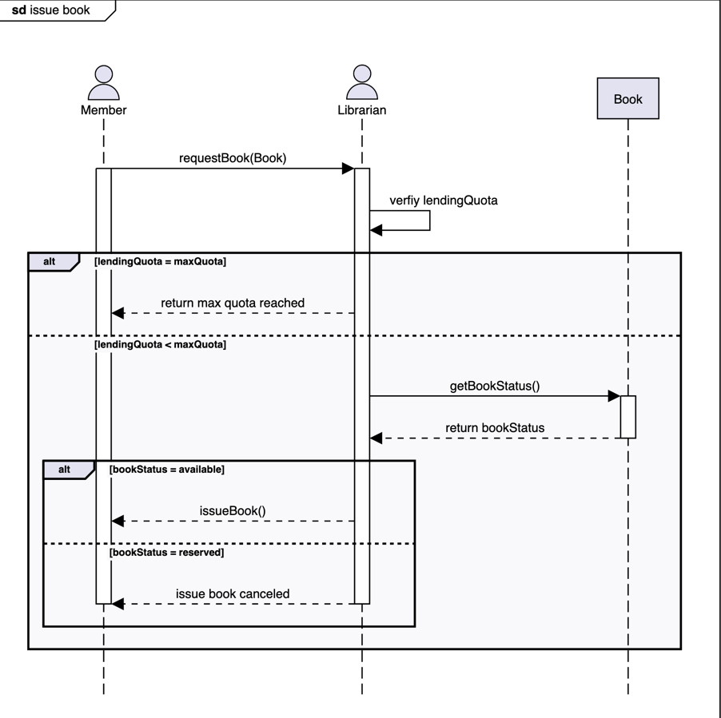

- Sequence challenge: The member returns a book.

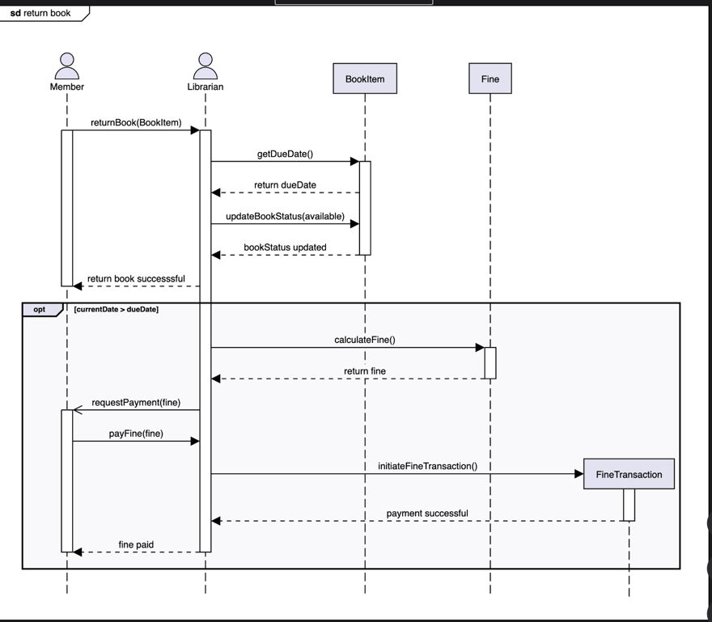

Activity Diagram for the Library Management System

Activities diagrams are a great way to visualize the flow of messages from one activity to the other in the system.

Check out a book from the library.

The following are the states and actions involved in this activity diagram.

States

Initial state: The member selects a book and initiates checkout.

Final state: There are two final states present in this activity diagram, shown below:

- The member completes the checkout process successfully, and the book will be allocated to the member.

- An error occurred during the checkout process due to book unavailability or issue book limit exceeds.

Actions

The member selects a book and enters the ID. The system will perform a few checks like book availability, the max limit of the member, and book reservations. If all checks are clear, then the book will be issued. Otherwise, the system will show an error message.

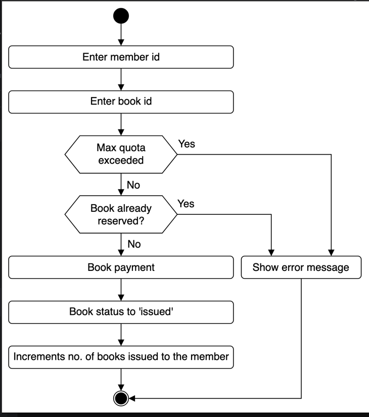

Return a book to the library.

The following are the states and actions involved in this activity diagram.

States

Initial state: The member returns a book back to the library.

Final state: There are two final states present in this activity diagram, shown below:

- The member completes the return process and pays a fine, if any.

- The system allocates a book to someone who reserved that book.

Actions

The member enters the book ID. The system will check if the book is returned within the due date, and the member will pay a fine, if any. Then, the book will be allocated to someone who has reserved the book.

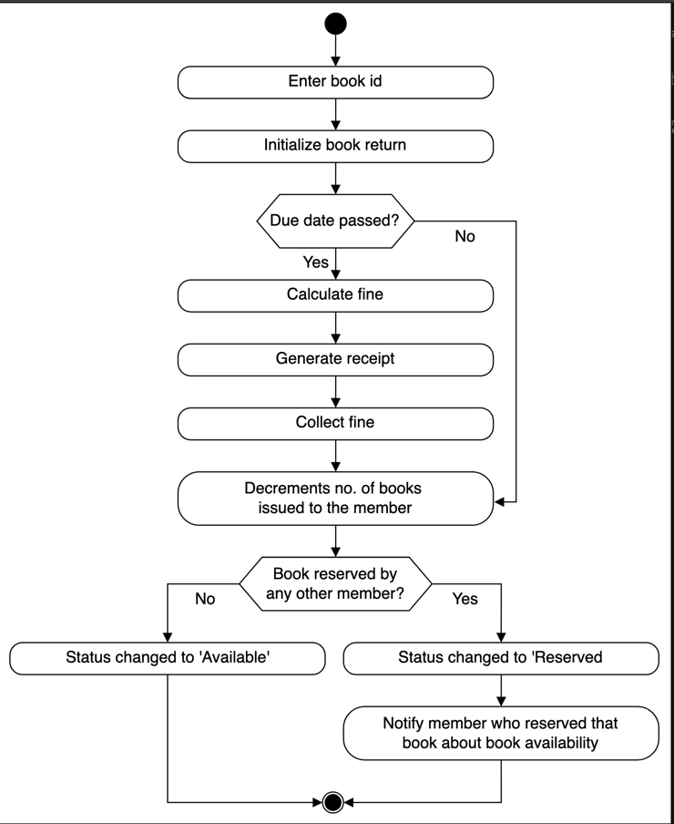

Activity challenge: Renew a book from the library.

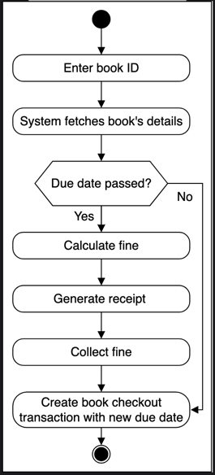

Code of Library Management System

Enumerations

First, we will define all the enumerations required in the library management system. According to the class diagram, there are four enumerations used in the system: BookFormat, BookStatus, ReservationStatus, and AccountStatus.

Address and person

This section contains the code for Address and Person classes where the Person class is composed of an Address class. 

User

The User is an abstract class that represents the various people or actors that can interact with the system. Since there are two types of users, the librarian and the library member, the user can either be a Librarian or a Member.

Book reservation, book lending and fine

This component shows the implementation of BookReservation, BookLending, and Fine classes. These classes will be responsible for managing reservations against books, managing reservations, and calculating fine on books.

Book and rack

The Book is an abstract class and BookItem represents each copy of the book. For example, if there are two copies of the same book then there would only be one Book object and two BookItem objects. 

Notification

The Notification class is another abstract class responsible for sending notifications to the users, with the PostalNotification and EmailNotification classes as its child classes

Search and catalog

The Search is an interface used in the efficient searching of library books by various methods, and the Catalog class is used to implement the search interface to help in book searching

Library

The final class of LMS is the Library class which will be a Singleton class, meaning the entire system will have only one instance of this class. 
