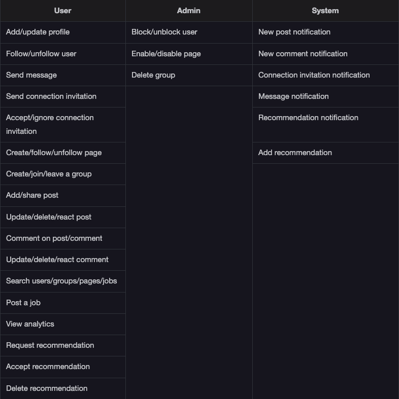

Getting Ready: The LinkedIn System

Problem definition

LinkedIn is an employment-focused social network platform to manage the user's professional identity. This platform is primarily used to facilitate its users. It helps them find new opportunities, grow their careers, and connect with the people they know and trust professionally. Moreover, this platform allows employers to post jobs. It allows job seekers to post their resumes to find the best employment match for themselves. Therefore, LinkedIn is used for career development and professional networking.

LinkedIn allows both workers and companies to create profiles and pages, respectively. The LinkedIn users' profile page represents their education, experience, skills, achievements, and recommendations. LinkedIn also allows its users to create posts regarding a topic of interest, comment on a post, invite other users to become a connection, message other users, and create groups to form a community of similar users. LinkedIn generates a personalized feed for its users based on their connections, job, work, and education history, liked pages, groups, and the content they engage with to ensure the best experience.

LinkedIn is very similar to Facebook in terms of its layout and design. These features are more specialized because they cater to professionals. However, if we know how to use Facebook or any other similar social network, we may find LinkedIn familiar.

Discoverability

It is important to develop a better understanding of how LinkedIn’s discoverability feature works. The interviewer would expect you to ask the questions listed below:

How can users search the job opportunities for themselves?

How are companies able to find out the perfect match for their job openings?

How are users able to search other users’ profiles?

Can users search for other users using their company name/employment history and job type?

Connections and following

Both connections and following are the primary features of LinkedIn. Make sure to ask the following questions from the interviewer:

How are users able to connect with other users?

Can a page connect with other pages as well?

How can users follow or unfollow the pages without becoming a direct connection?

Groups, pages, and jobs

Groups and pages on LinkedIn create a space for people looking for similar job opportunities. Make sure to define your requirements. You may ask the following questions from the interviewer:

Can the users create both groups and pages in addition to their user profiles?

Can both the users and companies create groups and pages?

Can the individual user post a job?

Can a user join any group, or are there any criteria for joining the group?

Alerts

Notifications and alerts allow users to stay updated with the activity in their circle. Therefore, you may want to understand how alerts work in your system. You may ask the following questions:

How will users be notified of preselected events?

How much control do users have in choosing what notifications they can receive?

Design approach

We’ll design LinkedIn using the bottom-up design approach. For this purpose, we will follow the steps below:

Identify and design the smallest components first—features like a post and comment.

Use these small components to design bigger components—a page, group, and profile.

Repeat the steps above until we design the complete LinkedIn platform.

Design pattern

During an interview, it is always a good practice to discuss the design patterns that the LinkedIn falls under. Stating the design patterns gives the interviewer a positive impression and shows that the interviewee is well-versed in the advanced concepts of object-oriented design.

Requirements for LinkedIn

R1: Users should be able to add information to their profile including education, experiences, achievements, and skills.

R2: Users should be able to search for, and also view, pages, groups, and other users.

R3: Users should be able to send and cancel connection requests. They should also be able to respond to the connection requests of other users by either accepting or ignoring them.

R4: Users should be able to follow other users without adding them as their connection.

R5: Users should be able to view their number of connections, profile views, post impressions, and search appearances.

R6: Users should be able to request and give recommendations to other users.

R7: Users should be able to write a new post.

R8: Users should be able to react, share, and comment on a post. They should also be able to react or comment on an existing comment.

R9: A user should be able to send and receive messages from other users.

R10: The system should send a notification to the user to inform them about messages, connection requests, or comments on their post.

R11: Users should be able to create company pages. Users should be able to follow other company pages.

R12: Company pages should have a list of job openings that users can apply for.

R13: A user should be able to create and join groups.

Use Case Diagram for LinkedIn

System

Our system is "LinkedIn."

Actors

Now, we’ll define the main actors of LinkedIn.

Primary actors

User: This actor can create a profile including their professional information. They can create posts, apply for jobs, follow pages, and join groups. They can also interact with other users by sending them connection invitations and messages, commenting on their posts, etc.

Admin: The admin is in charge of performing numerous operations, including blocking or unblocking users, enabling/disabling pages, deleting an existing group, etc.

Secondary actors

System: This is responsible for sending out notifications for new connection requests, messages, comments, posts, recommendations, etc.

Use cases

User

Add/update profile: To add information like education, experience, skill, and achievement to update an existing profile

Follow/unfollow user: To follow or unfollow other users

Send message: To send a message to other users

Send connection invitation: To send a connection invitation to other users

Accept/ignore connection invitation: To accept or ignore a connection invitation from another user

Create/follow/unfollow page: To either create a new page or perform actions including update, delete, or follow an existing page

Create/join/leave a group: To either create a new group or perform actions like joining or leaving an existing group

Add/share post: To add a new post or share an existing post

Update/delete/react post: To update a post, delete a post, or react to the post

Comment on post/comment: To comment on the post, or to add a comment on an existing comment

Update/delete/react comment: To update the content of the comment, react to a particular comment, or delete a comment

Search users/groups/pages/jobs: To search for other users, or any existing groups, company pages, or jobs

Post a job: To post the job on the page

View analytics: To see the number of connections, post impressions, profile views, and search appearances of the user

Request recommendation: To send a recommendation request to other users

Accept recommendation: To accept a recommendation request from the user

Delete recommendation: To delete a recommendation request from the user

Admin

Block/unblock user: To block or unblock a user on LinkedIn

Enable/disable page: To enable or disable a page

Delete group: To delete an existing group

System

New post notification: To send a notification of any new posts

New comment notification: To send a notification whenever another user comments on a user's post or comment

Connection invitation notification: To send a notification of any connection invitation sent by any user

Message notification: To send a notification of any new messages

Recommendation notification: To send a notification of recommendation requested by any user

Add recommendation: To add a recommendation to the user's profile

Relationships

Generalization

The user can add/update their profile by either adding or updating their education, experience, skill, or achievement. This shows that the “Add/update profile” use case has a generalization relationship with “Add/update education,” “Add/update experience,” “Add/update skill,” and “Add/update achievement” use cases.

Associations

Include

The “Send message” use case has an include relationship with the “Message notification” use case, because whenever a user receives a message, the user is notified.

The “Send connection invitation” use case has an include relationship with the “Connection invitation notification” use case. Whenever a user receives the connection invitation, the system notifies the user.

When the user accepts the recommendation request, the system adds that recommendation in the user's profile. Therefore, the “Accept recommendation” use case has an include relationship with the “Add recommendation” use case.

The “Add/share post" use case has an include relationship with the “New post notification.” Whenever a user creates a post or shares it, the system notifies the connected users.

The “Comment on post/comment” use case has an include relationship with the “New comment notification” use case. Whenever a new comment is made by another user on a post either created by the default user or followed by the default user, the system notifies the default user.

The “Request recommendation” use case has an include relationship with the “Recommendation notification” use case. Whenever a user gets a recommendation request, the system notifies the user.

Extend

When users get the recommendation request, they can either accept or delete the request. Therefore, the “Request recommendation” use case has an extend relationship with the “Accept recommendation” and "Delete recommendation" use cases.

Whenever the users get a connection invitation request, they can either accept or ignore the request. Therefore, the “Send connection invitation” use case has an extend relationship with the “Accept/ignore connection invitation” use case.

Use case diagram

Class Diagram for LinkedIn

Class diagram of LinkedIn

Design pattern

We know that LinkedIn allows its users to follow company pages and join a group. By default, when a user follows or joins a page or group, they get notified of any new posts. To effectively map this behavior in our design, we can use the Observer design pattern.

All members of the page or group are set as subscribers, by default, on LinkedIn. Whenever there is a new activity, the system notifies the subscribers. The members also have the option to opt out of these notifications and to remove themselves from the subscriber list.

Sequence Diagram for LinkedIn

Send a connection invitation

Activity Diagram for LinkedIn

Creating a new post

The states and actions that will be involved in this activity diagram are provided below.

States

Initial state: The user selects the new post option.

Final state: The post is published.

Actions

The user selects the new post option, selects the privacy option, adds any attachments, and publishes the post.

Activity challenge: A user creates a page

Code for LinkedIn

Constants

The following code provides the definition of the various enums and custom data types being used in the LinkedIn design:

Account

The Account class refers to an account of a user on LinkedIn. It includes their personal details, such as username, password, etc. It also allows users to reset their existing passwords.

Person, admin, and user

The Person class is an abstract class and contains details like the name, address, phone number, and email. It is derived into the Admin and User class.

Recommendation, achievement, and analytics

The Recommendation, Achievement, and Analytics classes will provide a user's personal information and make up the Profile class. 

Profile, experience, education, and skill

The Experience, Education, and Skill classes will provide a user's personal information and make up the Profile class.

Company, job, and group

LinkedIn users can create groups and company pages. The company page contains information about the company. The company pages will host various job postings. The Job, CompanyPage, and Group classes

Post, comment, message, and connection invitation

LinkedIn users can create posts and comments. They can also send messages and connection invitations to other users. The definition of Post, Comment, Message, and ConnectionInvitation classes

Search, catalog, and notification

The SearchCatalog class contains information on users, company pages, groups, and jobs. It also implements the Search interface class to enable the search functionality based on the given criteria (user, company page, group, and job keywords).

The Notification class is responsible for sending notifications to users about any new messages, comments, posts, or connection invitations via the built-in notification option.

