A meeting scheduler software allows organizations to schedule and book meetings for a group of participants. The scheduler determines a meeting time and location depending on the availability of the participants. It ensures that most of the intended participants can effectively meet on the specified date and interval. The system allows users to book and cancel meetings. The invited participants promptly receive these notifications. The organizer can also add new participants to a meeting after the meeting is scheduled.

Room assignment

How does the system determine available rooms?

How important is the capacity of a room when assigning a room for a meeting?

Availability of attendees

How does the system check the availability of the attendees?

How does the system access the meeting information of all attendees?

Design approach

We'll design a meeting scheduler using the bottom-up design approach. For this purpose, we will follow the steps below:

Identify and design the smallest components first, like an interval and meeting room.

Use these small components to design additional components, for example, a meeting and a calendar.

Repeat the steps above until we design the scheduler, which is the main component of the system.

bottom-up design approach

During an interview, it is always a good practice to discuss the design patterns that the meeting scheduler falls under

Requirements

R1: There should be an n number of meeting rooms.

R2: Each meeting room should have a specific capacity to accommodate the desired number of people.

R3: If not reserved already, each meeting room should have the ability to be booked, along with setting an interval, a start time, and an end time for the meeting.

R4: A notification should be sent to all the people invited to the meeting.

R5: Users will receive an invite regardless of whether they are available at the interval or not. Users can respond to the invitation by either accepting or rejecting the invite.

R6: Each user should have access to a calendar that is used to track the date and time, as well as to schedule or cancel meetings.

Use Case Diagram

Primary actors

Scheduler: This actor can schedule and cancel meetings and book and release meeting rooms.

User: This actor can accept and reject invitations and will decide their presence for the meetings.

Secondary actors

System: This is responsible for sending out notifications regarding any new meetings or cancellations.

Associations

Scheduler

Schedule/Cancel meeting: To schedule a new meeting or cancel an existing one

Book/Release room: To book a room for a meeting or release it

User

Attend meeting: To attend a meeting

Accept/Reject meeting: To accept or reject a meeting invitation

System

Send invite notification: To send a notification of any new meeting invitations

Send cancelation notification: To send a notification of any meeting cancellations

Include

The "Schedule meeting" use case has an include relationship with "Book room," since a room also needs to be booked when a meeting is scheduled.

The "Schedule meeting" use case also has an include relationship with "Send invite notification," since, whenever a new meeting is scheduled, an invite is sent to all participant's users.

The "Cancel meeting" use case has an include relationship with the "Release room" use case, since the scheduled room needs to be set free whenever any meeting is canceled.

The "Cancel meeting" use case has an include relationship with the "Send cancelation notification" use case, since, whenever a meeting is canceled, a cancelation notice is sent to all participant's users.

The "Cancel meeting" use case also has an include relationship with the "Remove meeting from calendar" use case, since, once a meeting has been canceled, the interval time of all participant's users needs to be set free.

use case diagram

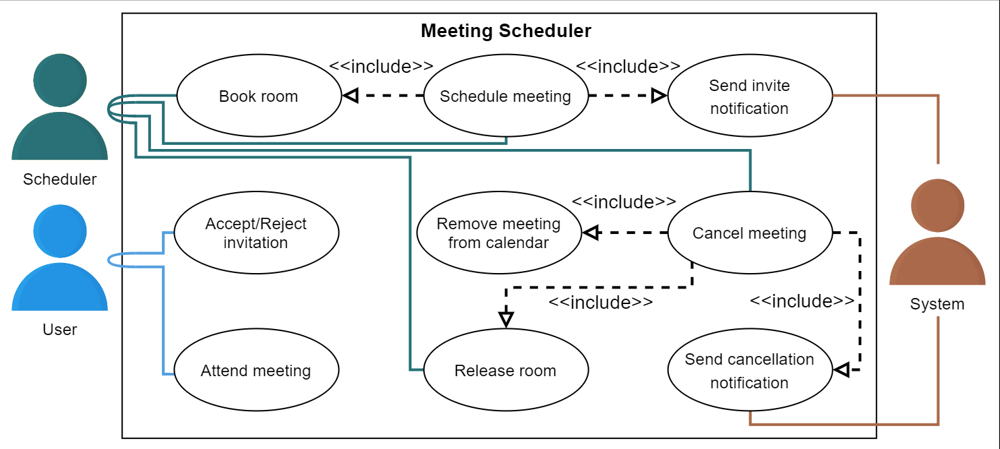

class diagram

User

The User class is responsible for representing the personal information of a user such as their name, email, and can also accept or reject an invitation to a meeting.

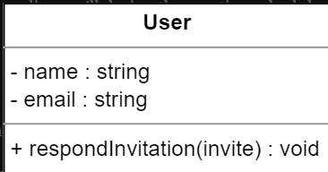

R5: Users will receive an invite regardless of whether or not they are available at the interval. Users can respond to the invitation by either accepting or rejecting the invite.

Interval

The Interval class contains the start time and end time of a meeting. 

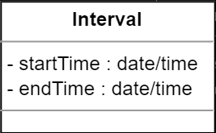

R3: If not reserved already, each meeting room should have the ability to be booked, along with setting an interval, a start time, and an end time for the meeting.

Meeting room

The MeetingRoom class contains the details of any particular room, such as its capacity and a status, to identify whether it is currently available. It also contains a list of intervals to keep track of when the room is booked for a meeting.

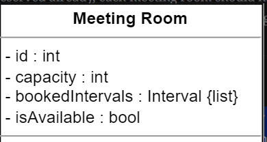

R2: Each meeting room should have a specific capacity to accommodate the desired number of people.

R3: If not reserved already, each meeting room should have the ability to be booked, along with setting an interval, a start time, and an end time for the meeting.

Meeting

The Meeting class displays the meeting details, such as the participants, the meeting time, and the meeting room.

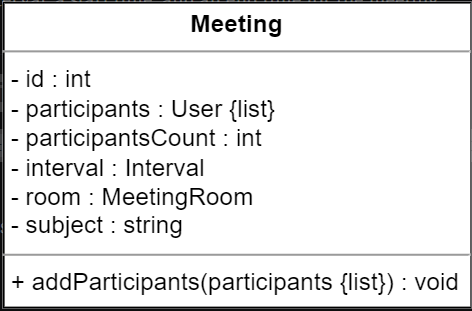

R3: If not reserved already, each meeting room should have the ability to be booked, along with setting an interval, a start time, and an end time for the meeting.

Calendar

The Calendar class keeps track of all the meetings that are scheduled or being held.

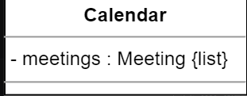

R6: Each user should have access to a calendar that can be used to track the date and time, as well as to schedule or cancel meetings.

Meeting scheduler

The MeetingScheduler class contains an organizer that is responsible for scheduling a meeting using the calendar. It can also cancel a meeting, check the availability of meeting rooms, and book or release a meeting room.

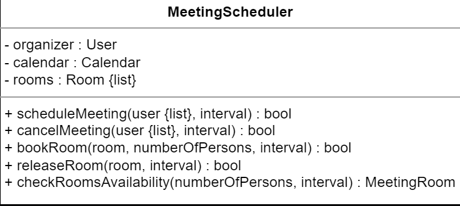

R6: Each user should have access to a calendar that can be used to track the date and time, as well as to schedule or cancel meetings.

Notification

The Notification class will send a notification for an invitation to a user regarding any new meeting. It will also send a cancelation notification to a user as well, in case any meeting gets canceled or is postponed.

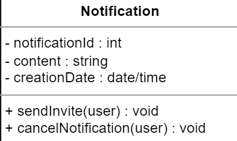

R4: A notification should be sent to all the people invited to the meeting.

Relationship

Association

The User class has a one-way association with the Notification class and a two-way association with the Meeting class.

The MeetingScheduler class has a one-way association with the Notification and Meeting classes.

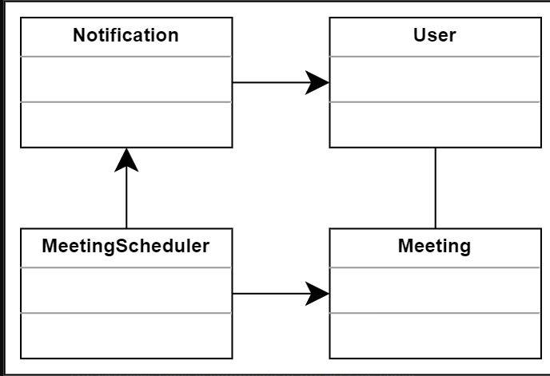

Composition

The MeetingScheduler class is composed of the Calendar class.

The Calendar class is composed of the Meeting class.

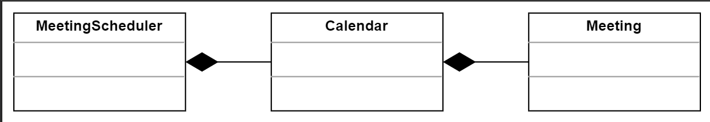

Aggregation

The MeetingScheduler class is aggregated from the User and MeetingRoom class.

The MeetingRoom class is aggregated from the Interval class.

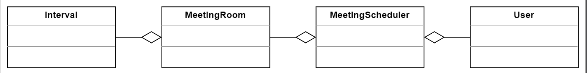

class diagram

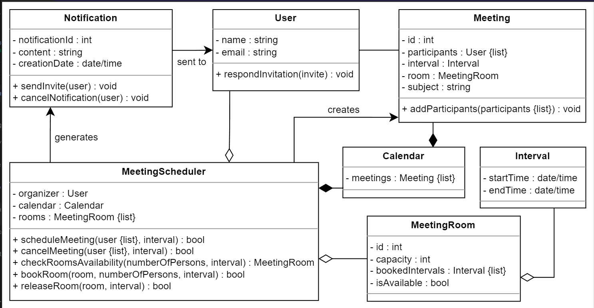

Design pattern

In the meeting scheduler design, the entire system revolves around the scheduler which is responsible for scheduling meetings. To create a robust design, it is not possible that there can be more than one instance for the scheduler. Therefore, we use the Singleton design pattern to ensure that only one instance of the scheduler is created and that this instance has a global point of access.

sequence diagram

Schedule a meeting: The meeting organizer schedules a meeting time for some attendees.

Sequence challenge: The meeting organizer cancels a scheduled meeting.

Schedule a meeting

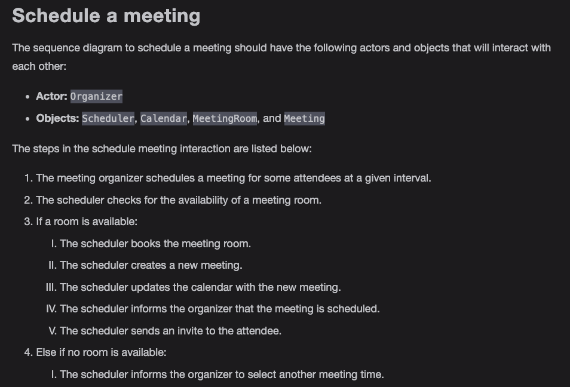

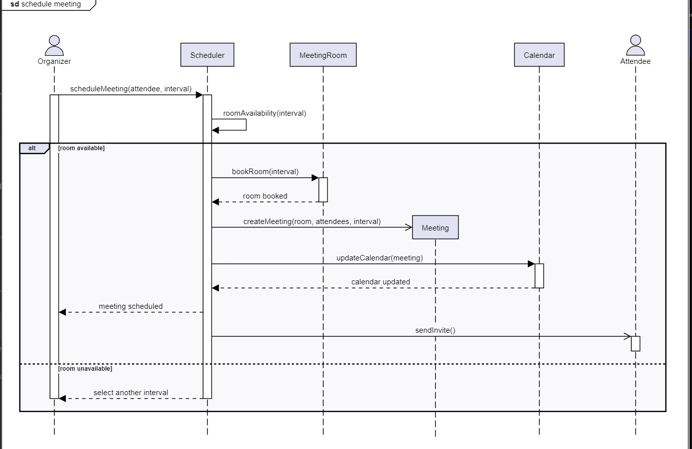

Cancel meeting

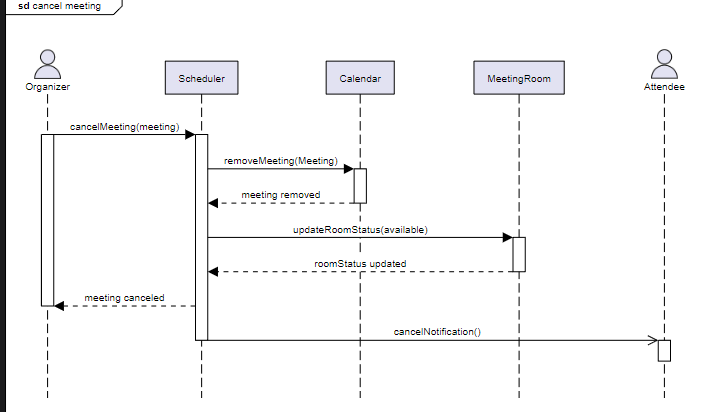

Activity diagram

Schedule meeting

The following states and actions will be involved in this activity diagram.

States

Initial state: The user opens the calendar.

Final state: The notification and meeting details are sent to all the invited participants.

Actions

The user opens the calendar and selects an available slot. The user books a meeting room and the meeting details are sent to all invited users.

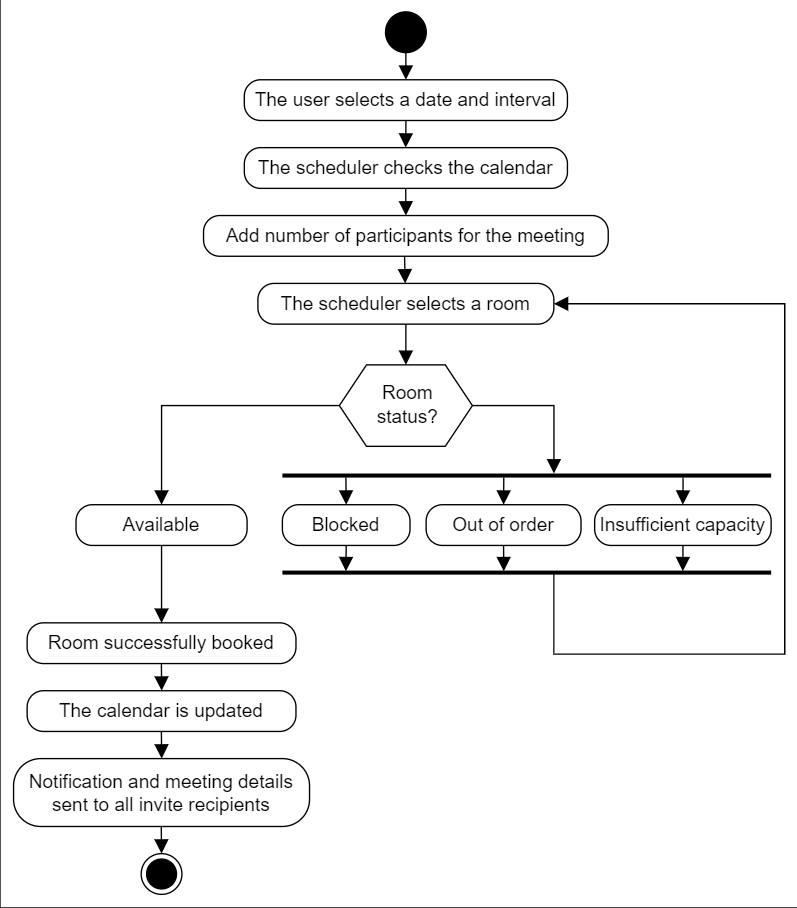

Respond to an invite

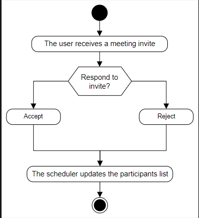

Code for the Meeting Scheduler

User

The User class refers to a participant taking part in a meeting. A user can either accept or reject an invitation. The definition of this class is given below:

Interval

The Interval class denotes the meeting interval (the start and end time).

Meeting room

The MeetingRoom class will represent the meeting rooms, each having a specific capacity, a boolean to check if a room is available, and a list of intervals for which the room is booked. The definition of the class is provided below:

Calendar

The Calendar class contains a list of meetings to keep track of all the scheduled meetings. The definition of this class is provided below:

Meeting

The Meeting class outlines the meeting details such as the number and list of participants, meeting time interval, and meeting room. It also has the option to add more participants

Meeting scheduler

The MeetingScheduler class is the main class of the meeting scheduler and contains the organizer, which is responsible for scheduling and canceling a meeting as well as booking or releasing a room. It also checks if any meeting rooms are available for a meeting. In addition, there will be only one instance of the scheduler in the meeting scheduler. Therefore, the MeetingScheduler class will be a Singleton class to ensure that only one instance for the scheduler is created in the entire system.

Notification

The Notification class is responsible for sending notifications to users about any new meetings or cancelations. The definition of this class is provided below:

