The movie ticket booking system is a system that allows customers to book shows for their favorite movies. The booking system has information on all cinemas present in different cities and the hall information for each cinema. There are numerous movies stored in the system database. Each movie can have multiple shows playing in a particular cinema. The customer can search and select a movie for which they wish to book a show. The system displays a seating layout that identifies booked and available seats so that the customer can choose to reserve available seats. Once the customer completes the payment for the booking, the seat booking is confirmed and the customer receives an email notification.

Seat selection

How will the system make sure that multiple users do not book the same seat?

Will there be a timeout session that reserves seats temporarily? Will the system use a first come, first serve algorithm?

Will there be transaction locks involved in the system?

Payment handling

What payment methods can the customer use (for example, credit card or cash)?

How is the payment performed? Does the customer pay themselves online or through a ticket agent on the location?

Price variance

How will the price of the booking be calculated? Will it vary based on the popularity of the show?

Does the seat type affect the pricing?

Will there be discount coupon codes?

Duplication

How are we handling these instances, such as the same cinema having multiple cinema halls showing different movies simultaneously?

Is the same movie being shown at different times in the same cinema/hall?

Design approach

We’ll design this movie ticket booking system using the bottom-up design approach. For this purpose, we’ll follow the steps below:

Identify and design the smallest components first, such as a cinema hall.

Use these small components to design bigger components, such as building a cinema that can be composed of multiple halls.

Repeat the above steps until we design the whole system.

bottom-up design approach

During an interview, it is always a good practice to discuss the design patterns that a movie ticket booking system falls under

requirements

R1: There exist multiple cinemas in the city, and the cinema has multiple halls.

R2: Each movie in the cinema can have multiple shows, however, one hall will only show one show at a time.

R3: The cinema displays all available showtimes of a movie.

R4: Users can search movies based on the following four criteria: title, language, genre, and release date.

R5: Users can make a booking at any cinema hall at the available showtime.

R6: The booking can either be made by the customer online or via a walk-in by the ticket agent.

R7: Online customers can only pay using a credit card, while walk-in customers can pay using cash or credit card through the ticket agent.

R8: Users can select multiple available seats for a show from a given seating arrangement.

R9: Each seat type has a fixed cost. There are three types of seats: silver, gold, and platinum.

R10: There can only be one ticket allocated per seat.

R11: No two customers should be able to reserve the same seat.

R12: The admin can perform the following five actions on the show times and the movie:
- Add a show
- Delete a show
- Update a show
- Add a movie
- Delete a movie

R13: The system should be able to differentiate between available and booked seats.

R14: The system should generate a notification for the following three cases:
- A new movie has been released.
- A booking has been made.
- A booking has been canceled.

Use case diagram

Primary actors 
- Customer: This actor can book one or more movie tickets for any movie as well as modify and cancel the booking. They also need to pay for the movie tickets that they booked.
- Ticket agent: The ticket agent will assist the customer and perform almost all the tasks that a customer can do, such as creating a booking of the movie ticket on behalf of the customer, except for modifying and canceling a booking.

Secondary actors
- Admin: This can add, remove, or update a show and movie.
- System: This is responsible for sending out notifications for new movies, bookings, cancellations, etc.

Associations

Admin

Add show: To add a new show for any particular movie

Modify show: To modify a show

Delete show: To delete or cancel a show

Add movie: To add a new movie to the calendar

Search movie: To search for any particular movie based on the given criteria (title, language, genre, release date)

Delete movie: To delete any particular movie

Customer

Search movie: To search for any particular movie based on the given criteria (title, language, genre, release date)

Create/Modify/View/Cancel booking: To create or cancel a booking for any show of a movie, and to view or modify the booking details for any show of a movie

Reserve a seat: To reserve a seat from the available seats on a seating map for any show of a movie

Pay using credit card/cash: To pay the movie ticket fee via credit card or cash

Ticket agent

Search movie: To search for any particular movie based on the given criteria (title, language, genre, release date)

Create/View booking: To create a booking for any show of a movie and view its details

Reserve a seat: To reserve a seat from the available seats on a seating map for any show of a movie

System

Send new movie notification: To send a notification of any new movie launched

Send booking notification: To send a notification of the bookings made

Send cancellation notification: To send a notification of any canceled bookings

Generalization

We can search for a movie with the title, language, genre, or release date. This shows that the “Search movie” use case has a generalization relationship with the “By movie title,” “By movie language,” “By movie genre,” and “By movie release date” use cases.

Include

The “Create booking” use case has an include relationship with the “Reserve seat” use case, since the booking creation process includes reserving a seat on a seating map.

The “Pay using cash” and “Pay using credit card” use cases have an include relationship with the “Send booking notification” use case, since once the payment has been made and verified, only then will the system generate a notification.

The “Cancel booking” use case has an include relationship with the “Refund payment” use case, since this is part of the process.

The “Add movie” use case has an include relationship with the “Send new movie notification” use case, since a notification will only be sent when an admin adds a new movie.

The “Cancel booking,” “Delete movie,” and “Delete show” use cases have an include relationship with the “Send cancellation notification” use case, since a notification will only be sent when an admin cancels the show or the movie or a customer cancels their booking.

user case diagram

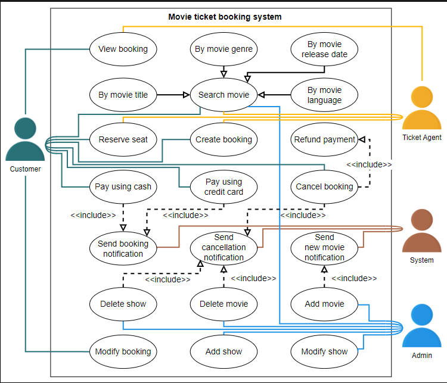

class diagram

Seat

Our movie ticket booking system should have a Seat object that will be an abstract class and can be of three types: silver, gold, and platinum. Each seat type will have a fixed cost and differs from one another.

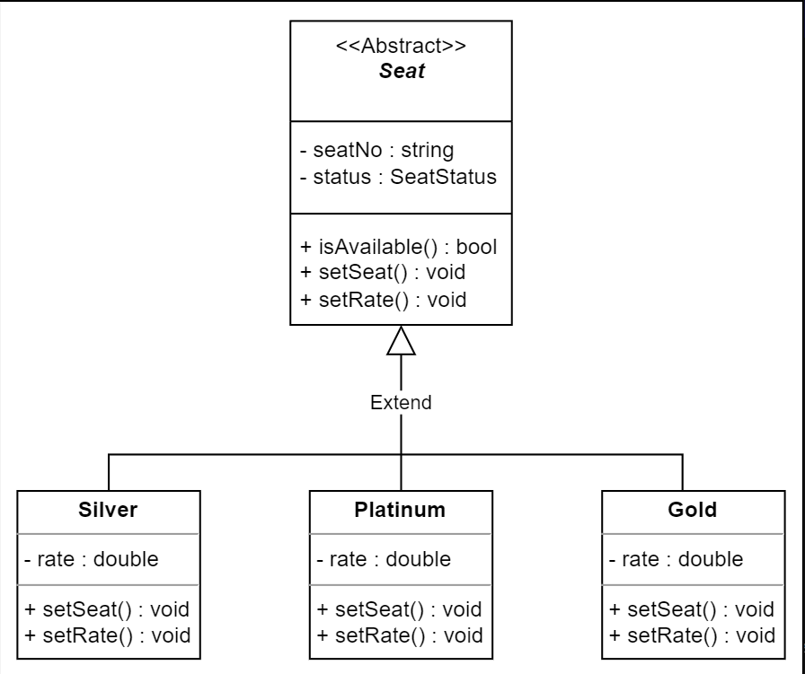

R9: Each seat type has a fixed cost. There are three types of seats:

- Silver
- Gold
- Platinum

R13: The system should be able to differentiate between available and booked seats.

Show time

The ShowTime class represents a particular show of a movie and contains information like the start time, the date on which the show is airing, and the number of seats available for the show.

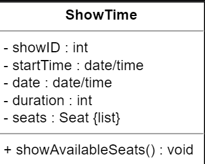

R5: Users can make a booking at any cinema at the available showtime.

Hall

The Hall class is responsible for finding the current show airing. It contains the ID attribute as there can be multiple halls inside a cinema and is composed of a ShowTime object that specifies the currently airing show.

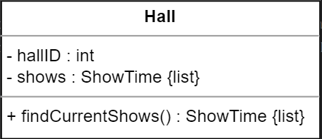

R2: Each movie in the cinema can have multiple shows, however, one hall will only show one show at a time.

Cinema

The Cinema class consists of the number of halls present in the cinema along with the city in which it is located and an id attribute to identify the cinema in that particular city.

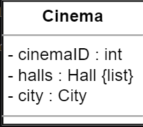

R1: There exist multiple cinemas in the city and the cinema has multiple halls.

City

The City class includes the name of the city, the state it is located in, and its zip code. In addition, it includes a list of all the cinemas available in the city.

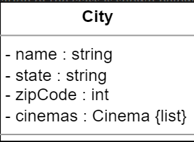

R1: There exist multiple cinemas in the city and the cinema has multiple halls.

Movie

The Movie class contains all the various details of a particular movie, such as the title, genre, language, and release date. It is also composed of a list of running shows.

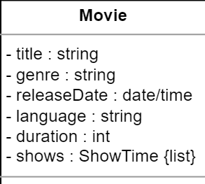

R4: Users can search movies based on the following four criteria:

- Title
- Language
- Genre
- Release date

Movie ticket

The MovieTicket class refers to a customer’s ticket for a particular movie with a ticketID as its unique identifier. It describes the details of the seat in the hall and the movie for which the ticket was bought, along with the show details.

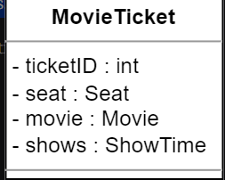

R10: There can only be one ticket allocated per seat.

Payment

The Payment class will be an abstract class and will have two child classes: CreditCard, and Cash

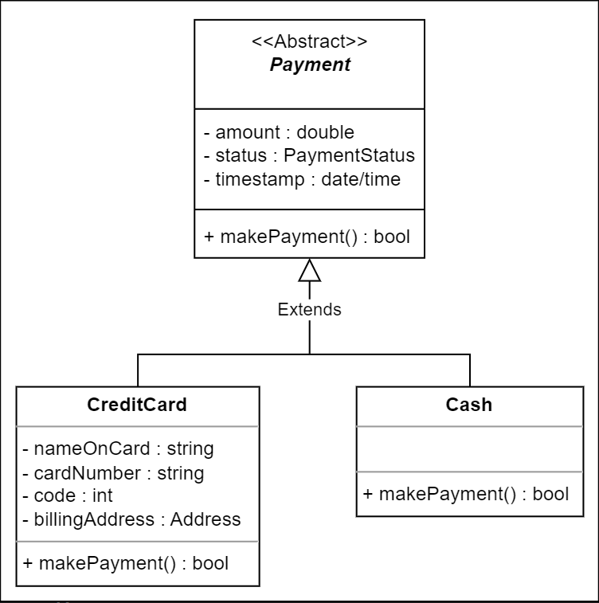

R7: Online customers can only pay using a credit card, while walk-in customers can pay using cash or credit card through the ticket agent.

Person

The Person class contains details like name, address, phone number, and email and is derived into the following three different classes:

- Customer
- Admin
- TicketAgent

Customer

The Customer class refers to a user trying to create an online booking for any movie. A customer can also update the booking details and cancel the booking.

Admin

The Admin class is responsible for performing actions like adding, updating, and removing movies and shows.

Ticket agent

The TicketAgent class is responsible for creating bookings on behalf of walk-in customers. However, unlike the Customer class, a ticket agent cannot update or cancel a booking.

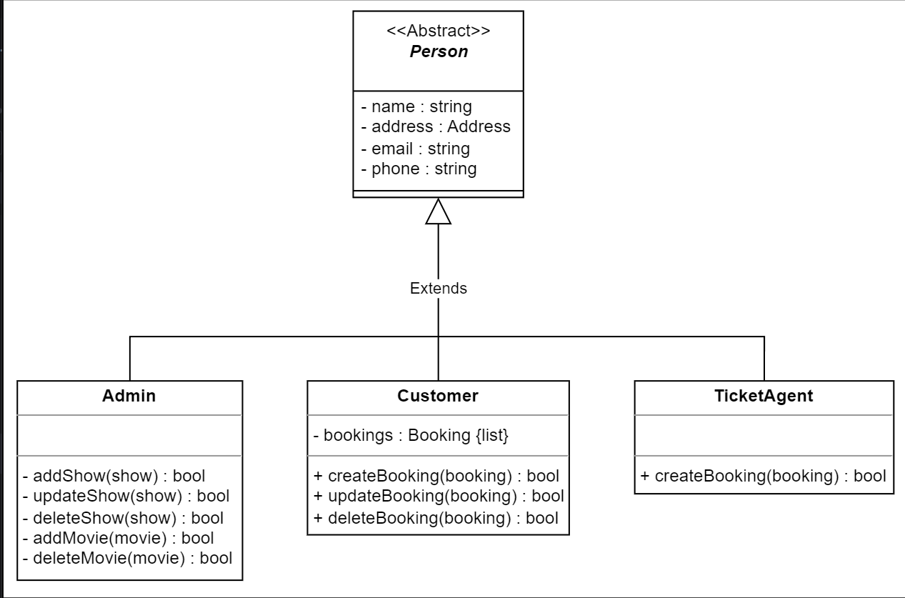

R5: Users can make a booking at any cinema hall at the available showtime.

R6: Booking can either be made by the customer online or via walk-in by the ticket agent.

R12: The admin can perform the following five actions on the showtimes and the movie:

- Add a Show
- Delete a Show
- Update a Show
- Add a Movie
- Delete a Move

Notification

Notification will be an abstract class since it can send a notification via email or phone (SMS). It is mainly responsible for sending notifications whenever any of the following conditions get met:

A customer makes a new booking.

The admin deletes a particular show, or a customer cancels their booking.

The admin adds a new movie to the database.

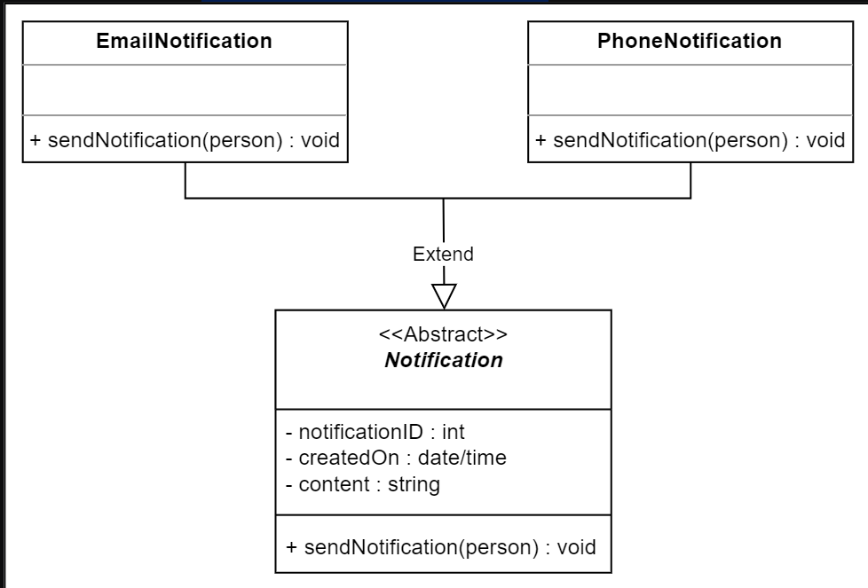

R14: The system should generate a notification for the following three cases:

- A new movie has been released.
- A booking has been made.
- A booking has been canceled.

Catalog

The Catalog is the class where the search function is implemented. Each catalog will contain a list of movies sorted according to one of the given search techniques, i.e., based on the movie’s title, language, genre, or release date.

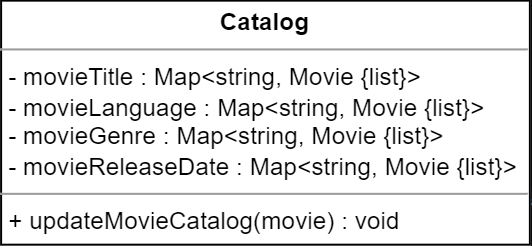

R4: Users can search movies based on the following four criteria:

- Title
- Language
- Genre
- Release date

Search

The Search class will be an interface that allows customers to search for any particular movie and return the list of movies upon searching, by any of the following methods:

Search movies by their title.

Search movies by their language.

Search movies by their genre.

Search movies by their release date.

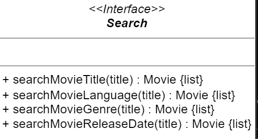

R4: Users can search movies based on the following four criteria:

- Title
- Language
- Genre
- Release date

Booking

The Booking class is the main class of our movie ticket booking system and contains a reference to the number of seats and tickets that a customer booked. In addition, it includes information about the payment status, the booking status, the show time, and the total amount that was charged for the booking.

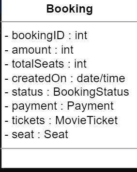

R5: Users can make a booking at any cinema at the available showtime.

Enumerations

PaymentStatus: The payment status checks if the customer's payment falls in any of the following stages: confirmed, declined, pending, or refunded.

BookingStatus: The booking status describes the status of a particular movie booking of a customer, whether it is pending, confirmed, canceled, declined, or refunded.

SeatStatus: The seat status tells about the status of a particular seat in the hall, whether it is currently available, booked, or already reserved.

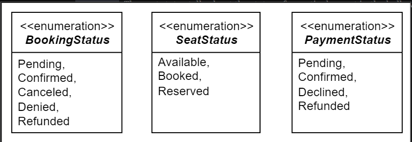

relationship

Association

The City class has a one-way association with Cinema.

The Admin class has a one-way association with ShowTime, Movie, and Notification.

Both Customer and TicketAgent have a two-way association with Notification.

The Booking class has a one-way association with MovieTicket, and Seat.

The Booking class has a two-way association with Payment.

The ShowTime class has a one-way association with Seat and MovieTicket.

The Movie class has a one-way association with ShowTime and MovieTicket.

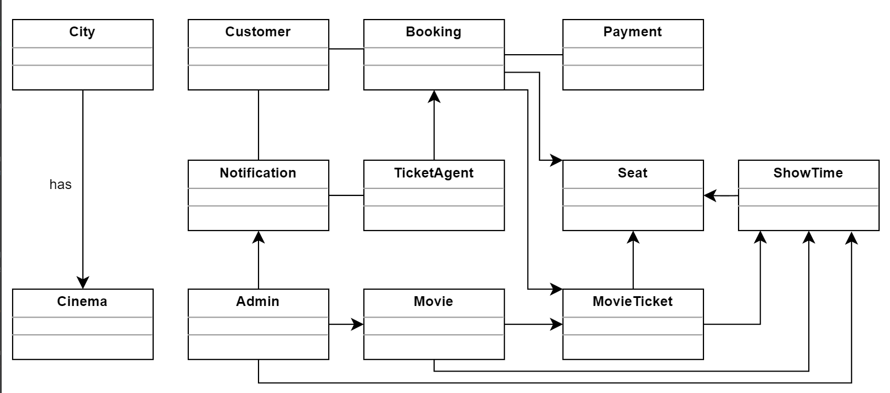

Composition

The Cinema class is composed of the Hall class, which is composed of the ShowTime class.

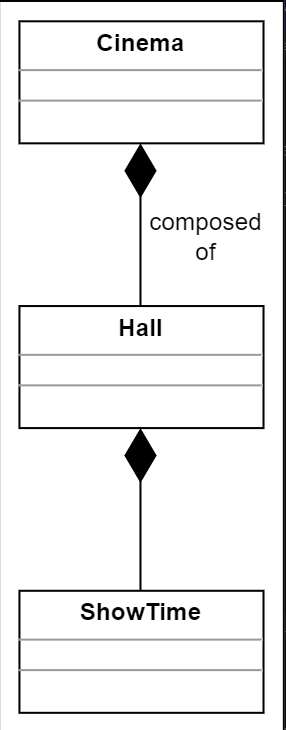

Aggregation

The Catalog class contains the Movie class.

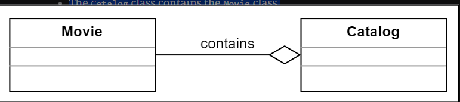

Generalization

The Catalog class implements the Search class.

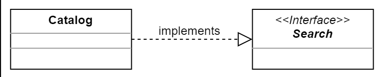

Inheritance

The Gold, Platinum, and Silver classes extend the Seat class.

The Admin, Customer, and TicketAgent classes extend the Person class.

Both Cash and CreditCard extend the Payment class.

Both EmailNotification and PhoneNotification extend the Notification class.

class diagram

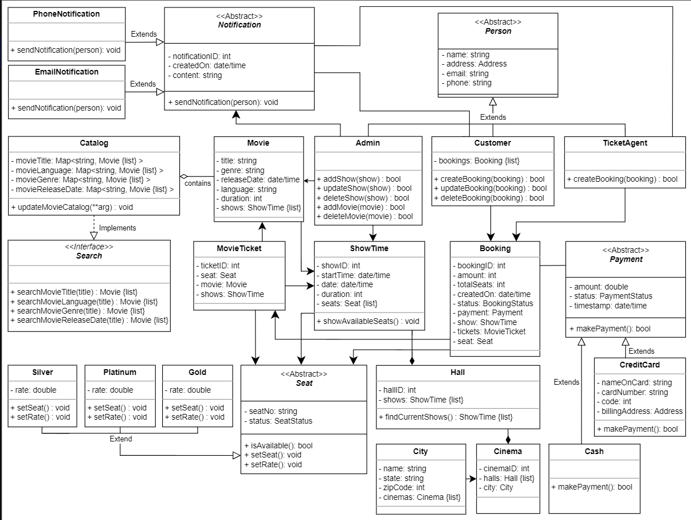

Handle concurrency

One of the major requirements of the movie ticket booking system is that no two customers can book the same seat in the same show of a movie. This is to prevent the case of double booking where two people have the same seats allocated to them.

To handle concurrent seat allocations, we can use the concept of locks, more specifically, optimistic locks or versioning.

The entire process has been summarized in the illustration given below:

Customer 1 tries to select some seats on the seat selection map and gets assigned a version number V1.

At the same time, customer 2 also tries to select some seats on the seat selection map and gets assigned a version number V1. However, both customers select the same seat.

A lock time gets assigned that keeps track of the timestamps related to the customers entering in the payment section.

The mutex lock gets acquired and the expiration time period starts. Since customer 1 took less time, it starts the payment process while customer 2 needs to wait.

Customer 1 successfully completes the payment. The mutex lock also gets released.

Versions of both customer 1 and the system get updated. Since the lock has been released, customer 2 can now perform the action of booking the tickets again.

However, since the system version has been updated, customer 2 would need to perform the entire task from the beginning.

The previous seat has become unavailable so customer 2 selects a new seat.

Design pattern

In the movie ticket booking system, there can be multiple seat types for a cinema hall, and each seat type will have its own formula to calculate the ticket fare. Therefore, the Strategy design pattern can be applied here, which will design a separate strategy or algorithm to calculate the price of each seat type. It is applied through the definition of a function that provides the implementation of the rates for each seat type using different strategies. This strategy can also differ based on a movie’s popularity or taxes

Additional requirements

The interviewer can introduce some additional requirements in the movie ticket booking system, or they can ask some follow-up questions. Let’s see some examples of additional requirements:

Discount: Customers can use a coupon to add a discount to their payment. The class diagram provided below shows the relationship of Discount with the Payment class:

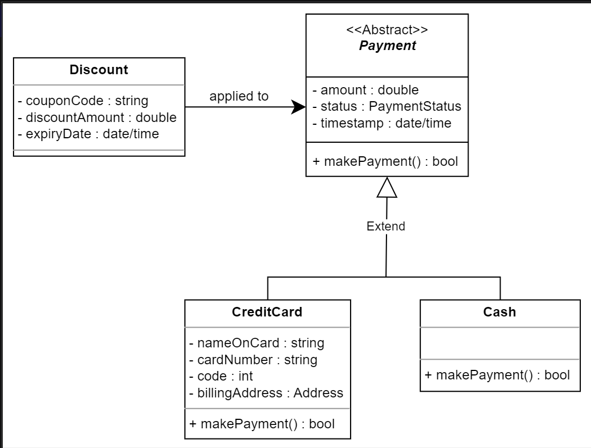

Customer and the guest users: There should be two types of users in our system. The guest user can search for movies and choose to register. The customer should be an authenticated user and is able to search movies and book shows. The class diagram below shows how we can implement separate functionality for different users:

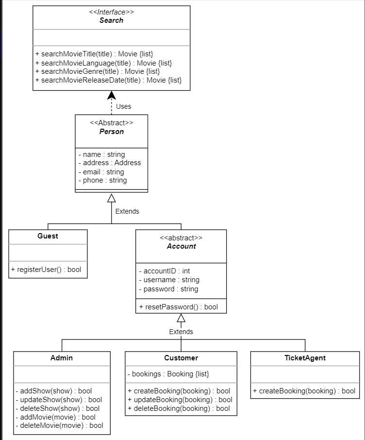

sequence diagram

Create a booking: The customer creates a booking for a show.

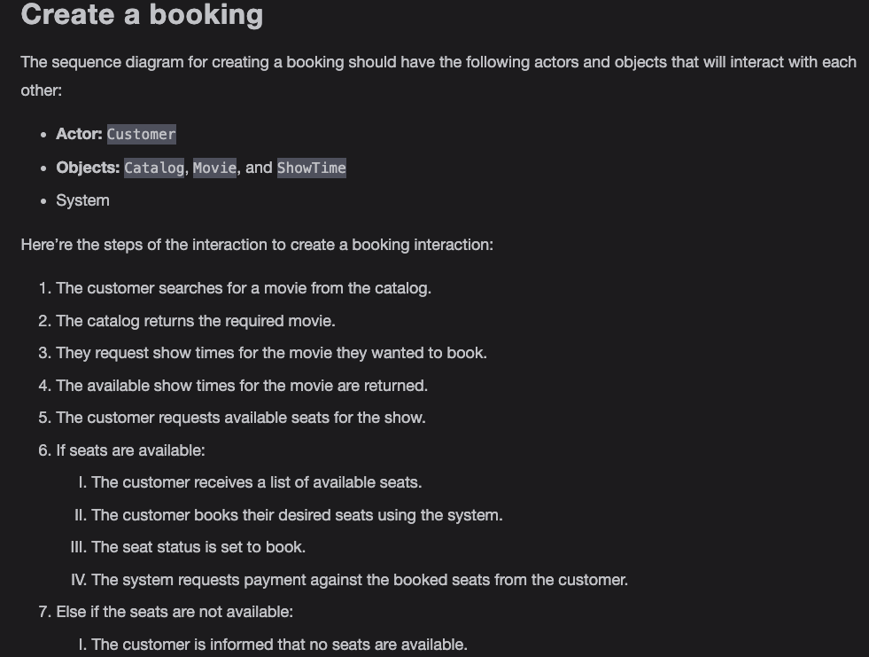

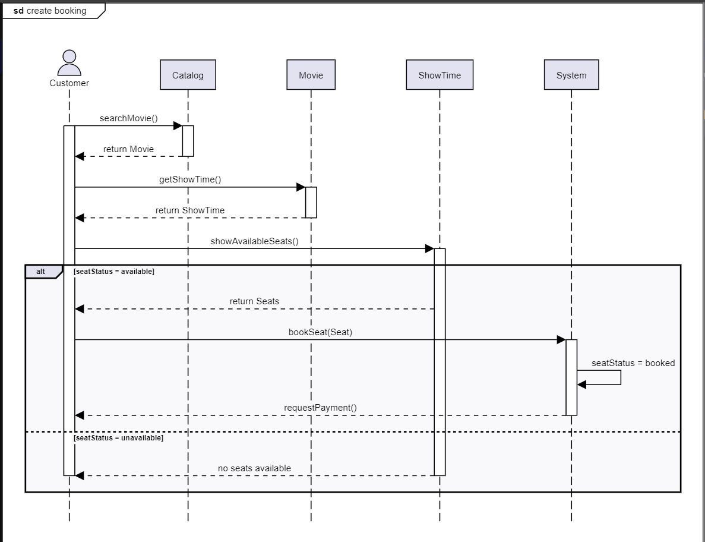

Payment for the booking: The customer pays for the booking.

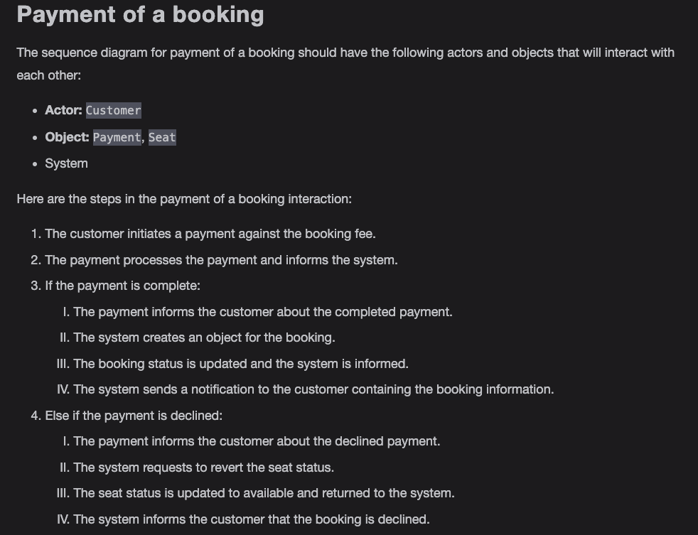

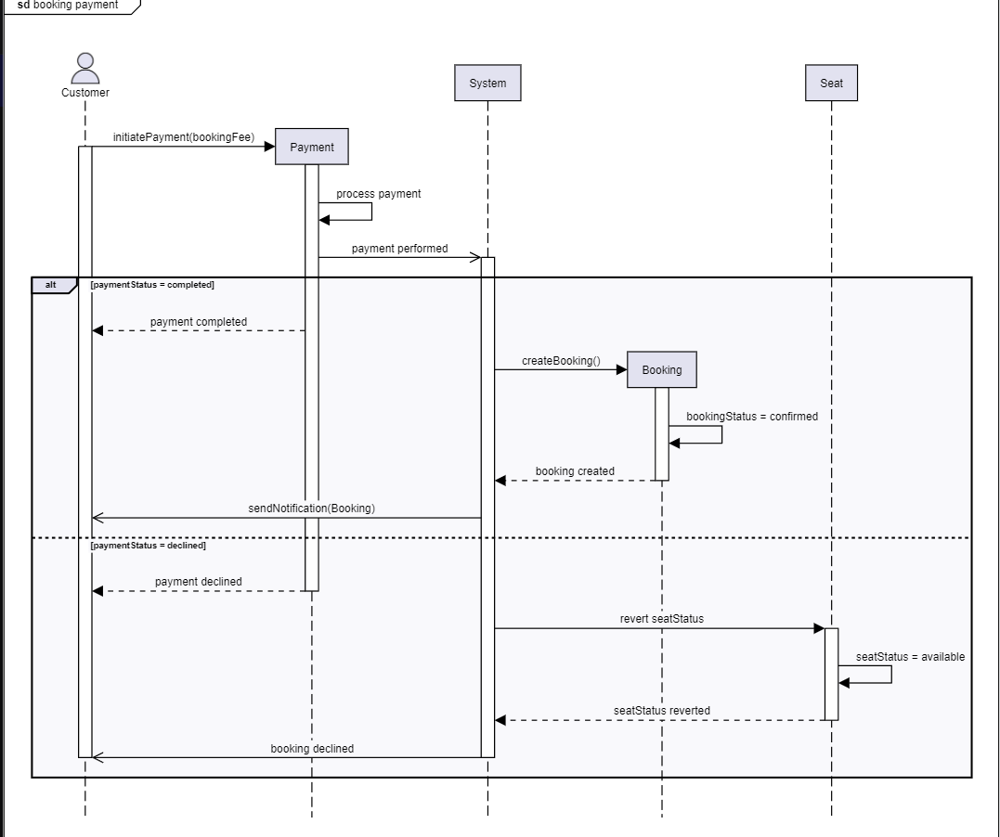

Sequence challenge: The customer cancels their booking.

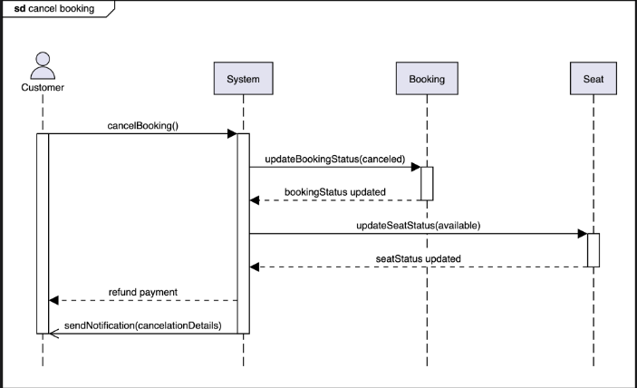

Activity Diagram

The customer makes a booking for the movie.

The following are the states and actions that will be involved in this activity diagram.

States

Initial state: The customer opens a search for a movie.

Final state: The customer receives a ticket for the movie.

Actions

The customer searches for a movie by specific criteria and selects their movie. The customer then selects their required seat and pays according to their seat type. The payment is carried out either through cash or a credit card. After successful payment, the customer receives the movie ticket.

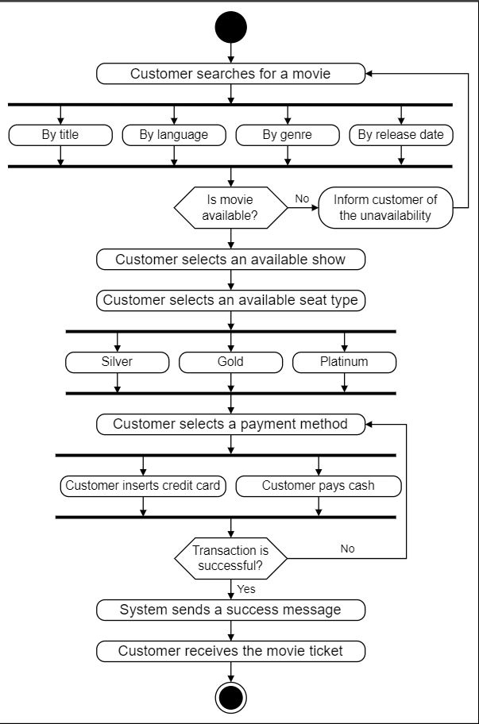

Activity challenge: The admin cancels a show.

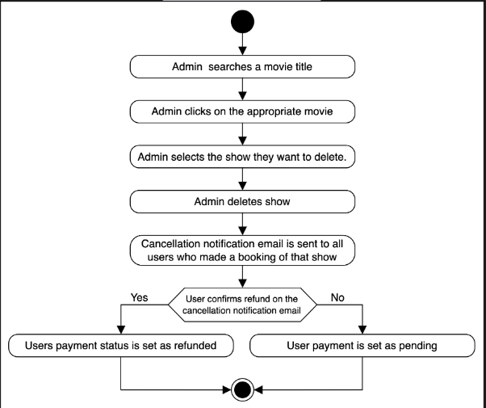

Code for the Movie Ticket Booking System

Enumerations

The following code provides the definition of the various enumerations used in the movie ticket booking system:

Actors

This section contains the different people that will interact with our movie ticket systems, such as a Customer, Admins, and TicketAgents. All of these classes will inherit the properties of the Person class. The definition of these classes is given below:

Seat

The Seat will be an abstract class, which serves as a parent for three different types of seats: Platinum, Gold, and Silver. The definition of the Seat and its child classes is given below:

Movie, showtime, and movie ticket

Next, we will explore the ShowTime, Movie, and MovieTicket classes that provide the details of the movie to the customer. The definition of these classes is given below:

City, cinema, and hall

This section contains classes like Hall, Cinema, and City that make up the infrastructure of our movie ticket system. The definition of these classes is given below:

Payment

The Payment class is another abstract class, with the Cash and CreditCard classes as its child. This takes the PaymentStatus enum to keep track of the payment status. The definition of this class is given below:

Notification

The Notification class is an abstract class that is responsible for sending notifications via email or phone/SMS after actions performed by either the admin and/or customer. Its definition is given below:

Booking

The Booking class is the main class of our movie ticket booking system and will display the information relating to a particular customer's booking. The definition of this class is given below:

Search and catalog

The Catalog class contains the movie information and implements the Search interface class to enable the search functionality based on the given criteria (title, language, genre, and release date). The definition of these two classes is given below:
