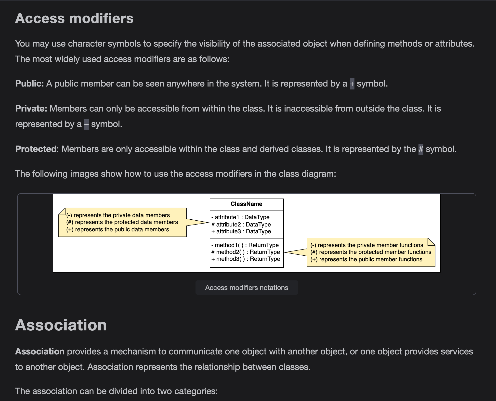
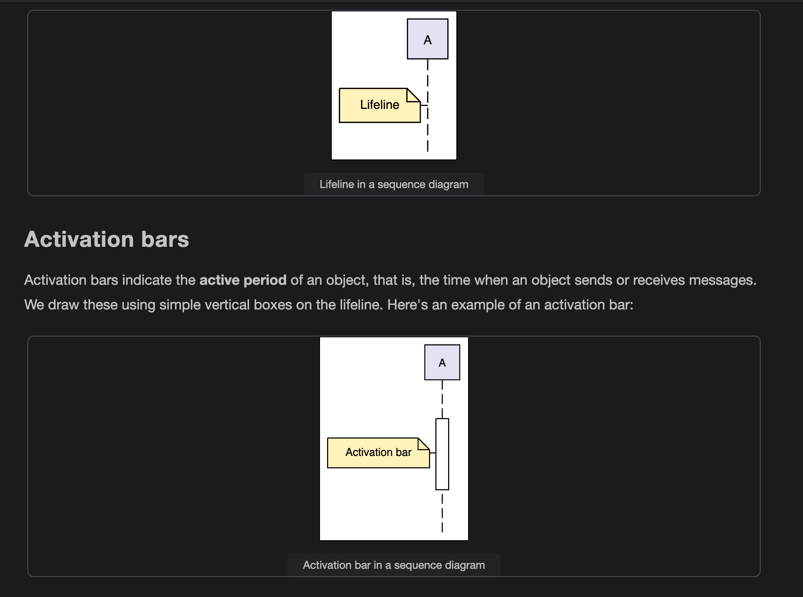

Encapsulation

Encapsulation is a fundamental programming technique used to achieve data hiding in OOP. Encapsulation in OOP refers to binding data and the methods to manipulate that data together in a single unit—class.

Encapsulation is usually done to hide the state and representation of an object from the outside. A class can be thought of as a capsule with methods and attributes inside it.

When encapsulating classes, a good convention is to declare all variables of a class private. This will restrict direct access by the code outside that class.

At this point, a question can be raised. If the methods and variables are encapsulated in a class, how can they be used outside that class? The answer to this is simple. One has to implement public methods to let the outside world communicate with this class. These methods are called getters and setters. We can also implement other custom methods.

Implementing encapsulation in programming languages

In this section, we will show how to implement encapsulation using some of the most popular object-oriented programming languages, such as Java, C#, Python, C++, and JavaScript.

For the sake of explanation, we’ll start off by creating a simple Movie class, which contains the following three data members (attributes):

- title

- year

- genre

implementation of the Movie class in different OOP languages.

encapsulation.java

There must be a way to interact with variables (title, year, and genre). They include all of the movie's information. The question is, how do we access or modify them?

We can create a getTitle() method, which will return the title to us. Similarly, the other two members can also have corresponding getters.

We may draw a conclusion by studying the emerging pattern. These functions should be part of the class itself. Let’s try it out.

encapsulation2.java

The Movie class has an interface with public methods for communication.

The private members (variables or functions) cannot be accessed directly from the outside, but public read and write functions allow access to them. This, in essence, is data encapsulation.

Advantages of encapsulation

- Classes are simpler to modify and maintain.

- Which data member we wish to keep hidden or accessible can be specified.

- We choose which variables are read-only and write-only (increases flexibility).

Abstraction

Abstraction is a technique used in object-oriented programming that simplifies the program's structure. It focuses only on revealing the necessary details of a system and hiding irrelevant information to minimize its complexity. In simpler words, we can say that it means to show what an object does and hides how it does it.

Example

There are countless real-life examples that follow the rules of abstraction. Take the "volume" button on a television remote. With one click, we can increase the TV’s volume. Let’s say the button calls the volumeUp() function. The TV responds with a sound louder than before. We are oblivious to the fact that the inner circuitry of the TV implements this, but we know how the exposed function interacts with the TV's volume.

Another instance of abstraction is our daily use of vehicles. To our general knowledge, the race peddle tells the car to consume fuel and increase its speed. We do not need to understand the mechanical process.

Implementation of abstraction in programming languages

So, let’s put all this theory into practice. In the code below, we have a basic class of a circle:

abstraction.java

It has two variables, radius and pi. Now let’s add the constructor and functions to calculate the area and perimeter:

abstraction2.java

As you can see, we only need to define the radius of the circle in the constructor. After that, the area() and perimeter() functions are available to us. This interface is part of encapsulation.

We use the functions to calculate the area and perimeter. Users do not need to know the implementation details of the functions. Even pi is hidden since it’s a constant. This is how we can achieve abstraction using classes.

Advantages of abstraction

The following are some advantages of abstraction:

- It reduces the complexity of the system from a user's perspective.

- It makes the code extendable and reusable.

- It refines the modularity of the application or the system.

- It makes the code more maintainable.

Abstraction vs. encapsulation

Since abstraction and encapsulation are data hiding techniques of OOP, they are often confused with being the same. Let's look at some of the differences in the following table:

Inheritance

Definition

Inheritance provides a way to create a new class from an existing class. The new class is a specialized version of the existing class such that it inherits all the public attributes (variables) and methods of the existing class. The existing class is used as a starting point or base to create the new class.

The IS-A relationship

After reading the definition above, the next question that comes to mind is, “when do we use inheritance?” Wherever we come across an IS-A relationship between objects, we can use inheritance.

So, from the description of inheritance above, we can conclude that we can build new classes by extending existing classes.

Let’s look at the figure below to visualize some examples where an IS-A relationship doesn’t exist.

The IS-A relationship does not exist

Remember, we cannot use inheritance if an IS-A relationship doesn’t exist between classes.

Modes of inheritance

Access modifiers are tags we can associate with each member to define the parts of the program they can access directly.  By using these modifiers, we define the scope of the data members and member functions for the other classes and main.

Types of inheritance

Based on parent classes and child classes, there are five types of inheritance in general, which are explained below.

Single inheritance

In single inheritance, there is only a single class extending from a single parent class.

Example:

- A fuel car IS-A vehicle

Multiple inheritance

When a class is derived from more than one base class, i.e., when a class has more than one immediate parent class, it is called multiple inheritance.

Example:

- The hybrid car IS-A fuel car.

- The hybrid car IS-A electric car as well.

Multi-level inheritance

When a class is derived from a class that itself is derived from another class, it is called multi-level inheritance. We can extend the classes to as many levels as we want.

Example:

- A fuel car IS-A vehicle

- A gasoline car IS-A fuel car

Hierarchical inheritance

In hierarchical inheritance, more than one class extends, as per the requirement of the design, from the same base class. The common attributes of these child classes are implemented inside the base class.

Example:

- A fuel car IS-A vehicle

- An electric car IS-A vehicle

Hybrid inheritance

A type of inheritance that is a combination of more than one type of inheritance is called hybrid inheritance.

Example:

- A fuel car IS-A vehicle.

- An electric car IS-A vehicle.

- A hybrid car IS-A fuel car and IS-A electric car.

Implementation

Let’s take an example of a Vehicle class and implement different classes that will extend from it. We will also implement hierarchical, multi-level, and multiple inheritances from this example.

Note: Some languages, such as Java, C# and JavaScript, do not support multiple inheritance through classes.

inheritance.java

Advantages of inheritance

The following are four main advantages of inheritance:

Polymorphism

Introduction to polymorphism

The word polymorphism is a combination of two Greek words, “poly” meaning many, and “morph” meaning forms. In programming, polymorphism is a phenomenon that allows an object to have several different forms and behaviors.

For example, take the Animal class. There are many different animals, e.g., lion, deer, dog, and crocodile, etc. So, they are all animals, but their properties are different. The animal class can have a method, makeNoise. Its implementation should be different for a lion, deer, or any other animal as they all have different noises. This is called polymorphism.

Types of polymorphism

There are two types of polymorphism: dynamic polymorphism and static polymorphism, as shown in the figure below.

Dynamic polymorphism

Dynamic polymorphism is the mechanism that defines the methods with the same name, return type, and parameters in the base class and derived classes. Hence, the call to an overridden method is decided at runtime. That is why dynamic polymorphism is also known as runtime polymorphism. It is achieved by method overriding.

Method overriding

In object-oriented programming, if a subclass provides a specific implementation of a method that had already been defined in one of its parent classes, it is known as method overriding.

Suppose we have a parent class, Animal, with its subclass, Lion. Below is the implementation of two functions with the same name in each class to check method overriding behavior.

polymorphism.java

Static polymorphism

Static polymorphism is also known as compile-time polymorphism, and it is achieved by method overloading or operator overloading.

Method overloading

Methods are said to be overloaded if a class has more than one method with the same name, but either the number of arguments is different, or the type of arguments is different. We have implemented method overloading using two functions with the same name but with different numbers of arguments. You can see this in the implementation below.

polymorphism2.java

Method overloading example

polymorphism3.java

Method overloading example

Operator overloading

Operators can be overloaded to operate in a certain user-defined way. Its corresponding method is invoked to perform its predefined function whenever an operator is used. For example, when the + operator is called, it invokes the special function, add, but this operator acts differently for different data types. The + operator adds the numbers when it is used between two int data types and merges two strings when used between string data types.

Let’s look at the implementation below, where we’ve overloaded the + operator to add complex numbers instead of simply adding two real numbers.

polymorphism4.py

Operator overloading example

Note: Java and JavaScript do not support operator overloading.

Dynamic polymorphism vs. static polymorphism

The table below provides a highlight of the differences between dynamic and static polymorphism:

Introduction to Object-oriented Analysis and Design (OOAD)

OOAD in the SDLC

The Software Development Life Cycle (SDLC) refers to the sequence of phases involved in software development. The stages of SDLC are shown below.

Stages of SDLC

The object-oriented analysis and design (OOAD) in SDLC allows one to analyze and design a system using object-oriented concepts and visualize each aspect of the OOAD process. In OOAD, we examine and inspect the entire system required for a particular problem, followed by identifying what it refers to as “objects” present in the system. It then establishes a relationship between the different objects and works on modeling and building a design for the whole system. This entire process is summarized in the following diagram:

Object-oriented analysis and design process

Let’s now explore the analysis and design stages of the OOAD process in further detail.

Object-oriented analysis

Object-oriented analysis is a method used to identify system requirements. This method creates a model by defining the roles of the objects in the system. It also defines the tasks for which the system is responsible. The analysis step excludes any implementation details. Instead, we focus on identifying different use cases.

Object-oriented design

Object-oriented design is the phase where the implementation of the defined requirements and the models created during the analysis phase begins. In this step, the models are further refined by adding additional constraints and making decisions such as adding new elements to the given initial structure. At this stage, the designer also goes into the inner details of the defined models and elaborates if any object-oriented principle is required. These models are usually built using Unified Modeling Language (UML) diagrams such as class or sequence diagrams which will be explained in detail in this chapter.

Advantages of OOAD

The object-oriented analysis and design process is highly well-known. The following are a few reasons why it is quite renowned among the community:

- It’s extremely easy to understand, which helps in creating models of complex problems.

- Concepts such as inheritance help make the data reusable and scalable.

- It’s easily maintainable, which helps identify the issues in the early processes and saves time.

Introduction to the Unified Modeling Language

What is UML?

Models offer us a way to view the system from different angles. However, how exactly does one create a perfect model that meets all our requirements? This scenario is where the Unified Modeling Language (UML) comes into the picture, which is a standard way of visualizing a system’s design.

UML is not a programming language but is used to visualize a system’s behavior and structure. It is known for providing tools to software engineers and developers that allow them to analyze, design, and develop software systems and model processes. UML is the perfect language to explain the inner workings of the software system to all the stakeholders involved—from an analyst to an author.

UML basic notations

UML is composed of three main building blocks: things, relationships, and diagrams. These three exist at the center of UML and play a key role in producing effective and easily understandable models.

Let’s look at these building blocks in detail.

Note: We’ll look into the relationships and diagrams of building blocks in the upcoming lessons.

Things

This building block itself is divided into the following various types:

- Structural things

- Behavioral things

- Grouping things

- Annotation things

We won’t be discussing the grouping and annotation things in detail since their functionalities are pretty much the same as their names. Let’s now explore the structural and behavioral things in detail.

Structural things

The structural things represent a system's physical aspects, such as a class, object, interface, use case, actor, component, and node. A description of these is provided below:

Behavioral things

The behavioral things represent the various system's interactions and functions, such as state machines, activity, and interaction diagrams. The explanation of these behavioral things is given below:

Note: We won't be using state machines in our course, so we won't go into its details.

Benefits of using UML

The following are the advantages of using UML:

- It’s extraordinarily flexible and easy to understand for all different stakeholders, even those who don’t have any technical knowledge.

- It’s widely used and has a large community, which makes it easier to perform collaborative work among teams.

- It has an abundance of tools that helps break complex systems into smaller pieces.

Types of UML Diagrams
Get familiar with the types of UML diagrams.

UML diagrams can be classified into two categories:

- Structural UML diagrams

- Behavioral UML diagrams

Structural UML diagrams

Structural diagrams represent the static structure of the system. They never depict the system’s dynamic behavior. The most commonly used structural diagram in software development is the class diagram.

Behavioral UML diagrams

Behavioral diagrams represent the dynamic behavior of elements in the system. All systems experience dynamic occurrences. In object-oriented programming, we use behavioral diagrams to illustrate the dynamic behavioral semantics of a problem or its implementation. The most commonly used behavioral diagrams are use case diagrams, activity diagrams, and sequence diagrams.

UML diagrams used in the OOD interview

In a typical OOD interview process, the following are the most widely asked UML diagrams:

- Use case diagram

- Class diagram

- Sequence diagram

- Activity diagram

Note: The class diagram belongs to the structural diagrams and the use case, sequence, and activity diagrams belong to the behavioral diagrams category of the UML.

Use Case Diagram

Use case diagram describes the specification of users and their possible interactions with the system. These possible interactions are called use cases.

Components of a use case diagram

To understand a use case diagram, it is important to first understand its components. Use case diagrams have the following components:

- Actor: Users are called actors. They interact with the system. They could be humans, machines/hardware, or other external systems. There are two types of actors:

  - Primary actors: These are the humans or external systems that interact with that system and are responsible for initiating the use case. They are placed on the left side in a use case diagram. Primary actors are also called active actors.

  - Secondary actors: These are the ones that are used by the system to assist the primary actors in a use case. They cannot interact with the system on their own. They need primary actors to initiate a use case. Secondary actors are also called passive actors, and they are placed on the right side in a use case diagram.

- Use case: This is a single function performed on a system by an actor. It is represented by an oval shape.

- Package: This is a group of different elements. These groups are represented inside a folder icon.

- Note: This is used to add additional information about any component or relationship in a use case diagram.

The representation of the components explained above in a use case diagram is given below:

- It explains the flow and objective of all use cases.

- It helps in understanding the high-level functional requirements of the system.

- It defines a system's context and needs.

- It explains system behavior from a user perspective.

- It explains the scope of the system

Class Diagram

Sequence Diagram

A sequence diagram is a form of communication diagram that illustrates how different actors and objects interact with each other or between themselves. The diagram represents these interactions as an exchange of messages between various entities and the type of exchange. Sequence diagrams also demonstrate the sequence of events that occur in a specific use case and the logic behind different operations and functions.

Elements of a sequence diagram

Various elements make up a sequence diagram. Let's discuss some of the essential elements of this diagram that appear most often.

Lifeline

In sequence diagrams, we write all entities horizontally. Each entity has a lifeline that represents its existence, i.e., when the entity is activated or deactivated. We illustrate this using a dotted line below the entity. We represent different objects, actors, entities, or boundaries in a system using lifelines, and they never overlap each other. The illustration below shows how to visualize a lifeline in UML. The horizontal boxes are used to denote the objects involved in the interaction.

Activity Diagram

An activity diagram is a communication diagram that is used to show the dynamic aspects performed by a system. This diagram is used to represent a series of actions, similar to how they may appear in a flowchart.

Purpose of activity diagram

Much like the previously discussed UML diagrams, activity diagrams are also used to show the sequence through which events occur in the system. Activity diagrams differ from other UML diagrams in that they specifically capture the message flow for each activity on to the next. These may look like flowcharts in appearance, but in execution, they can be much more. They can show various flows, such as single, parallel, concurrent, and branched.

Components of an activity diagram
Various components make up an activity diagram. Let's discuss some of the essential features of this diagram that appear most often.

Initial: This represents the start of the workflow of the activity diagram. They can be visualized as the node in a tree structure.

