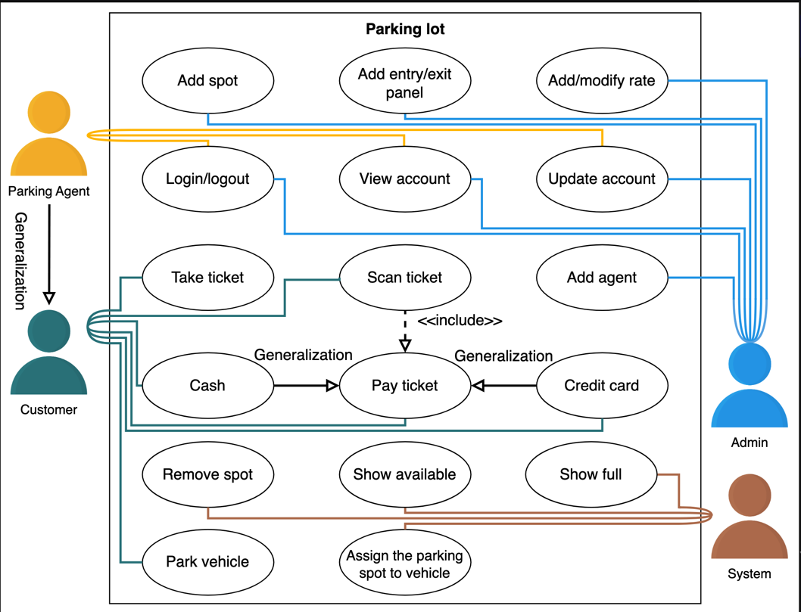
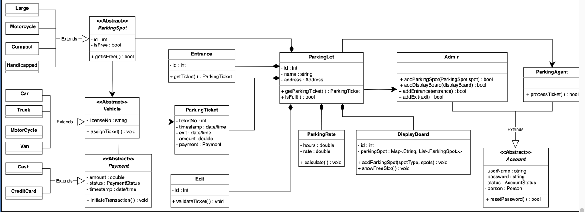
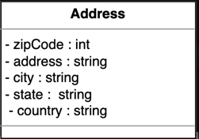
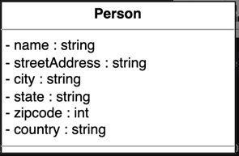
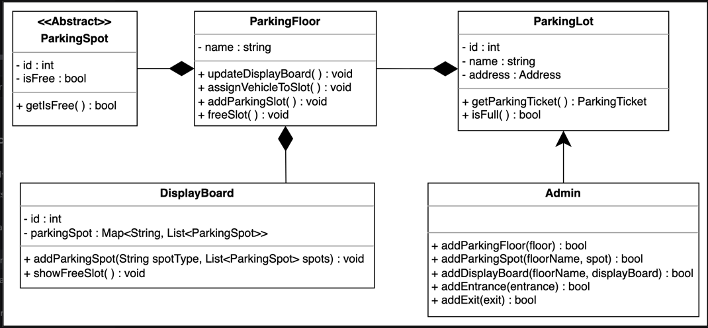
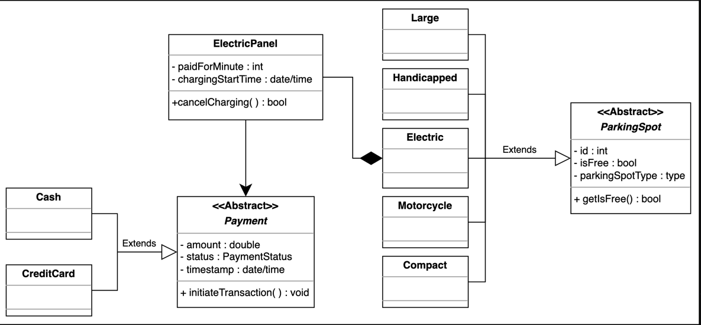
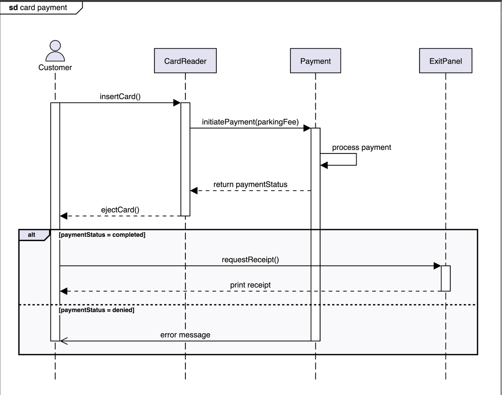
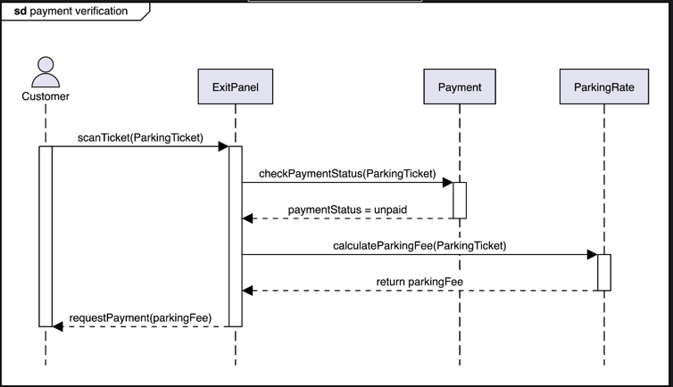

Requirement to ask and annote :

A parking lot is a designated area for parking vehicles and is a feature found in almost all popular venues
such as shopping malls, sports stadiums, offices, etc. In a parking lot, there are a fixed number of parking
spots available for different types of vehicles. Each of these spots is charged according to the time
the vehicle has been parked in the parking lot. The parking time is tracked with a parking ticket issued
to the vehicle at the entrance of the parking lot. Once the vehicle is ready to exit, it can either pay
at the automated exit panel or to the parking agent at the exit using a card or cash payment method.

parking lot

fixed number of sptos available
each spot is charged by time
different types of vehicles -> spot size -> handicapped, car, motocycles, van/truck
time is tracked by parking ticket issued at the entrance of the parking lot
exit
- pay at the automated exit panel
- or parking agent
  payment card or cash payment
  multiple entrance and exit

discussions to get requirements - questions to ask to get your requirements

several components each with specific constraints and requirements.

1 - payment flexibility -
- How are customers able to pay at different exit points (i.e., either at the automated exit panel or to the
parking agent) and by different methods (cash, credit, coupon)?
- If there are multiple floors in the parking lot, how will the system keep track of the customer having
already paid on a particular floor rather than at the exit?

2 - parking spot type
- How will the parking capacity of each lot be considered?
- What happens when a lot becomes full?
- How can one keep track of the free parking spots on each floor if there are multiple floors in the parking lot?
- How will the division of the parking spots be carried out among the four different parking spot types in the lot?
- (handicapped, compact, large, and motorcycle)

3 - vehicle types
- How will capacity be allocated for different vehicle types ?
- If the parking spot of any vehicle type is booked, can a vehicle of another type park in the designated parking spot?
- (car, truck, van, motorcycle)

4 - Pricing
- How will pricing be handled? Should we accommodate having different rates for each hour? For example, customers
will have to pay $4 for the first hour, $3.5 for the second and third hours, and  $2.5 for all the subsequent hours.
- Will the pricing be the same for the different vehicle types?

5 - Design Approach -> bottom-up design approach
- Identify and design the smallest components first, like, the vehicle and parking spot types.
- Use these small components to design bigger components, for example, the payment system at the exit.
- Repeat the steps above until we design the whole system like the parking lot.

6 - Design pattern
- Singleton design pattern
- Abstract Factory design pattern
- Factory design pattern

Requirements

requirements define the scope of a problem

- The parking lot should have the capacity to park 40,000 vehicles
- The four different types of parking spots are handicapped, compact, large, and motorcycle.
- The parking lot should have multiple entrance and exit points.
- Four types of vehicles should be allowed to park in the parking lot, which are as follows:

Car
Truck
Van
Motorcycle

- The parking lot should have a display board that shows free parking spots for each parking spot type.
- The system should not allow more vehicles in the parking lot if the maximum capacity (40,000) is reached
- If the parking lot is completely occupied, the system should show a message on the entrance and on the parking lot display board.
- Customers should be able to collect a parking ticket from the entrance and pay at the exit.
- The customer can pay for the ticket either with an automated exit panel or pay the parking agent at the exit
- The payment should be calculated at an hourly rate.
- Payment can be made using either a credit/debit card or cash.

Use Case

parking lot

actos
primary actors : Customer, Parking agent
secondary actors : Admin, System

Admin
Add spot: To add a parking spot
Add agent: To add a new agent
Add/modify rate: To add/modify hourly rate
Add entry/exit panel: To add and update exit/entry panel at each entry/exit
Update account: To update account details and payment information
Login/Logout: To login/logout to/from agent or admin account
View account: To view account details like payment status or unpaid amount

Customer
Take ticket: To take a ticket at the entrance, that contains information regarding the vehicle and its entrance time
Scan ticket: To scan the ticket at the exit and get the parking fee
Pay ticket: To pay the parking fee at the exit panel via cash or a credit card
Cash: To pay the parking fee via cash
Credit card: To pay the parking fee via credit card
Park vehicle: To park the vehicle at the assigned destination

Parking agent
Update account: To update account details and payment information
Login/Logout: To log in/log out to/from the agent or admin account
View account: To view account details like payment status or unpaid amount
Take ticket: To take a ticket at the entrance, that contains information regarding the vehicle and its entrance time
Scan ticket: To scan the ticket at the exit and get the parking fee
Pay ticket: To pay the parking fee at the exit panel via cash or a credit card
Cash: To pay the parking fee via cash
Credit card: To pay the parking fee via credit card
Park vehicle: To park the vehicle at the assigned destination

System
Assigning parking spots to vehicles: To check the vehicle type and associate a free spot according to it
Remove spot: To remove a parking spot if it is not available for parking
Show full: To display the status of the parking lot as full
Show available: To show the details of available parking spots

Generalization
The “Parking agent” has a generalization relationship with the “Customer” since the parking agent can perform all those tasks that a customer can perform.
“Cash” and “Credit card” use cases are used for payments. Hence, both have a generalization relationship with the “Pay ticket” use case.

Include
The “Scan ticket” has an include relationship with the “Pay ticket” since it is necessary to scan a ticket and
get the total payable fee of parking a vehicle before the actual payment.

class diagram

design classes, abstract classes, and interfaces based on the requirements we have previously gathered from the interviewer in our parking lot system

bottom-up approach

classes

1 - Vehicle (abstract class) - a car, a truck, a van, and a motorcycle(class) -> 2 ways to represent vehicle
- Enumeration
- Abstract class

The enumeration class creates a user-defined data type that has the four vehicle types as values.

This approach is not proficient for object-oriented design because if we want to add one more vehicle type later in our
system, then we would need to update the code in multiple places in our code, and this would violate the Open
Closed principle of the SOLID design principle. This is because the Open Closed principle states that classes can
be extended but not modified. Therefore, it is recommended not to use the enumeration data type as it is not a scalable approach.

Using enums isn’t prohibited, but just not recommended. Later, we will use the PaymentStatus enum in our parking lot
design as it won’t require further modifications.

An abstract class cannot instantiate the object and can only be used as a base class. The abstract class for Vehicle
is the best approach. It allows us to create derived child classes for the Vehicle class. It can be extended easily
in case the vehicle type changes in the future.

2 - Parking spot (abstract class) -> handicapped, compact, large, and motorcycle (class)

Similar to the Vehicle class, the ParkingSpot should also be an abstract class
handicapped, compact, large, and motorcycle

3 - Account (abstract class) -> Admin, Parking Agent (class)

Similar to the Vehicle and ParkingSpot classes, Account should also be an abstract class

4 - Display board(class)
This class represents the free parking spot types and the number of empty slots.

5 - Entrance(class) and exit(class)

The Entrance class is responsible for returning the parking ticket whenever a vehicle arrives.
It contains the ID attribute, since there are multiple entrances to the parking lot. It also has the getTicket() method.

The Exit class is responsible for validating the parking ticket’s payment status before allowing the vehicle to exit the
parking lot. It contains the ID attribute, since there are multiple exits to the parking lot. It also has the validateTicket() method.

6 - Parking ticket(class)
The ParkingTicket class is one of the central classes of the system. It keeps track of the entrance and exit times of the
vehicles, the amount, and the payment status

7 - Payment(abstract class) -> card, cash(class)

The Payment class will be an abstract class and will have two child classes, card and cash, since these are two payment methods of the parking lot system.

8 - Parking rate(class)
The ParkingRate class is responsible for calculating the final payment based on the time spent in the parking lot.

9 - Parking lot (class)
Now, we will discuss the design of the whole ParkingLot system class. This parking lot system is composed of smaller
objects we have already designed, like entrance/exit, parking spots, parking rates, etc.

The enumerations and custom data types#

Enums

PaymentStatus: We need to create an enumeration to keep track of the payment status of the parking ticket, whether it is
paid, unpaid, canceled, refunded, and so on.

AccountStatus: We need to create an enumeration to keep track of the status of the account, whether it is active,
canceled, closed, and so on.

Address (class -> custom data type )
We also need to create a custom data type, Address, that will store the location of the parking lot.

Person (class -> custom data type)
The Person class is used to store information related to a person like a name, street address, country, etc.

Relationship between the classes

Association

The class diagram has the following association relationships:

The ParkingSpot has a one-way association with Vehicle.
The Vehicle has a one-way association with ParkingTicket.
The Payment has a two-way association with ParkingTicket.

Composition

The class diagram has the following composition relationships.

The ParkingLot class includes Entrance, Exit, ParkingRate, DisplayBoard, ParkingTicket, and ParkingSpot.

Inheritance

The following classes show an inheritance relationship:

The Vehicle class includes Car, Truck, Van, and MotorCycle subclasses.
The ParkingSpot class includes handicapped, compact, large, and motorcycle subclasses.
The Payment class includes the Cash and CreditCard subclasses.

Design pattern

The system itself will have a ParkingLot class. It will use the Singleton design pattern, because there will only be
a single instance of the parking lot system.

This parking lot system is also composed of smaller objects that we have already designed, like entrance,
exit, parking spots, parking rates, etc. Therefore, it will be a good practice to use the
Abstract Factory and Factory design pattern to instantiate all those objects.

Additional requirements

The interviewer can introduce some additional requirements in the parking lot system, or they can ask some follow-up questions.
Let’s see some examples of additional requirements:

Parking floor: The parking lot should have multiple floors where customers can park their cars. The class diagram
provided below shows the relationship of ParkingFloor with other classes:

Electric: The parking lot should have some parking spots specified for electric cars. These spots should have an
electric panel through which customers can pay and charge their vehicles. The class diagram provided below shows
the relationship of Electric and ElectricPanel with other classes:

Let’s say that the interviewer asks you that the parking lot should assign a parking spot closest to the entrance. How do you go about solving this requirement?

This requirement is more about how you implement this parking assignment strategy rather than designing it. The interviewer is really looking at your data structures and algorithms skills in this requirement.

In this scenario, let’s say we have four entrances and would like to return to the parking spot which is nearest to the entrance from where the customer is entering the parking lot. The best approach is to implement it using a min-heap.

We will declare four min-heaps. We will add all parking spots to these min-heaps, so there will be a min-heap for each entrance. These min-heaps will store the parking spots in the order of the shortest distance from the entrance.

We will also declare the following two sets of parking spots:
- A set of available parking spots
- A set of reserved parking spots

We have a map of min-heaps where the key is the entrance ID, and the value is a min-heap. When the user calls the getParkingSpot method, we get the entrance ID which gives us the min-heap for that entrance and allows us to pop the top element to get the parking spot.

We mark the parking spot as reserved and remove it from the available set. We also remove it from the min-heaps of other entrances.

Sequence Diagram

A sequence diagram is a great way to understand the interactions between different entities and objects in the system. There can be different sequence diagrams that we can create for our parking lot system. For the sake of this lesson, we will create sequence diagrams for the following two interactions:

- Card payment: This performs a payment using the card.
- Sequence challenge: This is for payment verification.

Card payment

The sequence diagram for the card payment should have the following actors and objects that will interact with each other:

- Actor: Customer
- Object: CardReader, Payment, and ExitPanel

Here are the steps in the card payment interaction:

1 - The customer inserts the card into the card reader.
2 -The card reader initiates a payment for the required parking fee.
3 - The payment processes the payment and returns the payment status.
4 - The card reader ejects the card.
5 - If the payment is successful:
5.1 - The customer requests a receipt for the transaction.
5.2 - The exit panel prints a receipt for the customer.
6 - If the payment is unsuccessful:
6.1 - The customer sees an error message for an unsuccessful Payment.

Note: The Payment object is created when a vehicle enters the parking lot.

Sequence challenge: Payment verification

In this section, you will help us in completing a sequence diagram for the payment verification of a customer at the exit panel.

