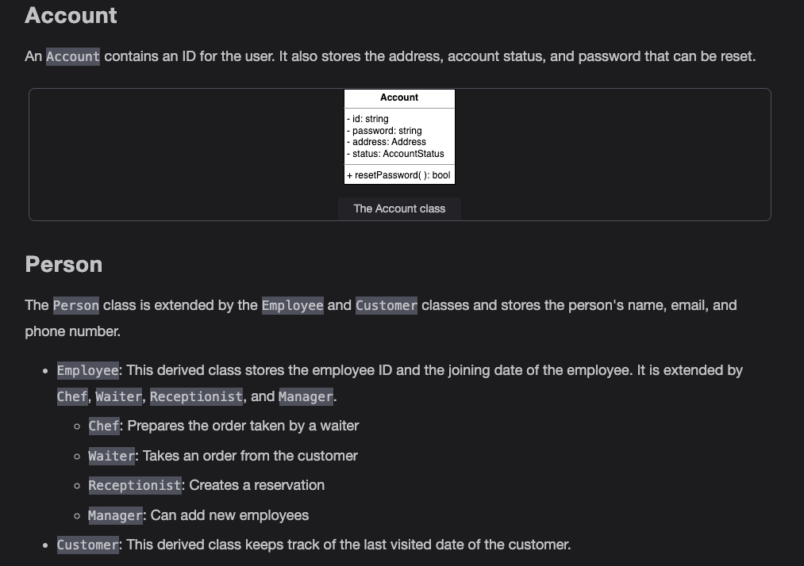
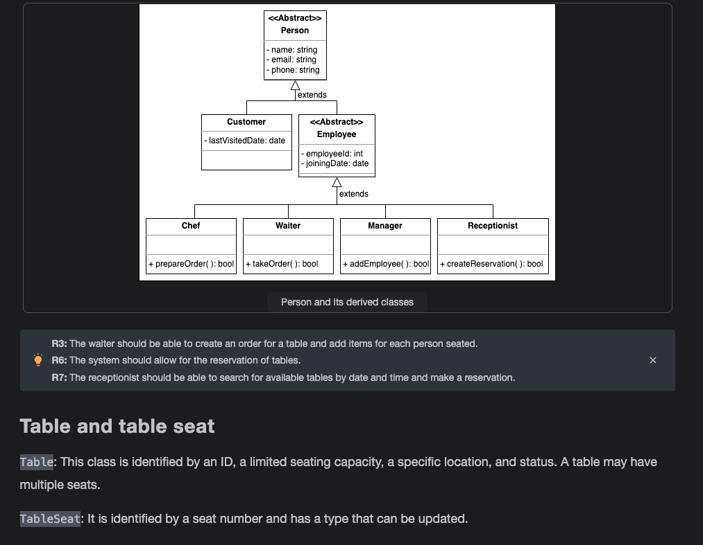
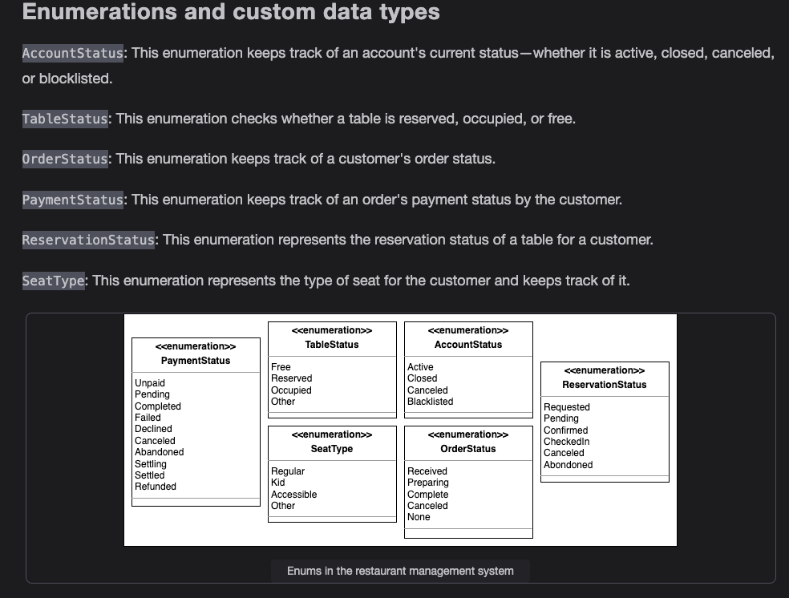
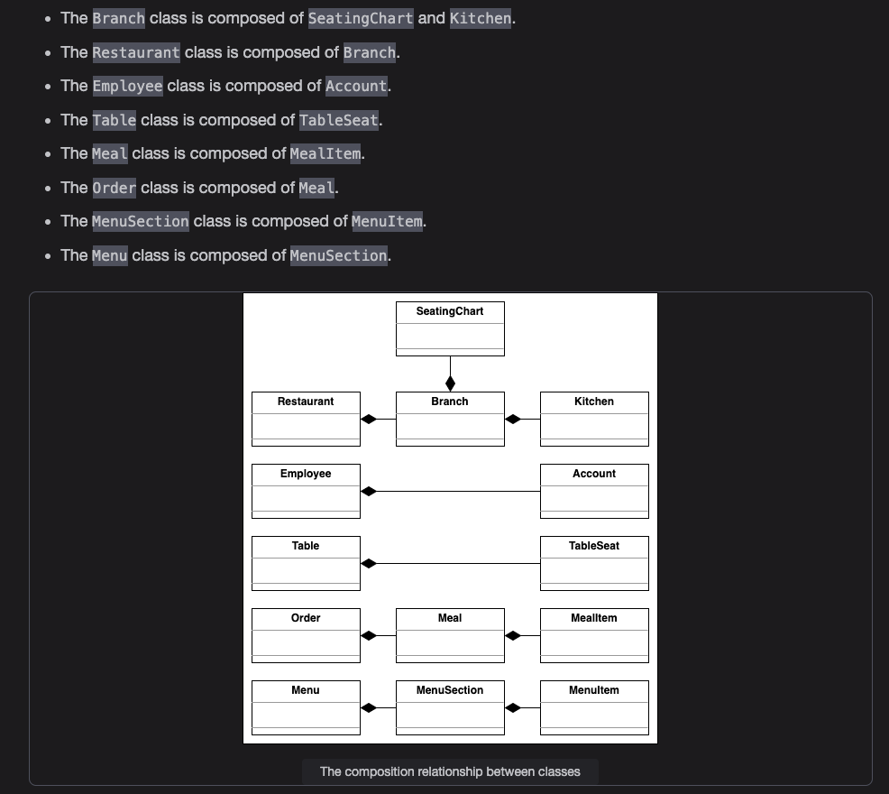

Getting Ready: The Restaurant Management System

A restaurant management system (RMS) is a software program that helps restaurant owners and managers to handle and organize various aspects of their businesses including food and beverage sales, employee schedules, and customer reservations. The restaurant management system can be used in various settings, including quick-service and fine-dining restaurants, and cafeterias. The system allows restaurants to streamline their operations, improve efficiency, and better serve their customers.

RMS is used to manage various aspects of a restaurant efficiently and securely. The restaurant’s management can have control and flexibility over their operations from a single location using this system. The system enables the manager to monitor available tables, make reservations, and generate bills.

Overall, the goal of a restaurant management system is to help restaurant owners and managers to streamline and automate various tasks, allowing them to focus on providing a high-quality dining experience to their customers.

Restaurant services

To better understand the services offered by a restaurant management system, you may ask the interviewer the following questions:

Does the restaurant provide a delivery service?

Can a customer place an online order?

Does the restaurant accept online/card payments?

Restaurant management

Restaurant branches vary in terms of services, which is why it is important to clear the following questions from the interviewer:

Can branches vary in terms of the services of a restaurant?

Do we need to consider the inventory management of the restaurant for this problem?

Design approach

We’ll design this restaurant management system using the bottom-up approach. Therefore, we’ll follow the steps below:

Identify and design the smallest components first—the table, table seat, meal, meal item, and seating chart.

Use these small components to design bigger components—the menu, branch, and restaurant.

Repeat the steps above until we design the whole restaurant management system.

Design pattern

During an interview, it is always a good practice to discuss the design patterns that the restaurant management system falls under. Stating the design patterns gives the interviewer a positive impression and shows that the interviewee is well-versed in the advanced concepts of object-oriented design.

Requirements for the Restaurant Management System

R1: The restaurant can have multiple branches.

R2: Each branch will offer a menu with various sections and items.

R3: The waiter should be able to create an order for a table and add items for each person seated.

R4: Each person’s order can consist of multiple items, each corresponding to a menu item.

R5: The system should be able to provide information about tables currently available for walk-in customers.

R6: The system should allow for the reservation of tables.

R7: The receptionist should be able to search for available tables by date and time and make a reservation.

R8: The system should allow customers to make and cancel their reservations.

R9: The system should send notifications as the reservation time approaches.

R10: Customers should be able to pay their bills with credit cards, checks, or cash.

R11: Each branch may have different configurations of tables.

Use Case Diagram for the Restaurant Management System

System

Our system is a "restaurant."

Actors

Let’s define the main actors of our restaurant management system.

Primary actors

Guest: This is the restaurant's primary actor who can view the menu, place orders, and make payments.

Receptionist: This actor is responsible for reserving tables and updating the table reservation status.

Waiter: This actor takes the order from the guest and processes the payment.

Manager: This actor acts as the admin of the system and can perform all tasks that a receptionist and a waiter can perform. Other than that, this actor updates the menu and sets the price of food items.

use cases

Guest

View menu: To view the food items available in the restaurant

Place order: To place the food order in the restaurant

Add/update order item: To add or remove a food item from the order

Cancel order: To cancel an existing order

View order: To view the item included in the order

Pay bill via cash: To pay the food bill with cash

Pay bill via card: To pay the food bill with the card

Pay bill via check: To pay the food bill with the check

Reserve table: To reserve a table for a guest

Update/cancel reservation: To change the table or cancel the reservation

Manager

Add/modify menu section: To add a new section of the food type in the menu

Add/modify menu item: To add a new food item in the food section

Set menu item price: To set the price of a food item

Generate report: To generate an analytical report of orders, inventory, and more

Add/ Update Tables chart: To keep an updated record of the table availability status

Reserve table: To reserve a table for a guest

Update/cancel reservation: To change the table or cancel the reservation

View menu: To view the food item available in the restaurant

Place order: To place a food order in the restaurant

Add/update order item: To add or remove a food item from the order

Cancel order: To cancel an existing order

View order: To view the item included in the order

Process payment: To generate a food bill from the system and receive payment from the guest

Receptionist

Add/ Update Tables chart: To keep an updated record of the table availability status

Reserve table: To reserve a table for a guest

Update/cancel reservation: To change the table or cancel the reservation

Waiter

View menu: To view the food item available in the restaurant

Place order: To place the food order in the restaurant

Add/update order item: To add or remove a food item from the order

Cancel order: To cancel an existing order

View order: To view the item that is included in the order

Process payment: To generate a food bill from the system and receive payment from the guest.

Relationships

Generalization

The manager is responsible for the receptionist and the waiter. It also has access to everything they both have. Therefore, the “Manager” has a generalization relationship with both “Receptionist” and “Waiter.”

Associations

The below table shows the association relationship between actors and their use cases.

Include

Whenever the manager adds a new menu item, the menu section is modified. Therefore, the “Add/ modify menu item” use case has an include relationship with the “add/modify menu section” use case.

Extend

If the payment is processed, it will be either by card, cash, or check. Therefore, the “Process payment” use case has an extend relationship with the “Pay bill via cash,” “Pay bill via card,” and the “Pay bill via check” use cases.

Use case diagram

Class diagram for the Restaurant Management System

Components of the restaurant management system

The two-way association relationship between classes

Composition

The class diagram has the following composition relationships.

Class diagram for the Restaurant Management System

Design pattern

The following design patterns have been used in the class diagram:

The Singleton pattern: This pattern ensures that a class has only one instance and provides a global point of access to that instance. This can be useful for the RMS’s database connection, for example, to ensure that there is only one connection to the database, and to make it easy for other parts of the system to access the connection.

The Command pattern: This pattern encapsulates a request as an object, which allows the request to be parametrized with different data. In the context of an RMS, this pattern could be used to encapsulate requests to the database, such as add, delete or modify entries. This way the views or other components don’t need to know how to handle the request. They just need to know how to execute it.

The Observer pattern: This pattern allows objects to be notified of changes to other objects. In the context of an RMS, this pattern could be used to notify the viewers of changes to the model so that they can update themselves accordingly.

The Factory pattern: This pattern provides a way to create objects without specifying the exact class of object that will be created. In an RMS, this pattern could be used to create different types of menu items, for example, without having to specify the exact class of each item.

Additional requirements

The interviewer can introduce some additional requirements in the given restaurant management system, or they can ask some follow-up questions. Let's see examples of the additional requirements:

Discount: A discount will be applied to the payment depending on special events such as the New Year, an anniversary, a branch opening, and so on. The class diagram provided below shows the relationship of Discount with the Payment class:

Sequence Diagram for the Restaurant Management System

Modifying an order

Sequence challenge: The guest pays for the order

Activity Diagram for the Restaurant Management System

Place the order

The following are the states and actions that will be involved in this activity diagram.

States

Initial state: A guest arrives at the restaurant and asks for a table.

Final state: The guest successfully placed a food order.

Actions

The guest arrives at the restaurant reception and asks for a table. The receptionist checks for table availability. The guest will sit at the table if the table is available. If the table is unavailable, the guest will wait for a free table.

The waiter will appear with the menu when a guest sits at the table. The guest will decide to order from the menu. The waiter will send it to the kitchen.

Activity challenge: Cancel the order

Code for the Restaurant Management System

Enumerations and custom data type

The following code provides the definition of the enumeration and custom data type used in the restaurant management system.

PaymentStatus: This enumeration keeps track of an order's payment status by the customer.

TableStatus: This enumeration keeps track of the table’s status.

SeatType: This enumeration represents the type of seat for a customer.

AccountStatus: This enumeration keeps track of an account's status.

OrderStatus: This enumeration keeps the customer's order status in check.

ReservationStatus: This enumeration represents the reservation status of a table.

Address: This custom datatype represents the address of the restaurant's branch or a person.

Account and person

The Account class represents a user account that has an ID, address, status, and a password that can be reset and is validated using the resetPassword() function.

The Person class stores the personal details of a person who can either be an Employee or a Customer of the restaurant. The derived class Employee is further extended by the following:

Receptionist: Has a method named createReservation() to create reservations for customers

Manager: Has a method named addEmployee() to hire new employees to the restaurant

Chef: Has a method named prepareOrder() for preparing the order

Waiter: Has a method named takeOrder() for taking new orders

The derived Customer class has a private member that stores the last visited date of the customer. The definitions of these classes are provided below:

Table and table seat

The Table class has a unique ID. It stores the table status, table location, and maximum capacity. Reservations can be added to a table using the addReservation() method. It also maintains a list of all the seats it has, where each TableSeat is identified by a seat number and has a type

Meal and meal item

The MealItem class is identified by a unique ID and stores and updates the quantity of a menu item. It can be added to a Meal using the addMealItem() method, where the Meal class represents the meal ordered for a specific table.

Menu, menu section, and menu item

The Menu class represents the menu of a restaurant. It is identified by a unique ID and maintains a list of MenuSection, where the MenuSection class is the representation of a menu's different sections. A MenuSection has a list of MenuItem in which an item's price can be updated. 

Order, kitchen, and reservation

An Order has a number of meals and is assigned to a waiter and chef for a specific table. Meals can be updated in an Order using the addMeal() and removeMeal() methods.

A Kitchen has a number of chefs where new chefs can be assigned using the assignChef() method.

The Reservation class represents the reservation of a table that stores the reservation time, people count, status, check-in time, and customer information. It also maintains a list of notifications for the customer.

Payment and bill

The Payment class is an abstract class with the Check, CreditCard, and Cash classes as its child classes. This takes the PaymentStatus enum to keep track of the payment status. The Bill class represents the bill generated for a customer's order. 

Notification

The Notification class is another abstract class responsible for sending notifications, with the SmsNotification and EmailNotification classes as its child

Seating chart, branch, and restaurant

The SeatingChart class stores the seating plan for a Branch of the Restaurant, which can be printed. The Branch of a restaurant has a specific name, address, and kitchen. The Restaurant class maintains a list of all the branches under it.

