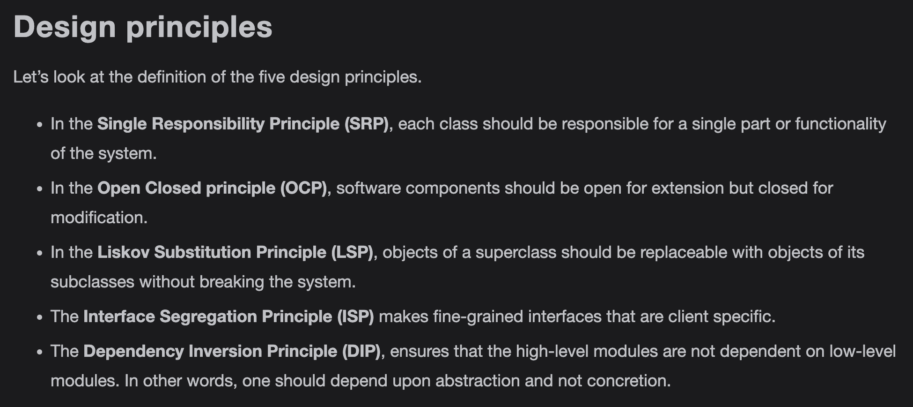
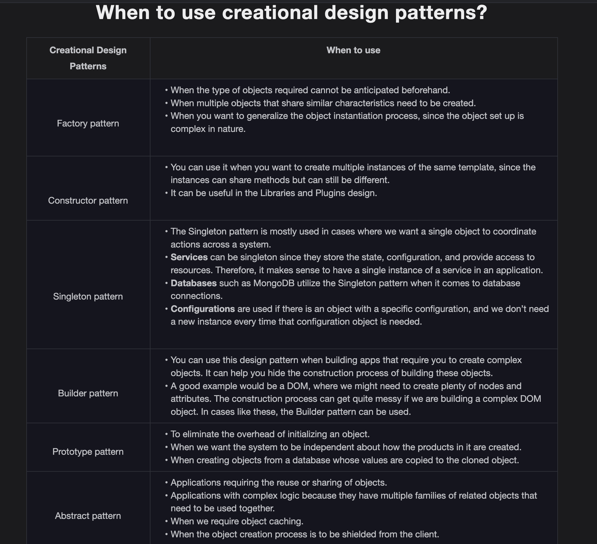

Introduction to SOLID Design Principles

Introduction

When creating software, we can follow good practices to avoid issues to make our code easier to understand, robust, and maintainable. Few of these practices are often termed as principles, e.g., the SOLID principles refer to the best practices to be followed in OOD.

SOLID is an acronym for the first five object-oriented design (OOD) principles by Robert C. Martin, also known as Uncle Bob, the author of Clean Code: A Handbook of Agile Software Craftsmanship.

The illustration below represents the acronym for SOLID design principles.

SOLID: Single Responsibility Principle

Introduction

The Single Responsibility Principle (SRP) is perhaps the least understood of the SOLID concepts. The term was coined by Robert C. Martin who defines the SRP in the following way, "A class should have only one reason to change." This implies that any class or component in our code should only have one functionality. Everything in the class should be related to just one goal.

When programmers need to add features or new behavior, they frequently integrate everything within the current class. When something needs to be changed later, due to the complexity of the code, the update process becomes extremely time consuming and tedious. The Single Responsibility Principle helps us create simple classes that perform just one task. This helps in making modifications or adding extensions to the existing code much easier.

SOLID: Open Closed Principle

SOLID: Liskov Substitution Principle

- It avoids the generalization of concepts that may not be needed in the future.

- It makes the code maintainable and easier to upgrade.

SOLID: Interface Segregation Principle

Introduction

The Interface Segregation Principle (ISP) is a design principle that does not recommend having methods that an interface would not use and require. Therefore, it goes against having fat interfaces in classes and prefers having small interfaces with a group of methods, each serving a particular purpose.

The goal behind implementing the ISP is to have a precise code design that follows the correct abstraction guidelines and tends to be more flexible, which would help in making it more robust and reusable. This becomes key when more and more features are added to the software, making it bloated and harder to maintain.

Example

Let’s construct a simple interface called Shape that has the area() method, and Square and Rectangle as the classes to implement it as shown below:

- It helps to keep our software maintainable and robust.

- It allows for efficient refactoring and redeployment of code.

SOLID: Dependency Inversion Principle

Introduction

The Dependency Inversion Principle (DIP) states that high-level modules should not depend on low-level modules, but rather both should depend on abstractions. The abstractions should not depend on details. Instead, the details should depend on abstractions.

In many cases, thinking about the interaction between modules as an abstract concept allows the linking of components to be reduced without the need for more coding patterns to be implemented. This allows for a functional scheme with reduced implementation and allows the system to be more flexible.

Real-life example

Let’s try to understand the concept of DIP with the help of a school example. Suppose there is a headmaster of a high school. Under the headmaster, there are faculty members such as teachers, assistants, and some helpers.

Violation

Let’s see what a possible design would look like without the implementation of the DIP.

The class diagram of this example is shown below:

Introduction to the Design Patterns

What are design patterns?

Designing efficient and reusable code is something that all developers strive for. When working on large applications, code structure becomes an integral element where we need to prevent repeating code for similar tasks. However, trying to build upon and adding features to an existing system is quite a challenging task, since a developer needs to know the complete particulars. These include the relationships that each entity possesses or the sort of hierarchy that exists between different entities. Also, developers need to update their code in such a way as to make it easily adaptable to change in the future. In such scenarios, it’ll be helpful to have a structure that could be used to solve various common issues. This is where the design patterns come into play.

Design patterns are solutions to frequently occurring real-life problems in software design. They can also be considered customizable templates that can meet the requirements of a particular design problem. Let’s take the example of an ice-cream factory that serves as the base of operations to produce various types of ice creams according to the defined requirements. This is similar to how a design pattern can be used as a template in different circumstances.

Classification of Design Patterns

The illustration below demonstrates some of the popular design patterns:

Creational Design Patterns

Introduction to creational design patterns

In this lesson, we will discuss creational design patterns. Creational design patterns deal with object creation mechanisms. As the name implies, these patterns provide optimized object creation techniques. They help cater to the design and complexity problems that might occur when using the basic approach. They also help control the creation of objects.

The chart below shows the patterns that fall under this category:

Structural Design Patterns

Get introduced to structural design patterns and learn when to use them.

Introduction to structural patterns

In this lesson, we will discuss structural design patterns. As the name implies, these patterns are concerned with object relationships and the structure of classes or objects. They help to add new functionality without having to modify the entire system. They ensure that if one part of a system changes, the whole system does not change with it. Let’s look at the most common structural patterns that are used in solving design problems.

Behavioral Design Patterns

An Approach to Solve a Real-world Problem

