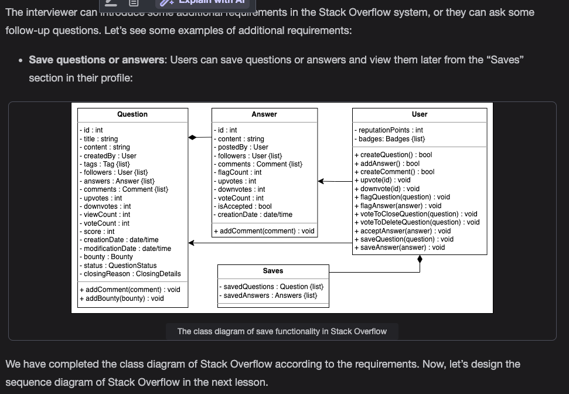

Problem definition

Stack Overflow is a Q&A website for programmers and developers, irrespective of their expertise level in the domain. It has a wide variety of questions on topics related to computer science and programming. Registered users can post new questions and answer questions from other users. Each user can collect reputation points. These points are affected by the upvotes or downvotes received by the user on their questions or answers. More reputation points allow users to perform additional functions like voting to close or delete a question. On achieving reputation milestones, users are awarded badges to highlight their credibility.

Expectations from the interviewee

It is important to narrow down the components to be included in your Stack Overflow design. The following section provides an overview of some of the main expectations that the interviewer will want to hear you discuss in more detail during the interview:

Discoverability

You may want to ask the interviewer the following to get a better understanding of how Stack Overflow's discoverability works:

How are users able to search for questions?

Is there a way to filter questions using tags or users?

Reputation

Reputation points affect user privileges. Therefore, it's important to ask the interviewer the following aspects of reputation points:

How are reputation points calculated? Do users get points for asking or answering questions?

How many points are required for users to get a moderator access?

Voting

Voting is one of the main features of Stack Overflow. It gives insight on which questions or answers are more popular among users. Make sure to ask the following questions to understand how voting works in Stack Overflow:

What are the different types of voting allowed on Stack Overflow? Are you allowed to upvote and downvote?

How does voting work when a question has to be closed and deleted? Which user can vote in such circumstances?

Bounty

Bounty is a special reputation placed on a question that is not being noticed or answered. Any user that answers a bounty question receives reputation points equal to the bounty value. You need to clarify the bounty requirements from the interviewer by asking the following questions:

How are reputation points awarded on bounty questions?

When do users start a bounty? How long does a bounty last before expiring?

Design approach

We’ll design Stack Overflow using the bottom-up design approach. For this purpose, we’ll follow the steps below:

Identify and design the smallest components first, like a question and answer.

Use these small components to design additional components, for example, comments, bounty, and tags.

Repeat the steps above until we design the complete Stack Overflow platform.

Design pattern

During an interview, it is always a good practice to discuss the design patterns that the stack overflow falls under. Stating the design patterns gives the interviewer a positive impression and shows that the interviewee is well-versed in the advanced concepts of object-oriented design.

Requirements for Stack Overflow

R1: Any guest can view questions and search questions by tag, username or words.

R2: Users should be able to post new questions and add answers to an open question.

R3: Users can flag a question, answer, or comment if anything goes against the community guidelines.

R4: A user can upvote, downvote, and add comments to a question or answer, while they can only upvote a comment.

R5: Users can vote to delete or vote to close off questions for community-specific reasons. However, they can only vote to delete an answer.

R6: Any user can add a bounty to their question to attract more answers.

R7: Moderators can close a question or restore an already deleted question. Moderators can also delete answers.

R8: The system should send the user a notification whenever there has been an interaction with them, such as the user’s question receiving an answer, earning a badge, or someone upvoting or downvoting their post.

R9: Users can earn badges for their helpful answers or comments.

R10: The system should also be able to determine the most popular tags used in questions.

R11: Users can add tags to their questions. A tag is a word or phrase that describes the topic of the question.

Use Case Diagram for Stack Overflow

System

Our system is "Stack Overflow."

Actors

Now, we’ll define the main actors of Stack Overflow.

Primary actors

User: This actor can create, answer, and flag questions. This actor can add bounty, tags, and comments to questions, and vote to close or delete questions or answers.

Secondary actors

Guest: The guest can only search and view questions and their answers but needs to register an account to ask and answer questions.

Admin: The admin is in charge of performing numerous operations, such as blocking or unblocking users.

Moderator: The moderator is in charge of performing numerous operations, such as closing, reopening, deleting, and restoring questions.

System: This is responsible for awarding badges to users and sending out notifications whenever a new answer is added to a question asked by a user.

Use cases

User

Login/Logout: To log in or log out from the Stack Overflow account

Reset password: To reset the password of the Stack Overflow account

Add/modify/flag question: To create a new question or modify or flag an existing question

Add/modify/flag answer: To create a new answer or modify or flag an existing answer

Add comment: To add a comment to a question or answer

Vote to close/delete question: To vote to either close or delete an existing question

Upvote/downvote: To either offer support or register disapproval for a post

Guest

Search/view question: To search for a question from Stack Overflow and view its contents

Register account: To register an account

Admin

Block/unblock user: To block or unblock a user

Moderator

Close/reopen/delete/restore question: To close or delete an existing question, reopen a closed question or restore a deleted question

Delete answer: To delete an existing answer

System

Award badge to a user: To award an earned badge to a user

Send notification: To send a notification if any new answer or comment is added to a question followed by a user, and if there is an upvote or downvote on a question/answer

Relationships

We describe the relationships between and among actors and their use cases in this section.

Generalization

"Moderator" has a generalization relationship with "User" as the moderator can perform all those tasks that a normal user can perform.

"User" has a generalization relationship with "Guest" as the normal user can perform all those tasks that a guest user can perform.

Associations

Include

The “Send notification” use case also has an include relationship with the “Add answer,” “Add comment,” and “Add question” use cases, since a notification is sent whenever an interaction is made for any of these.

Extend

The “Modify question” use case has an extend relationship with the “Modify tag” and “Modify bounty” use cases, since the modification of a question can involve the steps to modify the tags and bounties.

The “Add question” use case has an extend relationship with the “Add bounty” and “Add tag” use cases, since a user can either add a bounty or tag when creating a question.

The “Modify question” use case also has an extend relationship with the “Add tag” and “Add bounty” use cases, since a user can decide to add tags and bounties after creating a question as well.

Class Diagram for Stack Overflow

Class diagram of Stack Overflow

Design pattern

We can use the Observer design pattern to implement the notification functionality. By default, users that post a question or answer are set as subscribers for that question or answer.

In addition, all users that choose to follow a question or answer also become subscribers. These users are added to a list of followers for both the question and answer. If there is a new activity for that question or answer, all subscribers are notified.

Additional requirements

Sequence Diagram for Stack Overflow

Close question

Sequence challenge: Create question

Activity Diagram for Stack Overflow

A member posting a question

The following are the states and actions that will be involved in this activity diagram.

States

Initial state: The member clicks on the “Ask Question” button.

Final state: There are two final states present in this activity diagram, shown below:

The question was successfully posted.

The question is not posted.

Actions

The member clicks on the “Ask Question” button and fills in the required fields. The member is then asked if they want to add a tag. After the post is composed, the system checks if the terms of service are followed. The question is posted only if the terms of service are followed.

Activity challenge: A member closes a question

Code for Stack Overflow

Constants

The following code provides the definition of the various enums and custom data types being used in the Stack Overflow design:

Account

The Account class refers to an account of a user on Stack Overflow and is responsible for containing their personal details, such as the username, password, etc. It also allows users to reset their existing passwords.

User, admin, moderator, and guest

The User class will be a parent class that represents a regular Stack Overflow user. A normal user can also be an Admin and a Moderator. Another actor is represented by the Guest class that refers to a user who can only search and view questions as well as their answers. However, they need to register an account to ask or answer questions.

Question, answer, comment, and bounty

Stack Overflow users can create and answer questions, upvote and downvote them, and add bounties and comments to questions.

Badge, tag, and tag list

Users can have badges that act as their reputation awards. Questions can have tags that describe the category that the question falls in. To keep a count of the tags being used, the TagList class is used.

Notification

The Notification class is responsible for sending notifications to users about any new messages, comments, posts, or friend requests via either a phone number, or an email

Search catalog and interface

The SearchCatalog class contains information on existing questions and answers. It also implements the Search interface class to enable the search functionality based on the given criteria (tags, usernames, and searched keywords).

