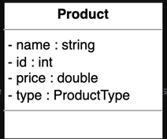
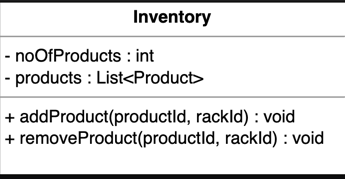

A vending machine is an automated machine. The machine provides items, including snacks, chocolates, and beverages to consumers. There are multiple racks inside the vending machine with products on each rack. A user inserts money into the machine, selects the rack number from which they want to buy a product, and presses the button. A vending machine dispenses the product to the users based on the amount of money inserted and the selection of the product.

questions

What function do the vending machines perform? Alternatively, how many different states can the vending machines have?

After inserting money into the machine, what does the system do?

Who presses the vending machine button, and what happens after pressing it?

What does the dispense function do?

If the vending machine is in a dispense state, is it possible to insert money?

If you are in NoMoneyInsertedState and try to select a product without paying money, would you be able to select a product?

Money handling

What should the system do if we pay less money than the product price?

What should the system do if we pay more money than the product price?

Can the credit card be used to input money or can only cash be used?

bottom-up design approach

Design pattern

Requirement

R1: There are different products placed at different positions in the vending machine.

R2: The vending machine can be in one of these three states:

NoMoneyInsertedState: There is no money inserted into the machine.

MoneyInsertedState: Money is inserted into the machine.

DispenseState: The machine gives out the product.

R3: There can be two actors in the system. One is the user and the other is the admin.

R4: The admin can add a product to the machine or remove a product from the machine.

R5: The system should allow the users to select a product they want to purchase from the machine by specifying the rack number.

R6: The user can insert money into the machine in the form of cash.

R7: The system should be able to calculate the money inserted into the machine.

R8: The system should check whether the user inserted the exact amount required for the specific product into the machine.

R9: If the amount is greater than the product price, the system should change back the user and dispense the product.

R10: If the amount is less than the product price, the system should display an error message and return the money.

Use Case Diagram

System

Our system is a "Vending machine."

Actors

Customer: This actor can view, select and take products, insert money, and take out change from the machine.

Operator: This actor can do everything a "Customer" can do. It can also add or remove products and remove cash from the machine.

System: This actor can search for the selected product and dispatch it after validating money.

Customer

View products: To view all available products in the vending machine

Select products: To select a product to buy from the vending machine

Insert money: To insert money to buy products from the vending machine

Take product: To take out products from the vending machine

Take change: To take out change from the vending machine

Operator

Add product: To add new products inside the vending machine

Remove product: To remove products from the vending machine

Cash remove: To remove collected cash from the vending machine

System

Search product: To search for the selected product in the machine to dispatch it

Validate money: To validate that the money is legal

Dispense product: To dispense selected products so customers can take them

Return change: To return the change to the customer if the inserted amount is less than the purchased product price

Generalization

The customer and operator are two actors who interact with the vending machine. The consumer can only engage with the system to purchase a product. An operator can execute all the duties that a customer can, along with certain administrative responsibilities. Therefore, the “Operator” actor has a generalization relationship with the “Customer” actor.

Include

When a customer selects a product to buy, the system then searches for the product’s location and dispatches it. Therefore, the “Select products” use case has an include relationship with the “Search product” use case.

When a customer selects a product to buy, the system then validates the money that the customer inserted and then dispenses the product. Therefore, the “Validate money” use case has an include relationship with the “Dispense product” use case.

Extend

When a customer selects a product to buy, the system then validates the money that the customer inserted and then returns the change if the amount is greater than the price of the purchased product. Therefore, the “Return change” use case has an extend relationship with the “Validate money” use case.

class diagram

State

State is an interface that represents the current state of the vending machine. There can be three possible states of a vending machine, i.e., no money inserted state, money inserted state, and the dispense state. The NoMoneyInsertedState class represents the state when there is no money inserted in the machine. When the user inserts the money into the machine, the state changes to MoneyInsertedState. Furthermore, when the machine dispenses the required product to the user, it transitions to the DispenseState.

This problem follows the State design pattern since the vending machine changes its behavior based on its state. Here, the State class defines an interface for declaring what the subclasses (NoMoneyInsertedState, MoneyInsertedState, DispenseState) should do. The subclasses provide the implementation for methods defined in the State, and the implementation of each method changes with the change of the state. Every state implements some functions,

According to the implementation of the State design pattern, all functions will be available in each state. However, it is not necessary that every function has a meaningful definition for that particular state.

Product

The Product class contains the details of a particular product available in the vending machin

The Rack class is used to identify the location of the product in the vending machine. Every rack has a specific rackNumber as an identifier.

Inventory

The Inventory class will contain a list of products available at different positions inside the vending machine. It will also reference the name of the product present in the particular rack. This class is also responsible for adding a product to the vending machine

Vending machine

VendingMachine is a class that represents the whole vending machine. The State type variable is used to define the current state of the vending machine. The vending machine has a list of racks and amount stored in it. This class follows the Singleton design pattern, since there will only be one instance of the clas

Enumeration

ProductType

We need to create an enumeration to keep track of the type of product

Relationship between the classes

Composition

The class diagram has the following composition relationships.

The VendingMachine class is composed of the Rack class.

The Inventory class is composed of the Product class.

Aggregation

The class diagram has the following aggregation relationships:

The VendingMachine class contains the State interface.

Association

The class diagram has the following association relationships.

The VendingMachine class has a two-way association with the Inventory class.

The Rack class has a two-way association with the Product class.

Inheritance

The following classes show an inheritance relationship:

The NoMoneyInsertedState, MoneyInsertedState, and DispenseState classes implement the State interface.

class diagram

Design pattern

We have used the State design pattern to design this problem because, in different states, we perform different or specific tasks according to the state. The vending machine changes its behavior based on its state. The different states within the system are listed below:

No money inserted state

Money inserted state

Dispense state

Additional requirements

The interviewer can introduce some additional requirements in the vending machine, or they can ask some follow-up questions. Let's see some examples of additional requirements:

Refund/Cancel: The vending machine should have the option to cancel the operation. In that case, the customers will get a refund. The class diagram provided below shows the refund functionality in all states:

In the class diagram above, we can see a function, refundFullMoney(), in all states which is used to refund the full money. Here is the definition of the refundFullMoney() function according to each state:

NoMoneyInsertedState: In this state, the refundFullMoney() function throws an exception or warning, “please insert some cash first” because we we have not inserted any money yet.

MoneyInsertedState: In this state, we know the customer inserted the cash because, due to this, we shifted the state of the vending machine from NoMoneyInsertedState to MoneyInsertedState. If the customer uses the refund option, then the refundFullMoney() function will call and return the full amount back in the change tray.

DispenseState: In this state, the refundFullMoney() function is blocked. We can say that if the customer uses the refund option, then the system does not do anything. This is because, in this state, the customer has already selected a product, and the vending machine is in the dispense state.

activity diagram

Product purchase from the vending machine

States

Initial state: The customer inserts money in the vending machine.

Final state: The customer receives the desired product.

Actions

The customer interacts with the vending machine and inserts money. The customer selects their desired product. If that product is available, they get the product and the change. Otherwise, the system shows a message of product unavailability and asks the customer to select some other product.

