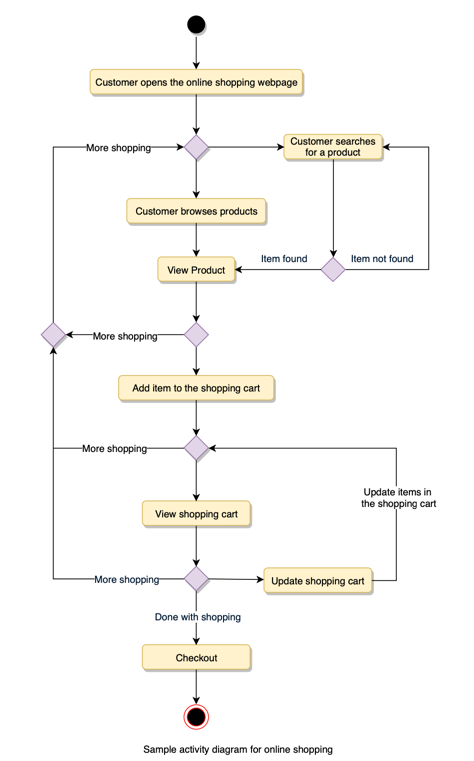

# grokking-low-level-design

Object-oriented programming (OOP) is a style of programming that focuses on using objects to design and build applications.

Object-oriented design (OOD) uses the object-oriented methodology to design a computational problem and its solution. It allows the application of a solution, based on the concepts of objects and models. OOD works as a component of the object-oriented programming (OOP) lifecycle. While designing a software solution, it is necessary to have less software development time and high code accuracy. OOD helps achieve this, since the design process involves objects communicating with each other and displaying the behavior of a program.

OOP is a programming style, not a tool, so despite being old, it’s vastly popular and established. This programming style involves dividing a program into pieces of objects that can communicate with each other. Every object has its own unique set of properties. These properties are later accessed and modified through the use of various operations.

Objects: Objects represent a real-world entity and the basic building block of OOP. For example, an Online Shopping
System will have objects such as shopping cart, customer, product item, etc.

Class: Class is the prototype or blueprint of an object. It is a template definition of the attributes and methods of
an object. For example, in the Online Shopping System, the Customer object will have attributes like shipping address,
credit card, etc., and methods for placing an order, canceling an order, etc.

The four principles of object-oriented programming are encapsulation, abstraction, inheritance, and polymorphism.

Encapsulation: Encapsulation is the mechanism of binding the data together and hiding it from the outside world.
Encapsulation is achieved when each object keeps its state private so that other objects don’t have direct access
to its state. Instead, they can access this state only through a set of public functions.

Encapsulation
Encapsulation is a fundamental programming technique used to achieve data hiding in OOP. Encapsulation in OOP refers to binding data and the methods to manipulate that data together in a single unit—class.

Encapsulation is usually done to hide the state and representation of an object from the outside. A class can be thought of as a capsule with methods and attributes inside it.

When encapsulating classes, a good convention is to declare all variables of a class private. This will restrict direct access by the code outside that class.

At this point, a question can be raised. If the methods and variables are encapsulated in a class, how can they be used outside that class? The answer to this is simple. One has to implement public methods to let the outside world communicate with this class. These methods are called getters and setters. We can also implement other custom methods.

Abstraction: Abstraction can be thought of as the natural extension of encapsulation. It means hiding all but the
relevant data about an object in order to reduce the complexity of the system. In a large system, objects talk
to each other, which makes it difficult to maintain a large code base; abstraction helps by hiding internal
implementation details of objects and only revealing operations that are relevant to other objects.

Inheritance: Inheritance is the mechanism of creating new classes from existing ones.

Polymorphism: Polymorphism (from Greek, meaning “many forms”) is the ability of an object to take different forms
and thus, depending upon the context, to respond to the same message in different ways. Take the example
of a chess game; a chess piece can take many forms, like bishop, castle, or knight and all these pieces will
respond differently to the ‘move’ message.

The process of OO analysis and design can be described as:
1. Identifying the objects in a system;
2. Defining relationships between objects;
3. Establishing the interface of each object; and,
4. Making a design, which can be converted to executables using OO languages.

We need a standard method/tool to document all this information; for this purpose we use UML. UML can be considered
as the successor of object- oriented (OO) analysis and design.

UML stands for Unified Modeling Language and is used to model the Object- Oriented Analysis of a software system.

UML is a way of visualizing and documenting a software system by using a collection of diagrams, which helps engineers,
businesspeople, and system architects understand the behavior and structure of the system being designed.

Types of UML Diagrams: The current UML standards call for 14 different kinds of diagrams. These diagrams are organized
into two distinct groups: structural diagrams and behavioral or interaction diagrams.

Structural UML diagrams

Class diagram    *
Object diagram
Package diagram
Component diagram
Composite structure diagram
Deployment diagram
Profile diagram

Behavioral UML diagrams

Use case diagram   *
Activity diagram   *
Sequence diagram   *
State diagram
Communication diagram
Interaction overview diagram
Timing diagram

we are focus only in

Use Case Diagram: Used to describe a set of user scenarios, this diagram, illustrates the functionality provided by the
system.

Class Diagram: Used to describe structure and behavior in the use cases, this diagram provides a conceptual model of
the system in terms of entities and their relationships.

Activity Diagram: Used to model the functional flow-of-control between two or more class objects.

Sequence Diagram: Used to describe interactions among classes in terms of an exchange of messages over time.

Use case diagrams describe a set of actions (called use cases) that a system should or can perform in collaboration
with one or more external users of the system (called actors)

1. Use Case Diagrams describe the high-level functional behavior of the system.
2. It answers what system does from the user point of view.
3. Use case answers ‘What will the system do?’ and at the same time tells us ‘What will the system NOT do?’.

Customer or Guest -> actor

customer or guest
- use cases-

- checkout shoping cart -> include -> make payment
- search product -> extend -> search product by category , serach product by name

System boundary: A system boundary defines the scope and limits of the system. It is shown as a rectangle that spans
all use cases of the system.

Actors: An actor is an entity who performs specific actions. These roles are the actual business roles of the users
in a given system. An actor interacts with a use case of the system. For example, in a banking system, the customer
is one of the actors.

Use Case: Every business functionality is a potential use case. The use case should list the discrete business
functionality specified in the problem statement.

Include: Include relationship represents an invocation of one use case by another use case. From a coding perspective,
it is like one function being called by another function.

Extend: This relationship signifies that the extended use case will work exactly like the base use case, except that
some new steps will be inserted in the extended use case.

Class Diagram

Class diagram is the backbone of object-oriented modeling - it shows how different entities (people, things, and data)
relate to each other. In other words, it shows the static structures of the system.

The purpose of the class diagram can be summarized as:

1.Analysis and design of the static view of an application;
2. To describe the responsibilities of a system;
3. To provide a base for component and deployment diagrams; and,
4. Forward and reverse engineering.

These are the different types of relationships between classes:

Association: If two classes in a model need to communicate with each other, there must be a link between them.
This link can be represented by an association. Associations can be represented in a class diagram by a line
between these classes with an arrow indicating the navigation direction.

the association between Pilot and FlightInstance is bi-directional, as both classes know each other.

By contrast, in a uni-directional association, two classes are related - but only one class knows that the
relationship exists. In the below example, only Flight class knows about Aircraft; hence it is a
uni-directional association

Multiplicity Multiplicity indicates how many instances of a class participate in the relationship.
It is a constraint that specifies the range of permitted cardinalities between two classes.
For example, in the diagram below, one FlightInstance will have two Pilots, while a Pilot can
have many FlightInstances. A ranged multiplicity can be expressed as “0...*” which means
“zero to many" or as “2...4” which means “two to four”.

Aggregation: Aggregation is a special type of association used to model a “whole to its parts” relationship.
In a basic aggregation relationship, the lifecycle of a PART class is independent of the WHOLE class’s lifecycle.
In other words, aggregation implies a relationship where the child can exist independently of the parent.
In the above diagram, Aircraft can exist without Airline.

Composition: The composition aggregation relationship is just another form of the aggregation relationship,
but the child class’s instance lifecycle is dependent on the parent class’s instance lifecycle. In other words,
Composition implies a relationship where the child cannot exist independent of the parent. In the above example,
WeeklySchedule is composed in Flight which means when Flight lifecycle ends, WeeklySchedule automatically gets
destroyed

Generalization: Generalization is the mechanism for combining similar classes of objects into a single, more general
class. Generalization identifies commonalities among a set of entities. In the above diagram, Crew, Pilot, and
Admin, all are Person.

Dependency: A dependency relationship is a relationship in which one class, the client, uses or depends on another
class, the supplier. In the above diagram, FlightReservation depends on Payment.

Abstract class: An abstract class is identified by specifying its name in italics. In the above diagram, both
Person and Account classes are abstract classes.

Sequence diagrams describe interactions among classes in terms of an exchange of messages over time and are used to
explore the logic of complex operations, functions or procedures. In this diagram, the sequence of interactions between
the objects is represented in a step-by-step manner.

We use Activity Diagrams to illustrate the flow of control in a system. An activity diagram shows the flow of control
for a system functionality; it emphasizes the condition of flow and the sequence in which it happens

Typically, activity diagrams are used to model workflow or business processes and internal operations.

Activity diagram captures the process flow. It is used for functional modeling. A functional model represents the
flow of values from external inputs, through operations and internal data stores, to external outputs.

Sequence diagram tracks the interaction between the objects. It is used for dynamic modeling, which is represented
by tracking states, transitions between states, and the events that trigger these transitions.

Design a Library Management System

A Library Management System is a software built to handle the primary housekeeping functions of a library.
Libraries rely on library management systems to manage asset collections as well as relationships with their members.
Library management systems help libraries keep track of the books and their checkouts, as well as members’
subscriptions and profiles.

Library management systems also involve maintaining the database for entering new books and recording books
that have been borrowed with their respective due dates.

System Requirements
clarify requirements at the beginning of the interview
ask questions to fin the exact scope of the system

1. Any library member should be able to search books by their title, author, subject category as well by the
publication date.

2. Each book will have a unique identification number and other details including a rack number which will help
to physically locate the book.

3. There could be more than one copy of a book, and library members should be able to check-out and reserve any copy.
We will call each copy of a book, a book item.

4. The system should be able to retrieve information like who took a particular book or what are the books checked-out
by a specific library member.

5. There should be a maximum limit (5) on how many books a member can check-out.

6. There should be a maximum limit (10) on how many days a member can keep a book.

7. The system should be able to collect fines for books returned after the due date.

8. Members should be able to reserve books that are not currently available.

9. The system should be able to send notifications whenever the reserved books become available, as well as when the
book is not returned within the due date.

10. Each book and member card will have a unique barcode. The system will be able to read barcodes from books and
members’ library cards

user case diagram

3 main factors

Librarian: Mainly responsible for adding and modifying books, book items, and users. The Librarian can also issue,
reserve, and return book items.
Member: All members can search the catalog, as well as check-out, reserve, renew, and return a book.
System: Mainly responsible for sending notifications for overdue books, canceled reservations, etc.

top use cases :

Add/Remove/Edit book: To add, remove or modify a book or book item.
Search catalog: To search books by title, author, subject or publication date.
Register new account/cancel membership: To add a new member or cancel the membership of an existing member.
Check-out book: To borrow a book from the library.
Reserve book: To reserve a book which is not currently available.
Renew a book: To reborrow an already checked-out book.
Return a book: To return a book to the library which was issued to a member.

Library: The central part of the organization for which this software has been designed. It has attributes like
‘Name’ to distinguish it from any other libraries and ‘Address’ to describe its location.

Book: The basic building block of the system. Every book will have ISBN, Title, Subject, Publishers, etc.

BookItem: Any book can have multiple copies, each copy will be considered a book item in our system. Each book
item will have a unique barcode.

Account: We will have two types of accounts in the system, one will be a general member, and the other will be a
librarian.

LibraryCard: Each library user will be issued a library card, which will be used to identify users while issuing
or returning books.

BookReservation: Responsible for managing reservations against book items.

BookLending: Manage the checking-out of book items.

Catalog: Catalogs contain list of books sorted on certain criteria. Our system will support searching through
four catalogs: Title, Author, Subject, and Publish-date.

Fine: This class will be responsible for calculating and collecting fines from library members.

Author: This class will encapsulate a book author.

Rack: Books will be placed on racks. Each rack will be identified by a rack number and will have a location
identifier to describe the physical location of the rack in the library.
Notification: This class will take care of sending notifications to library members.

Activity diagrams

Check-out a book: Any library member or librarian can perform this activity. Here are the set of steps to check-out a book:

Return a book: Any library member or librarian can perform this activity. The system will collect fines from members
if they return books after the due date. Here are the steps for returning a book:

Renew a book: While renewing (re-issuing) a book, the system will check for fines and see if any other member has not
reserved the same book, in that case the book item cannot be renewed. Here are the different steps for renewing a book:

Here is the code for the use cases mentioned above: 1) Check-out a book, 2) Return a book, and 3) Renew a book.

