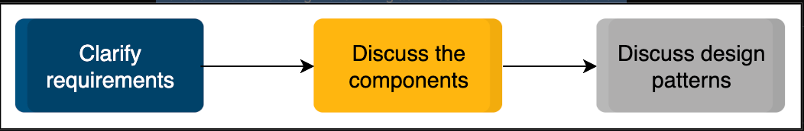

# grokking-low-level-design

What is object-oriented design?

Object-oriented design (OOD) uses the object-oriented methodology to design a computational problem and its solution. It allows the application of a solution, based on the concepts of objects and models. OOD works as a component of the object-oriented programming (OOP) lifecycle. While designing a software solution, it is necessary to have less software development time and high code accuracy. OOD helps achieve this, since the design process involves objects communicating with each other and displaying the behavior of a program.

About this course

A typical object-oriented design (OOD) interview is hard. You never know what design problem you’ll be asked, and there are so many of them. Moreover, the interviewer expects you to design a near-perfect solution to the given problem that covers all the edge cases.

This course is about getting familiar with the fundamentals of object-oriented design with an extensive set of real-world problems usually asked in an object-oriented design (OOD) interview.

We’ll start with the introduction of the cornerstones of object-oriented programming and object-oriented design with an overview of different types of UML diagrams. We will also review a well-known object-oriented design principle, SOLID, followed by the definition and explanation of some of the most widely used design patterns. We’ll also illustrate 21 real-world design problems mostly asked in FAANG interviews.

The purpose of providing foundational knowledge about object-oriented programming, object-oriented design, design principles, and design patterns before diving deep into the actual design problems is to equip our learners with the essential conceptual foundation. This is so that they don't get lost while designing a problem during the interview.

In each design problem, we have presented a detailed discussion of the problem requirements. We’ve modeled the findings with the help of use cases, as well as class, sequence, and activity diagrams for each problem. For the benefit and ease of our learners, we have also provided the code implementation of these design problems in five different programming languages (Java, C#, Python, C++, and JavaScript). We have included multiple interactive elements, including challenges and illustrations to develop your understanding of the problem.

Intended audience

If you aim to ace the object-oriented design (OOD) interview for your dream job, this course is for you. Here's how object-oriented design can help you advance in the tech industry:

- Software developers: Object-oriented design benefits software developers to design their systems efficiently. The object-oriented design allows code to be reusable in a way that reduces redundancy leading to shorter, more readable code. Therefore, employing object-oriented design allows for easier collaborations, which increases productivity and leads to faster development of software.

- Project/product managers: A big challenge in project or product management is to build systems that scale well and perform effectively over time. Managers that are aware of object-oriented design can design systems much more efficiently.

- Object-oriented design learners: Individuals in tech domains can greatly benefit from learning object-oriented design. This course helps a learner understand how different real-world problems can be developed through the object-oriented model.

- Interview preparation: Object-oriented design is becoming an important part of software development interviews. This course helps software engineers prepare for interviews in big tech companies including FAANG.

Prerequisites for this course
We assume that you know the fundamental concepts of object-oriented design. We’ve discussed topics like object-oriented programming, design concepts, design principles, and patterns in this course. However, we strongly believe that a high-level understanding of these concepts will be beneficial for the learner and will expedite the learning process. We also assume that you are well-versed in the syntax of object-oriented programming for any of the following programming languages:

- java

Structure of the course

This course consists of 28 chapters. These chapters can be segmented into the four sections listed below:

- Foundational: The foundational section is composed of three chapters. The first chapter introduces the course and its key features. The second chapter talks about object-oriented programming and its four paradigms. The third chapter introduces UML notations, and in this chapter, we focus on four widely used UML diagrams in object-oriented design.

- Design patterns: There are two chapters in the design patterns section. The first chapter introduces the five design principles widely used in object-oriented software development called SOLID. The second chapter discusses the three design patterns: creational, structural, and behavioral.

- Real-world design problems: There are twenty-one chapters in this section. The first chapter explains a typical object-oriented design interview process. In particular, this chapter discusses the steps involved in solving a design problem. Chapters 6–27 describe and solve the 21 real-world design problems in detail. We have dedicated a chapter for each problem in which we walk the learner through all the phases of designing an object-oriented problem. These chapters include requirement gathering, use case diagrams, class designs, sequence and activity diagrams, as well as the skeleton code implementation in five popular languages.

- Wrapping up: This section provides interview tips for the reader and wraps up this course.

Background of Object-oriented Programming (OOP)

Definition

We use programming to solve real-world problems, and it won’t make much sense if one can’t model real-world scenarios using programming languages. This is where object-oriented programming comes into play. Object-oriented programming, also called OOP, is a programming model that is dependent on the concept of objects and classes.

OOP is a programming style, not a tool, so despite being old, it’s vastly popular and established. This programming style involves dividing a program into pieces of objects that can communicate with each other. Every object has its own unique set of properties. These properties are later accessed and modified through the use of various operations.

Check out the illustration below. It shows a real-life example of an employee record, where every employee can be considered an “object”. Since every employee has a name, age, salary, and designation, all these can be considered as the properties of each employee.

Building blocks of OOP

The following are the essential concepts of object-oriented programming:

- Attributes

- Methods

- Classes

- Objects

Classes and objects

In the real world, we can find many objects around us like cars, buildings, and humans. What are the characteristics of these objects? All these objects have some state and behavior.

Let's take an example of a calculator. It has a state, i.e., either it is on or off. It also has behaviors, i.e., we can perform addition, subtraction, multiplication, division, and many other operations on numbers. Therefore, we can say that objects have state(s) and behavior(s).

Interesting, isn’t it? However, the question is, “where do the objects come from?”

The answer to the question above is classes. A class can be thought of as a blueprint for creating objects.

Attributes

Attributes are variables that represent the state of the object. In other words, if you were to implement the calculator object below in a computer program, variables could represent its state.

Methods

Methods are like functions that represent the behavior of the object. In other words, if you were to implement the calculator object below in a computer program, functions could represent its behavior. Methods have access to a class's attributes (and other methods). They can accept parameters, return values, and are used to perform an action on an object of a class.

The illustration below shows what a Calculator class should look like:

Principles of OOP
The following are the four principles of object-oriented programming:

- Encapsulation

- Abstraction

- Inheritance

- Polymorphism

Encapsulation

Data hiding

Data hiding is an essential concept in object-oriented programming. In simple terms, it can be defined as masking a class's internal operations and only providing an interface through which other entities can interact with the class without being aware of what is happening within.

The goal is to implement classes in a way that prevents unauthorized access to or modification of the original contents of a class by its instances (or objects). The underlying algorithms of one class need not be known to another class. The two classes can still communicate, though.

Components of data hiding

Data hiding can be divided into two primary components:

- Encapsulation

- Abstraction

When used together, they allow us to make efficient classes for further use in our application.

Interview Tips

How to prepare for success

Substantial preparation is necessary to increase our chances of getting the job we’ve applied for. Depending on a candidate’s seniority and proficiency, different candidates need different amounts of times for interview preparation. For an average candidate, three to four months might be required to prepare for an object-oriented design interview.

Mock interviews

Mock interviews are a great way to prepare for the object-oriented design interviews. They involve pairing up with a friend and allowing them to ask questions. If a friend is not available, another strategy is to record ourselves and play the role of both the interviewer and interviewee. With this approach, we can critique ourselves or ask a knowledgeable friend for feedback.

What to do during the interview

The interviewer has probably asked many candidates the same question. Reproducing a run-of-the-mill design might not impress the interviewer.

At the same time, an interview can be a stressful situation. Having a plan to tackle the problem might be a good strategy. Depending on the candidate, there can be multiple strategies to address a design problem. We suggest the following technique:

Strategize, divide, and conquer

We recommend including the following activities somewhere in the interview:

Clarify requirements

The interviewer provides you with a design problem and a set of requirements. As an interview candidate, you need to ask the interviewer questions from to clarify the requirements and narrow down the scope of the problem so that it can be solved within 30–40 minutes. Clearly defined requirements can help visualize the design solution.

Discuss the components

You need to start solving the problem by identifying the components required for the design. The nouns in the requirements can translate as objects in our system. However, the verbs can be categorized as the methods or actions these objects can perform. As you categorize the requirements in this manner, it becomes easier to see the individual components. You should make sure to discuss your approach with the interviewer clearly so that they can understand your thought process.

Discuss design patterns

The best solution is one that is easily maintainable and extendable. Interviewers often ask follow-up questions about what design patterns can be used to improve the quality of the proposed solution. You should be well-versed in some of the most commonly occurring design patterns. It leaves a great impression on the interviewer if you can correctly use design patterns in the appropriate components.

What not to do in an interview

Here are a few things that you should avoid in an object-oriented design interview:

- Don’t start building without a plan.
- Don’t work in silence. It is encouraged to think out loud during the interview.
- Don’t code the implementation of the system unless specifically asked. You only need to define your classes and methods.
- If you don’t know something, don’t pretend to know it.

Note: If an interviewer asks you about a design problem you haven’t heard of, you should just be honest and tell them so. The interviewer will either explain it to you, or they might change the question.

How to manage interview stress

Interview stress is very common, even if one is well-prepared and qualified for the job. Being in a situation where a stranger holds the power to make decisions regarding your future can trigger anxiety and nervousness and often lead to underperforming in the interview. However, there are a few strategies and techniques that you can apply to help you prepare for the day:

- Practice self-care by getting the required amount of sleep.
- Visualize yourself succeeding. Believe in your abilities and trust yourself to perform well.
- Research as much as possible about the interview to avoid any surprises.
- Remove any stressors that are not directly related to the interview, for example, clothes preparation and commuting to interview location. Prepare this beforehand to reduce the chances of last-minute anxiety.
- In case of online interviews, make sure to download, set up, and perform a trial run for the required applications beforehand.

Conclusion

Conclude your journey with the course summary along with the feedback details.

Congratulations on completing such a challenging course!

We hope your new object-oriented design skills help you ace your next OOD interview. If you’d like to prepare further, we have several other interview preparation courses available on our platform. You may sharpen your algorithm analysis and design skills or improve your system design skills to position yourself for a role with greater technical responsibilities.

We carefully selected our design problems from many different domains, and made an explicit effort to incorporate some unique aspects or issues of object-oriented design activity in each of them.

Whatever you choose to do, remember that hands-on preparation is the best way to calm those pre-interview anxieties, and Educative is here to help every step of the way. Good luck with your interview and happy learning!

Finally, we would like to thank you for taking the time to complete this course! We hope that it was a great experience for you. We look forward to hearing from you!

